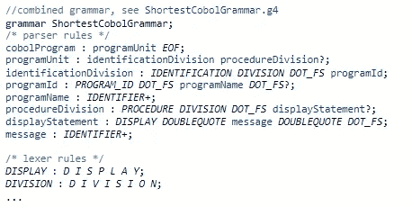
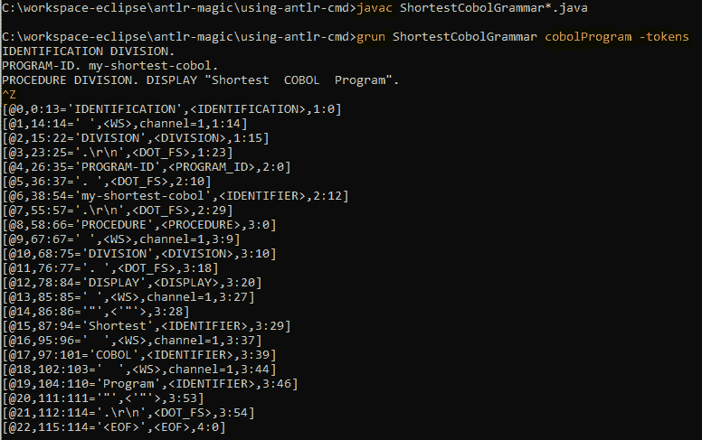
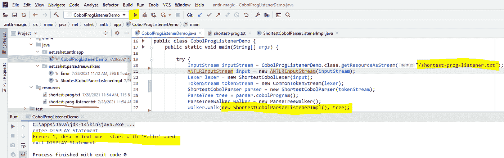

# ANTLR Magic——使用语言识别器开发大型机语言应用程序

> 原文：<https://medium.com/codex/antlr-magic-developing-mainframe-language-applications-using-language-recognizer-5262726e1e93?source=collection_archive---------4----------------------->

你有没有想过编写自己的语言应用程序，并将其集成到一个 IDE 中？

每个开发人员都有自己喜欢的 IDE 来帮助他们开发应用程序。所以，让我们换一种方式来问这个问题，你有没有想过这些 ide 是如何提供现代编码和调试体验的？回答这个问题可能并不简单。因此，让我们用一种更简单的方式，用实际的例子来描述它是如何实现的，以及使用哪种技术(例如，Java、ANTLR、VSCode、Typescript、LSP、DAP 等。)支持哪个部分[组件，特性]，以及那些组件如何协同工作。

在开始开发任何语言应用程序之前，您需要了解该语言的语法，并且需要有一个语言识别工具(例如 ANTLR[1])，它理解该语言并使用预定义的语言语法生成解析器。此外，要将语言应用程序与 ide 集成以提供现代编码和调试体验，您需要实现一个语言服务器和一个客户端，它们必须符合 LSP [2]和 DAP [3]规范。

在我之前的博客中，我已经描述了这些规范的作用:LSP 带来了现代编辑能力的魔力，而 DAP 提供了现代调试体验。在本文中，我将向您展示 ANTLR 带来的**魔力**，以及它在构建语言应用程序(例如 COBOL 语言支持、JCL、REXX 等)中的作用。).

作为一个案例研究，为了学习 ANTLR 的技术方面，您将创建一个样例 Java 应用程序，它允许我们编写最短的 COBOL 程序。要开始开发，首先使用命令行工具尝试手动下载 jar 文件，然后在不同的 ide 上使用 ANTLR 插件切换到 Maven。然后逐步应用 ANTLR 特性。

请记住，您在这里看到的许多代码片段并不完整，因此只需参考 GitHub repo 即可获得完整的示例。示例应用程序的源代码在[这里](https://github.com/asatklichov/antlr-magic)是公开的。

# ANTLR v4 入门

1989 年，Terence Parr 教授在创建基于计算机的语言识别方面迈出了重要的一步，这是一个递归下降解析工具——ANTLR。ANTLR(另一个语言识别工具)是一个强大的解析器生成器，用于读取、处理、执行或翻译结构化文本或二进制文件[4]。在生成的解析器执行之前，它在运行时动态地而不是静态地执行语法分析。它还简化了许多步骤，使得创建语言识别器和解析器更加容易和方便。ANTLR 被广泛用于编写新语言的解释器和编译器，或者构建工具和框架，或者分析日志。例如:Hibernate 使用 ANTLR 解析和处理 HQL 查询，而 Elasticsearch 使用它进行无痛查询。在 Groovy、Ruby、Go、Swift、Python、Apache Spark、Intellij IDEA、WebLogic、JBoss Rules 等中也有 ANTLR 的其他用法。

**安装 ANTLR**

ANTLR 是用 Java 编写的(所以一个先决条件是你应该至少安装了 Java 7)，它由两个主要部分组成:ANTLR 工具(命令行工具)，用于将你的语法翻译成 Java 语言(或其他目标语言:JavaScript、Python、Ruby、C#等)的解析器/词法分析器。)和运行生成的解析器/词法分析器所需的运行时。

要手动安装 ANTLR[下载](https://www.antlr.org/download.html)最新的"[*ANTLR-4 . x . x-complete . jar*](https://www.antlr.org/download/antlr-4.9.2-complete.jar%20)并将其添加到类路径中。jar 文件包含运行 ANTLR 工具所需的所有依赖项，以及编译和执行 ANTLR 生成的识别器所需的运行时库。然而，为了使所有的 **antlr4** 和 **grun** 命令正常工作，请遵循[不同操作系统](https://github.com/antlr/antlr4/blob/master/doc/getting-started.md)的说明。下面是在 OSX[4]上的安装步骤

或者，要通过构建工具安装 ANTLR，可以使用 Maven 或 Gradle，也可以将 ANTLR 插件集成到您喜欢的 ide 中(参见将生成的解析器集成到项目中一节)。

# ANTLR4 语法简介

使用[上下文无关语法](https://en.wikipedia.org/wiki/Context-free_grammar)指定语言，使用[扩展的巴克斯-诺尔形式](https://en.wikipedia.org/wiki/Extended_Backus%E2%80%93Naur_Form) (EBNF)表达。识别语言的程序被称为**解析器**或**语法分析器**。ANTLR 允许你定义你的计算机语言的“语法”,它通过一组规则提供了一种方便的和开发者友好的定义语言语法的方式。**规则**由一系列**标记**和**动作**组成，它们定义了一条语句应该如何用您的源语言编写，以便能够被正确地识别和解析。ANTLR 语法结构的一般形式如下所示:

包含语法 X 的文件名必须称为 X **.g4** 。您可以按任意顺序指定元素(选项、导入、令牌规范和操作)。选项、导入和令牌规范最多只能有一个。所有这些元素都是可选的，除了语法头(语法名)和规则。必须至少定义一个规则，否则没有任何规则的语法是没有意义的。规则采用以下基本形式:rule name:alternative 1 |…| alternativeN；

定义语法有两种方法:自顶向下和自底向上。

**自顶向下**从用您的语言编写的文件的一般组织开始。像在 Java(或者其他现有语言 COBOL，C++等。):包声明、导入、类型声明、构造函数、方法等。当你对语言或语法本身有扎实的知识时，这种方法是很好的。然后，您开始定义代表整个文件的规则，它包括其他子规则。

在**自底向上**方法中，您首先关注小元素:定义如何捕获令牌，以及如何定义基本表达式。然后，移动到下一个更高级别的元素，并为整个文件逐步构建规则。这种方法有助于关注每一个细节，但在大多数情况下，你对产品及其未来的了解较少。

让我们定义一个组合语法(在一个语法下定义的解析器和词法分析器)，它将帮助我们使用 COBOL 编程语言编写一个最短的程序(考虑下面的代码)。

所以你需要提供描述这种语言的规则。它们可以是数据格式、图表或任何用文本表示的结构。规则元素指定解析器在给定时刻应该做什么，就像编程语言中的语句一样。这些元素可以是规则、标记或类似表达式的字符串。解析器规则名称必须以小写字母开头，词法分析器规则必须以大写字母开头。有关规则的更多信息，请参考 [ANTLR4 文档](https://github.com/antlr/antlr4/blob/master/doc/index.md)。

# 执行 ANTLR 和测试识别器

一旦安装了 ANTLR 并正确设置了类路径，就可以找到 ANTLR 工具和名为 TestRig(测试语法的实用工具)的运行时。为了快速启动工具，最好为两者创建一个方便的别名或批处理文件:参见[批处理文件](https://github.com/asatklichov/antlr-magic/tree/main/using-antlr-cmd) : run1、run2、run3，分别用于 CLASSPATH、Tool 和 TestRig。

> doskey**antlr 4**= Java org . antlr . v4 . tool $ *

> doskey**grun**= Java org . antlr . v4 . GUI . test rig $ *

然后使用 **antlr4** 命令将语法转换成程序，程序可以识别语法所描述的语言中的句子。详细执行步骤见[操作指南](https://github.com/asatklichov/antlr-magic/blob/main/using-antlr-cmd/__how-to-run.txt)文件。

> antlr 4 shortestcobolgrammar . G4//生成 antlr 工件，将语法翻译成可执行的 Java 代码

现在你可以看到一些生成的文件，它们的名字分别是 ShortestCobolGrammarLexer.java、ShortestCobolGrammarParser.java……还有*。令牌文件。

如果您调用 ANTLR 工具而没有任何命令行参数> antlr4，您将得到一条帮助消息，显示您在运行它时可以指定的选项。例如，您可以指定目标语言，生成 JS/TS、Python、C#、C++或其他语言的解析器，以便支持其他目标语言。

> antlr 4-d language = JavaScript shortestcobolgrammar . G4

> antlr 4-d language = python 3 shortestcobolgrammar . G4

另一个非常方便的选择是产生访问者，或者排除听众等等。ANTLR 从语法中生成一个解析器，该解析器可以构建解析树，还可以生成一个监听器(或访问者),这使得对感兴趣的短语的识别很容易做出响应。

> antlr 4-visitor shortest cobol . G4//创建侦听器和访问者

> antlr 4-visitor-no-listener shortest cobol . G4//仅创建访问者

为了测试你的语法，使用带有真实输入的 **grun** (TestRig)程序。TestRig 使用 Java 反射来执行编译后的识别器。这就是为什么您必须编译生成的 Java 源文件。

> javac ShortestCobolGrammar*。Java 语言（一种计算机语言，尤用于创建网站）

TestRig 接受一个语法名称、一个类似于 main()方法的起始规则名称(例如 cobolProgram)和各种选项(例如-- tokens，以显示检测到的标记),这些选项决定了您想要的输出。要测试语法，请按如下方式启动 grun:

> grun shortestcobolgrammar cobolprogram–tokens//for:eof #在 Unix 上键入 ctrl-D (^D ),在 Windows 上键入 Ctrl+Z

Grun *( > grun)* 还有几个有用的选项:-tree，-tokens，-gui，-ps，-diagnostics 等。

要可视化输入的解析树(AST ),请使用-gui 选项。解析器获取一段文本，并将其转换成一个有组织的结构(即:解析树)，也称为抽象语法树(AST)。

> grun shortest cobol grammar cobol program–GUI

**备注**:如果你修改了语法文件，那么你需要重新生成文件。因此，不要依赖你对生成文件的编码，而是用你自己的类来扩展它们，例如，供听众和访问者使用。

# ANTLR 的实际工作原理

ANTLR 通过分析您提供的语法(如 [ShortestCobolGrammar.g4](https://github.com/asatklichov/antlr-magic/blob/main/using-antlr-cmd/ShortestCobolGrammar.g4) )或取自[现有语法](https://github.com/antlr/grammars-v4))自动为您生成词法分析器和解析器。默认情况下，ANTLR 会读取一个语法，并为该语法定义的语言生成一个识别器。例如，下面的命令读取输入流，并且如果输入流不符合语法指定的语法，则生成错误。

c:\ workspace-eclipse \ antlr-magic \ using-antlr-cmd > grun shortest cobol grammar cobol program

如果没有语法错误，那么默认操作就是退出，不打印任何消息。

ANTLR 可以生成[词法分析器](https://en.wikipedia.org/wiki/Lexical_analysis)、[解析器](https://en.wikipedia.org/wiki/Parser)、[树解析器](https://en.wikipedia.org/w/index.php?title=Tree_parser&action=edit&redlink=1)，以及组合的[词法分析器](https://en.wikipedia.org/w/index.php?title=Lexer-parser&action=edit&redlink=1)。解析器可以自动生成[解析树](https://en.wikipedia.org/wiki/Parse_tree)或者[抽象语法树](https://en.wikipedia.org/wiki/Abstract_syntax_tree)，可以用树解析器进一步处理【7】。

# 词法分析器和语法分析器

一个**标记**是一个字符序列，代表一段有意义的输入:通常是一个单词或标点符号，由词法分析器分离并传递给解析器。将字符分组为单词或符号(记号)的过程称为**词法分析**或简称为**记号化**。您将对输入进行分词(执行词法分析)的程序称为**词法分析器**(或**分词器**)。识别语言的程序被称为**解析器**或**语法分析器**。默认情况下，ANTLR 生成的解析器构建一个数据结构，称为**解析树**或**语法树**(表示语法如何匹配输入)，记录解析器如何识别输入句子的结构及其组成短语。

解析( **语法分析**)是分析符合形式语法规则的自然语言、计算机语言或数据结构中的一串符号的过程。因此，正如您在下图中看到的，lexer 首先运行，并将输入拆分成标记。然后，令牌流被传递给执行所有处理的解析器。ANTLR 为您生成一个解析树，然后您可以用一个解析树遍历器来处理它。

图 4:图示了语言识别器的基本数据流[4]

# 将生成的解析器集成到项目中

ANTLR 工具和运行时，称为 TestRig 程序，在处理语法初稿时非常有用。一旦语法有了良好的开端，就可以将 ANTLR 生成的代码集成到更大的应用程序中。要将它集成到您的项目中，您可以使用 Maven 或 Gradle 来构建应用程序，并在编码过程中使用 ANTLR 开发工具(ide 的插件)的强大功能。

首先，让我们将 antlr-runtime 依赖项和 antlr-maven-plug-in 添加到 pom.xml 中。基本上，使用 ANTLR Maven 插件，您遵循与命令行方法相同的步骤(准备语法、生成源代码和创建侦听器)。因此，您将您的语法直接放在 **src/main/antlr4/** 下，并且由于我们的配置，Maven 确保在运行了> mvn clean install 之后，在对应于它们的包的目录中生成了词法分析器和语法分析器

# ANTLR 开发工具

有几个 ide 的 ANTLR 插件:Intellij、Eclipse、VS Code，还有许多其他的。这些插件在 ANTLR 开发过程中非常方便。您只需在插件编辑器中打开语法文件，就可以获得快速修复、语法着色、代码完成、语法和语义错误检查、代码导航、定位声明等支持。你可以做重构，你可以测试你的语法，生成解析树，并以不同的格式保存为图片。铁路图和 ATN 图也非常有助于可视化规则类型(解析器、词法分析器、片段)。

**月蚀**[ANTLR 4 IDE](https://marketplace.eclipse.org/category/free-tagging/antlr-antlr4-antlrv4-v4)

**Vscode 扩展:** [ANTLR4 语法语法支持](https://marketplace.visualstudio.com/items?itemName=mike-lischke.vscode-antlr4)

**IntelliJ**T14**ANTLR v4**

# ANTLR 还能做什么？

继续使用 ShortestCobolGrammar 示例，下一个目标是了解 ANTLR 还能做什么(侦听器、访问者、错误处理等等)。

但是，在这之前，让我们把合并的语法分成两个独立的语法，一个用于词法分析器，一个用于语法分析器。然后通过将 lexer 语法导入解析器语法来重用它。这种方法促进了良好的软件设计(代码重用和单一责任原则)，特别是当您有大量语法并且应用程序将并行支持多种语言时。

要创建一个只允许解析器规则( [ShortestCobolParser.g4](https://github.com/asatklichov/antlr-magic/blob/main/src/main/antlr4/net/sahet/parsers/ShortestCobolParser.g4) )或词法分析器规则( [ShortestCobolLexer.g4](https://github.com/asatklichov/antlr-magic/blob/main/src/main/antlr4/net/sahet/parsers/ShortestCobolLexer.g4) )的解析器语法，请使用下面的头。

要了解有关规则定义的更多信息，请参考[词法分析器规则](https://github.com/antlr/antlr4/blob/master/doc/lexer-rules.md)和[语法分析器规则](https://github.com/antlr/antlr4/blob/master/doc/parser-rules.md)。

仅有语法是不够的——解析树遍历器

你必须记住解析器不能检查语义。解析器应该只检查语法。ANTLR v4 鼓励你保持语法的整洁，并鼓励你使用解析树遍历器(监听器或访问者)来实现特定于应用程序的代码，例如执行语义检查(验证代码，或添加特定的逻辑检查等)。).侦听器和访问者是非常方便的机制，因为它们将应用程序逻辑排除在语法之外，并保持语法应用程序的独立性和编程语言的不可知性。因此，您可以使用相同的语法为任何目标语言(Java、JS、C++等)生成语言识别器。).

ANTLR 在其运行时库中支持两种树遍历机制:解析树侦听器(默认)和解析树访问者。ANTLR 自动生成这些树遍历器，可以用来访问树的节点以执行应用程序逻辑。

**解析树监听器**

默认情况下，ANTLR 自动生成一个解析树监听器接口，带有一个 base-listener 类，它是该接口的一个空实现。侦听器机制的美妙之处在于，您不需要自己进行任何树遍历，侦听器方法由 ANTLR 提供的 walker 对象自动调用(隐式访问它们的子对象)。

让我们使用一个侦听器机制，一旦显示文本不是以单词“Hello”开头，就打印一条错误消息。要编写一个对输入做出反应的程序(回调方法)，你所要做的就是在一个新的子类[*shortestcobolparserlistener*](https://github.com/asatklichov/antlr-magic/blob/main/src/main/java/net/sahet/parse/tree/walkers/ShortestCobolParserListenerImpl.java)中实现一些方法(处理进入和退出的规则，例如 *enterDisplayStatement 和* exitDisplayStatement)，该子类扩展了*ShortestCobolParserBaseListener。*

只需构建 Maven 项目并运行程序 *CobolProgListenerDemo* 来查看错误消息。

c:\ workspace-eclipse \ antlr-magic > mvn 全新安装

练习:为了巩固您的知识，为 COBOL AreaA 和 AreaB 职位定义一条错误消息。

**游客树行者**

正如您所看到的，侦听器机制是自动的，但是有些情况下您希望手动控制遍历并显式调用方法来访问子节点。因此，创建侦听器的替代方法是创建访问者。使用访问者机制，您可以显式地控制流并返回您想要的值。要生成访问者树遍历器，使用*–visitor*选项，然后 ANTLR 生成一个访问者接口，带有一个 base-visitor 类，该类是该接口的一个空实现。

让我们使用访问者机制来调整显示文本，并添加逻辑(例如，从输入消息中计算散列)。为了对这个需求进行编程，您需要创建一个新的子类[*ShortestCobolParserVisitorImpl*](https://github.com/asatklichov/antlr-magic/blob/main/src/main/java/net/sahet/parse/tree/walkers/ShortestCobolParserVisitorImpl.java)，它扩展了*ShortestCobolParserBaseVisitor<T>(T—用于返回类型)*，并实现了满足业务逻辑所需的方法(只需要在节点的子节点上调用 visit())。

c:\ workspace-eclipse \ antlr-magic > mvn 全新安装

**树木行走机构的区别**

树遍历机制的主要区别在于:

1.  与侦听器不同，用户在子节点上显式调用访问者。忘记在节点的子节点上调用 visit()意味着这些子树不会被访问。简单地说，在来访者中，你可以在树上行走，而在听者中，你只对树行者做出反应。
2.  侦听器方法(void)不能返回值，而访问者方法可以返回任何自定义类型。对于侦听器，您将不得不使用可变变量来存储值，而对于访问者则没有这样的需要。
3.  侦听器使用在堆上分配的显式堆栈，而访问者使用调用堆栈来管理树遍历。这意味着访问者的大量输入可能会导致嵌套很深的 ast 上的堆栈溢出异常，而侦听器不会有任何问题。
4.  两种树遍历机制都使用深度优先(当一个节点被访问时，它的子节点将被访问)类型的搜索。
5.  访问者和侦听器之间的最大区别是访问者不需要 ParseTreeWalker，例如，比较代码 *CobolProgListenerDemo 和* CobolProgVisitorDemo。
6.  此外，侦听器使用 [ParseTreeWalker](https://github.com/antlr/antlr4/blob/master/runtime/Java/src/org/antlr/v4/runtime/tree/ParseTreeWalker.java) 中的 walker 算法，访问者使用[AbstractParseTreeVisitor](https://github.com/antlr/antlr4/blob/master/runtime/Java/src/org/antlr/v4/runtime/tree/ParseTreeVisitor.java)*中的算法。*两者都“考虑”所有节点，这就是性能差异较小的原因，即使侦听器机制看起来更快。除了实现差异之外，访问者调用还涉及一般返回类型处理的开销。这应该会对任何现代 JVM 的性能产生无缝的影响。

有关更多 ANTLR 特性或功能(错误处理机制、动作和语义谓词等)，请参考 Terence Parr 的书[‘The Definitive ANTLR 4 Reference’](https://pragprog.com/titles/tpantlr2/the-definitive-antlr-4-reference/)。

# 构建语言应用程序

为了使 IDE 支持现代编码和调试体验，您需要实现一个基于 LSP[8]和 DAP[9]规范的语言服务器和客户端，并将它们集成到 IDE 中。为了成为客户端，代码编辑器(或 IDE)添加了一个小的扩展，它提供了一个与语言无关的前端编辑功能，而不需要知道语言的语义[见图 3]。

图 3: LSP 架构为我们提供了选择任何技术组合的灵活性(可以是 TS/Python，或者 TS/C++，或者 TS/TS ),以独立地实现客户端和语言服务器

[语言服务器](/modern-mainframe/lsp-magic-mainframe-language-support-in-modern-ides-4ea3d81259b3)提供语言语义，一次只为一个客户服务。它监听编辑器的元状态，并基于使用 ANTLR 的语法或语义分析，返回一组动作。这种通信基于由 [JSON RPC v2.0](http://www.jsonrpc.org/specification) 扩展版本定义的规则。为了将一致的体验扩展到调试，应该集成 [DAP 技术](/modern-mainframe/dap-magic-modern-debugging-experience-for-mainframe-software-deecb40df4c8)[9]。

**LSP 对大型机编程语言的支持**

基于上述 LSP 架构，Broadcom 提供了多个专用于特定语言的扩展，如 [COBOL 语言支持](https://marketplace.visualstudio.com/items?itemName=broadcomMFD.cobol-language-support)、 [HLASM 语言支持](https://marketplace.visualstudio.com/items?itemName=broadcomMFD.hlasm-language-support)、 [JCL 语言支持](https://marketplace.visualstudio.com/items?itemName=broadcomMFD.jcl-language-support)和 [REXX](https://marketplace.visualstudio.com/items?itemName=broadcomMFD.lsp-for-rexx) 。此外，为了一次安装所有的扩展，mainframe [Code4z](https://marketplace.visualstudio.com/items?itemName=broadcomMFD.code4z-extension-pack) 扩展对于市场中的 VS 代码编辑器是免费的，它也可以在 Eclipse 忒伊亚云编辑器中使用。

对 COBOL 的 LSP 支持是一个开源项目(使用的技术有:Java、ANTLR、VSCode、Typescript、LSP、DAP 等。)在 Eclipse 许可下 [che-che4z-lsp-for-COBOL](https://github.com/eclipse/che-che4z-lsp-for-cobol) 。COBOL 语言支持扩展为您提供了语言感知特性，如:自动完成、高亮显示、诊断和对文件扩展名的复制支持。cob 和. cbl。它还能够使用 Zowe CLI z/OSMF 配置文件连接到主机，以支持下载相关的复制本[8]。

图 4: COBOL 语言支持用例图。Michelle 是一名现代大型机开发人员，他使用 VSCode 开发 COBOL 应用程序。

code4z 团队使用 COBOL 的 IBM 语言参考、CICS 和 z/Os 的 SQL 构建了用于 COBOL 语言支持的[语法](https://github.com/eclipse/che-che4z-lsp-for-cobol/tree/development/server/src/main/antlr4/org/eclipse/lsp/cobol/core/parser)，并使用 ANTLR v.4 应用语法和语义分析，这些语法和语义分析为语言服务器提供与用例相关的诊断【参见图 4】(LSP 语言服务器支持的所有特性都可以在[这里](https://langserver.org/)找到)。

**总结**

本文讨论了“使用语言识别器开发大型机语言应用程序”这一主题，首先阐述了一个示例应用程序。然后在接下来的部分中，将描述 ANTLR 的特性和功能，并使用这些特性实现实际的例子。因此，您已经了解了现代编码和调试经验是如何开发并集成到基于 ANTLR(处理结构化文本的解析器生成器)、LSP(提供语言智能)、DAP(提供调试)和 VSCode 技术的 ide 中的。

如有更多问题，您可以通过 Slack 联系我们:[che4z.slack.com](http://che4z.slack.com/)

**参考文献**

[1][https://github . com/antlr/antlr 4/blob/master/doc/getting-started . MD](https://github.com/antlr/antlr4/blob/master/doc/getting-started.md)

[2][https://Microsoft . github . io/language-server-protocol/specification/specification-current/](https://microsoft.github.io/language-server-protocol/specifications/specification-current/)

[3][https://microsoft.github.io/debug-adapter-protocol/](https://microsoft.github.io/debug-adapter-protocol/)

[4][https://pragprog . com/titles/tpantlr 2/the-definitive-antlr-4-reference/](https://pragprog.com/titles/tpantlr2/the-definitive-antlr-4-reference/)

【https://www.antlr.org/tools.html 

[6]https://tomassetti.me/antlr-mega-tutorial/

[7][https://en.wikipedia.org/wiki/ANTLR](https://en.wikipedia.org/wiki/ANTLR)

[8][https://medium . com/modern-mainframe/LSP-magic-mainframe-language-support-in-modern-ides-4ea 3d 81259 B3](/modern-mainframe/lsp-magic-mainframe-language-support-in-modern-ides-4ea3d81259b3)

[9][https://medium . com/modern-mainframe/DAP-magic-modern-debugging-experience-for-mainframe-software-deec b40 df 4c 8](/modern-mainframe/dap-magic-modern-debugging-experience-for-mainframe-software-deecb40df4c8)

开源库:[https://github.com/eclipse/che-che4z](https://github.com/eclipse/che-che4z)