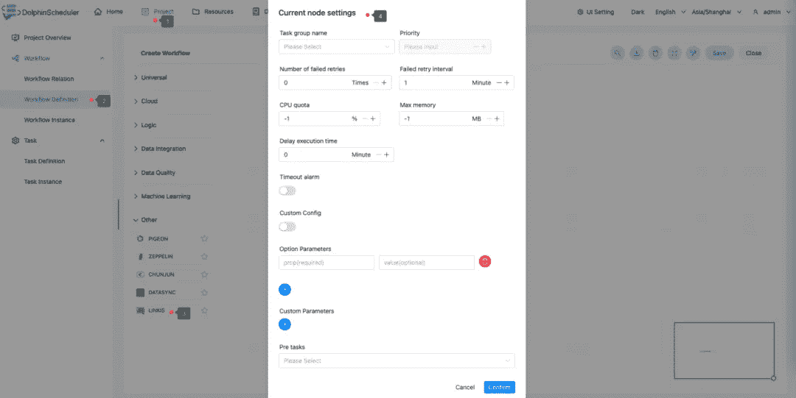

# Apache Dolphinscheduler 集成了 Linkis 任务插件，极大地提高了计算治理能力

> 原文：<https://medium.com/codex/apache-dolphinscheduler-integrates-linkis-task-plugin-greatly-improving-computing-governance-5c8eae9f31ea?source=collection_archive---------4----------------------->


今天，我们来看看 Apache DolphinScheduler 是如何与 Apache Linkis 集成的。两个月前，Apache DolphinScheduler 社区 PMC 邀请我一起做这项工作，我觉得这很有趣，所以我接受了。

我今天的分享主要分为两部分。一个是解释 Apache DolphinScheduler 的任务插件扩展是如何以及为什么这样设计的；另一个是如何整合 Apache DolphinScheduler 和 Linkis，包括我和 Linkis PMC 的相关讨论。也欢迎大家加入，为 doDolphinScheduler 贡献更多插件。

# 任务插件扩展简介

## 阿帕奇海豚调度程序


Apache DolphinScheduler 是一个分布式、去中心化、易于扩展的可视化 DAG 工作流项目调度平台，致力于解决数据处理流程中的复杂依赖问题，允许调度系统开箱即用地处理数据。

上图是 Apache DolphinScheduler 目前的架构，主要分为 Master 和 Worker。Master 用于分发和调度，Worker 用于任务执行，包括 UI、API、Alert alarm、ZK 分布式处理等。，最后执行各种任务。

Apache DolphinScheduler 有四个特点，一个是高可靠性，去中心化的多主&多工服务对等架构，避免单个主的压力过大，使用任务缓冲队列避免过载；

第二，简单易用。DAG 定义是通过拖放完成的。与 Airflow 只对具有一定 Python 技能、擅长统计的工程师和分析师友好不同，DolphinScheduler 可以通过拖拽的方式定义工作流；

第三，使用场景丰富，支持多租户，支持暂停和恢复操作。它非常适合大数据生态系统，并提供了 Spark、Hive、M/R、Python、Sub_process、Shell 和其他任务类型。现在随着 3.0 版本的发布，支持的任务类型更加丰富；第四，高可扩展性，因为 Master 和 Worker 都有无中心的分布式设计，所以可以一直横向扩展，即使业务场景越来越多，调度规模越来越大，也可以通过动态在线和离线进行调度。

## Dolphinscheduler 任务组件使用示例

接下来，我们以 SparkSQL 为例，介绍如何使用 Apache DolphinScheduler 任务组件。具体来说，我们需要创建一个视图表 terms，并以 Parquet 格式写入三行数据和一个表 wc，以确定该表是否存在。程序类型是 SQL，视图表术语的数据被插入到格式为 Parquet 的表 wc 中。

在工作流定义部分，可以看到 DolphinScheduler 目前支持的任务组件，包括一些简单的 shells，以及逻辑组件，比如子流程，以及依赖组件。

有些是通用节点，有些是任务执行节点。拖动这些节点后，界面如下所示:


每个任务都不一样。我们编辑需要执行的内容，设置 SPI 等。，然后单击“确认”以成功定义工作流、监控状态、获取日志等。

## SPI 服务发现

我们有这么多的任务组件，我们是怎么做的呢？这就涉及到我们刚刚提到的 SPI 服务发现功能。

SPI 的全称是服务提供者接口，它是内置于 JDK 中的服务提供者发现机制。大多数人可能很少使用，因为它的定位主要是面向开发者，在 java.util.ServiceLoader 的文档中有详细介绍，它的抽象概念是指动态加载某个服务实现。


这显示了加载整个动态的服务实现。从 DolphinScheduler 的 worker Server 启动服务开始，一个名为 TaskpluginManager 的类就会加载并监控，然后触发 SPI 类加载器加载这些类。

那些在 DolphinScheduler 上重新开发过的人，无论何时工作者启动，都会在日志中看到这些信息。

Apache DolphinScheduler 执行的任务分为逻辑任务和物理任务。逻辑任务指的是 DependTask、SwitchTask 等逻辑任务；物理任务指的是 ShellTask、SQLTask 等任务。在 Apache DolphinScheduler 中，我们一般会扩展物理任务，物理任务是由 Worker 执行的，所以我们需要理解的是，当我们有多个 Worker 时，我们需要将自定义任务分发到每台有 Worker 的机器上，当我们启动 Worker 服务时，Worker 会启动一个 ClassLoader 来加载实现规则的相应任务库。我在整合 Linkis 时也遵循这个过程。

## 构建任务实现

通过 TaskChannel，我们得到可执行的物理任务，但是我们需要在当前任务中添加相应的实现，这样 Apache DolphinScheduler 才能执行你的任务。首先，我们需要在编写任务之前了解任务之间的关系:


上图是该类的示意图。最上面的角是抽象任务类，下面集成了抽象任务类和任务执行器。该类分为 3 个主要类型，分别是基于 YARN、Python 和 Shell 的集成。

## 任务插件开发流程(基于 Shell 的任务)

*(参见 MapReduceTask)*

*   *您需要在 org . Apache . dolphin scheduler . server . worker . task 下的 TaskManager 类中创建一个自定义任务(您还需要在 task type 中注册相应的任务类型)*
*   *org . Apache . dolphin scheduler . server . worker . task 下的 AbstractYarnTask 需要集成*
*   *构造函数调度抽象任务构造函数*
*   *集成抽象参数自定义任务参数实体*
*   *在重写 AbstractTask 的 init 方法中解析自定义任务参数*
*   *重写 buildCommand 包装命令*

**非基于纱线的计算(参见 ShellTask)**

*   **定制任务需要在 org . Apache . dolphin scheduler . server . worker . task 下的 TaskManager 中创建**
*   **org . Apache . dolphin scheduler . server . worker . task 下的 AbstractTask 需要集成**
*   **在构造函数中实例化 ShellCommandExecutor**

```
**public ShellTask(TaskProps props, Logger logger) {
         super(props, logger);
         this.taskDir = props.getTaskDir();
         this.processTask = new ShellCommandExecutor(this::logHandle,
                 props.getTaskDir(), props.getTaskAppId(),
                 props.getTenantCode(), props.getEnvFile(), props.getTaskStartTime(),
                 props. getTaskTimeout(), logger);
         this.processDao = DaoFactory.getDaoInstance(ProcessDao.class);
}**
```

*   **放入自定义任务的 TaskProps 和自定义日志记录器，TaskProps 封装任务信息，Logger 封装自定义日志信息**
*   **集成抽象参数自定义任务参数实体**
*   **重写 AbstractTask 的 init 方法以解析自定义任务参数实体**
*   **重写 handle 方法，调用 ShellCommandExecutor 的 run 方法，将第一个参数传入您的命令，将第二个参数放入 ProcessDao，并设置相应的 exitStatusCode**

*****基于非 SHELL 的任务(参见 SqlTask)*****

*   **定制任务需要在 org . Apache . dolphin scheduler . server . worker . task 下的 TaskManager 中创建**
*   **org . Apache . dolphin scheduler . server . worker . task 下的 AbstractTask 需要集成**
*   **集成抽象参数自定义任务参数实体**
*   **在 AbstractTask 的构造方法或重写 init 方法中，解析自定义任务参数实体**
*   **重写 handle 方法以实现业务逻辑并设置相应的 exitStatusCode**

**看起来很麻烦，但是不用担心，等我解释完 Linkis 集成流程，你就知道任务插件流程很简单了。**

# **Apache DolphinScheduler 和 Linkis 的集成**

**接下来我就说说 DolphinScheduler 是怎么和 Linkis 集成的。**

## **Linkis 建筑**

**本着开源的思想，我们集成了优秀的计算中间件 Linkis 作为任务插件。作为一个计算中间件，Linkis 提供了强大的连接、重用、编排、扩展和治理能力。应用层和引擎层通过计算中间件解耦，简化了复杂的网络调用关系，降低了整体的复杂度，节省了整体的开发和维护成本。**

**Linkis 提供三大服务:计算治理服务、公共增强服务、微服务治理服务。我们主要使用它的计算治理服务。在提交和准备执行阶段，我们可以在 Linkis 计算中间件中执行许多类型的任务。如果任务太多，Linkis 可以帮助我们抽象和重用这些计算过程。**

****

**Linkis 建筑**

## **应用方法 1 (JAVA SDK)**

**接下来说说 DolphinScheduler 是如何在过程中整合 Linkis 和我的思考的。**

**Linkis 提供了两个对我们非常有用的集成类，一个是 Java SDK，一个是 Linkis-Cli，也就是 Shell 的能力。**

**Java SDK 是由 Linkis 官方提供的 Java 包。您可以在引用之前的 pom 中的依赖项后定义版本。后面我们可以在里面定义引擎及其参数，包括 Spark 的运行参数，Linkis 本身的纱线队列参数等。在定义了执行和提交之后。**

**示例代码如下:**

```
**private static JobExecuteResult toSubmit(String user, String code) {
         // 1\. build params
         // set label map :EngineTypeLabel/UserCreatorLabel/EngineRunTypeLabel/Tenant
         Map labels = new HashMap();
         labels.put(LabelKeyConstant.ENGINE_TYPE_KEY, "spark-2.4.3"); // rrequired engineType Label
         labels.put(LabelKeyConstant.USER_CREATOR_TYPE_KEY, user + "-APPName");// required execute user and creator eg:hadoop-IDE
         labels.put(LabelKeyConstant.CODE_TYPE_KEY, "py"); // required codeType
         // set start up map :engineConn start params
         Map startupMap = new HashMap(16);
         // Support setting engine native parameters, For example: parameters of engines such as spark/hive
         startupMap.put("spark.executor.instances", 2);
         // setting link is params
         startupMap.put("wds.linkis.rm.yarnqueue", "dws");
// 2\. build jobSubmitAction
         JobSubmitAction jobSubmitAction = JobSubmitAction. builder()
                 .addExecuteCode(code)
                 .setStartupParams(startupMap)
                 .setUser(user) //submit user
                 .addExecuteUser(user) // execute user
                 .setLabels(labels)
                 .build();
         // 3\. to execute
         return client. submit(jobSubmitAction);
     }**
```

**导入从属模块和创建客户机的过程:**

```
**org.apache.linkis
   linkis-computation-client
   ${linkis.version}
Such as:
   org.apache.linkis
   linkis-computation-client
   1.0.3**
```

**不过，虽然这是一个非常好的 SDK 包，理论上非常容易集成到 DolphinScheduler 中，但是它有一个致命的弱点，就是需要适配 Linkis 的版本。但是要适应 Linkis 的每个版本是不现实的，所以最后，我们放弃了这个方法。**

## **应用方法 2 (Linkis-Cli)**

**在与 Linkis 社区的 PPMC 沟通后，我们最终选择在 shell 模式下调用 Flink 任务，以减少多版本兼容性的差异，避免这个问题。**

**于是我们想到了使用 Linkis 提供的打包客户端，只需要运行 Linkis 安装目录下的一段代码就可以运行 SparkSQL。详情如下:**

**第一步是检查默认配置文件 linkis-cli.properties 是否存在于 conf/目录中，该文件包含以下配置:**

```
**#linkis-mg-gateway service address
    wds.linkis.client.common.gatewayUrl=http://127.0.0.1:9001
    #Authentication authentication strategy token/static
    wds.linkis.client.common.authStrategy=token
    #static mode is username/password, and token mode is token_name and logal_users in linkis-mg-gateway_auth_token table
    wds.linkis.client.common.tokenKey=Validation-Code
    wds.linkis.client.common.tokenValue=BML-AUTH**
```

**第二步是进入 Linkis 安装目录并输入命令**

```
**sh ./bin/linkis-cli -engineType spark-2.4.3 -codeType sql -code "select count(*) from testdb.test;" -submitUser hadoop -proxyUser hadoop**
```

**在第三步中，您将看到一条消息，表明任务已经提交给 Linkis 并开始在控制台上执行。**

**这种方法不需要关心 Linkis 的版本。它只需要确定执行引擎是什么，执行什么用户，执行什么内容，然后就可以提交给 Linkis 执行了。**

**我们在 DolphinScheduler 集成 Linkis 的整个过程中都使用了这种思想。**

**如果您想在生产环境中使用 Linkis 任务类型，您需要首先配置所需的环境。配置文件如下所示:**

```
**/dolphinscheduler/conf/env/dolphinscheduler_env.sh**
```

****

**定义完成后，可以在其他类中选择 Linkis，可以看到 Linkis 的参数:**

****

**正如我们刚才提到的，可以定义引擎的类型、代码类型等。可以添加到 Linkis 的 Prop 和值，第一个属性的创建就完成了。**

**接下来，我们可以单击加号，填充尽可能多的属性，然后创建我们的 Linkis 任务。**

## **整合过程**

**我到底是怎么进行整合的？这是我开发的任务链接的集成。**

****

**Linkis 插件的目录结构主要分为四个文件:**

*   **LinkisParameters(参数)**
*   **LinkisTask(任务执行)**
*   **LinkisTaskChannel(创建、取消等。实现类)**
*   **LinkisTaskChannelFactory(task channel 的工厂实现类)**

**参数和任务执行是比较上层的方法，主要开发的主要是这两种方法。**

**当集成流程时，主要是提交任务和构建我们的命令。**

****

**我们来看看这种提交方式。根据用户的输入和参数配置，构造一个 Linkis Shell 执行字符串。通过我们定义的 shellCommandExecutor 执行命令，根据命令的任务响应获取任务 ID 作为 App ID。以此类推，最终实现 Linkis 任务的提交。如果有异常，您可以将退出代码定义为失败或其他类型，**

****温馨提示:****

****可以通过 Linkis-cli 的状态来实现。****

**DolphinScheduler 在提交 Linkis 任务时会自动添加参数— async true，实现异步提交。**

**接下来，我们来说说 Build 命令的流程。**

****

**首先，我们刚刚提到的共享清理选项是刚刚定义的 op t/soft/linkis 的目录。定义之后，我们就可以连接到刚才提到的 Linkis 客户端的命令行了。Linkis 的异步提交参数是默认值。然后把我的 Prop 和 Value 键-值对拼接到 ArrayList 里面，然后一步一步的添加，形成 ArrayList 的命令。解析后可以看到，它通过空间拆分成命令，然后提交给 ShellCommandExecutor 执行。**

****

**看似复杂的集成主要就是用这种方法。您只需要构建命令，并将其放在我们为执行而定义的上层类中。**

**然后我们来看监控任务状态的方法，它会定期运行监控方法，根据返回的日志中的状态检查获取最新的任务状态，并随着 Linkis 的状态变化更新 DolphinScheduler。任务状态。**

**温馨提示:可以通过 Linkis-cli 的状态来实现。**

**当然击杀任务也是如此，这里就不赘述了。**

# **我的期望**

**可以看到，DolphinScheduler 对 Linkis 的集成是非常简单的，像这样的集成还有很多，包括 PyTorch、Flink、Spark 等。希望大家都能参与到 DolphinScheduler 的开源共建中来。我们鼓励任何形式的社区参与，例如:**

*   **GitHub 问题遇到的问题反馈**
*   **回答其他人在这些问题上遇到的问题**
*   **帮助改进文档**
*   **帮助向项目添加测试用例**
*   **向代码中添加注释**
*   **提交 PR 来修复 bug 或特性**
*   **分享你的应用案例，与调度相关的技术文章**
*   **帮助推广 DolphinScheduler，参与技术会议或 meetup 分享等。**

**我详细讲了集成 Dolphinscheduler 任务插件的过程，希望你能贡献你的工作来丰富我们的任务插件，让我们一起构建一个欣欣向荣的开源大数据生态！**

**相信参与 DolphinScheduler 社区会让你从开源中受益！**