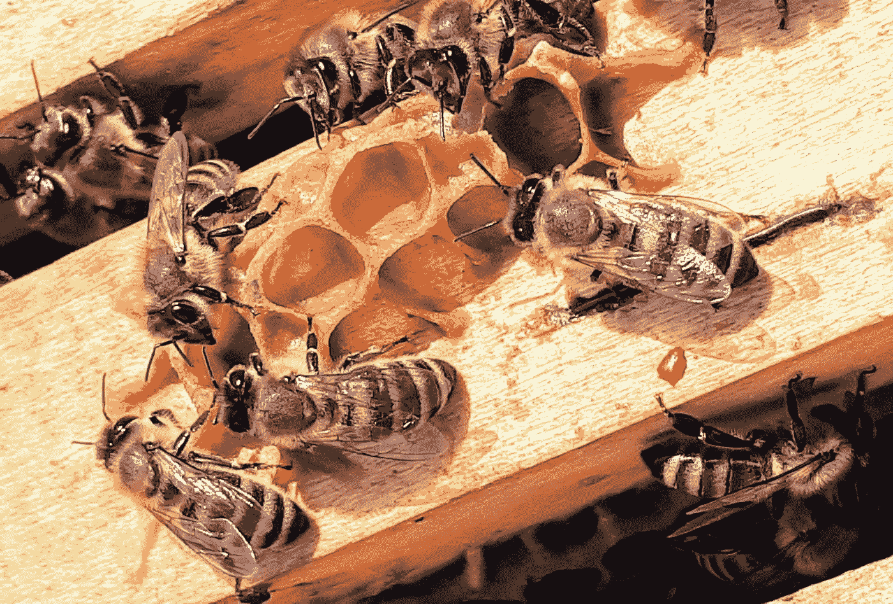

# 阿帕奇蜂房在静脉里！

> 原文：<https://medium.com/codex/apache-hive-in-the-vein-95e0bad2ca0c?source=collection_archive---------6----------------------->

在 [Unsplash](https://unsplash.com?utm_source=medium&utm_medium=referral) 上由[波巴·贾格利契奇](https://unsplash.com/@bobajaglicic?utm_source=medium&utm_medium=referral)拍摄的照片

## 发现阿帕奇蜂房，它的力量，以及更多！！:)

**#大数据**

我们不得不越来越多地处理大量的数据，这些数据是以令人难以置信的速度创建的，需要以令人难以置信的速度使用，具有巨大的变化，对于人类来说几乎不可能跟踪，关心其准确性，并能够以有效的方式为业务增加价值。(大的 5v…