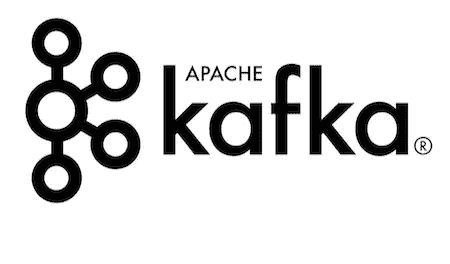
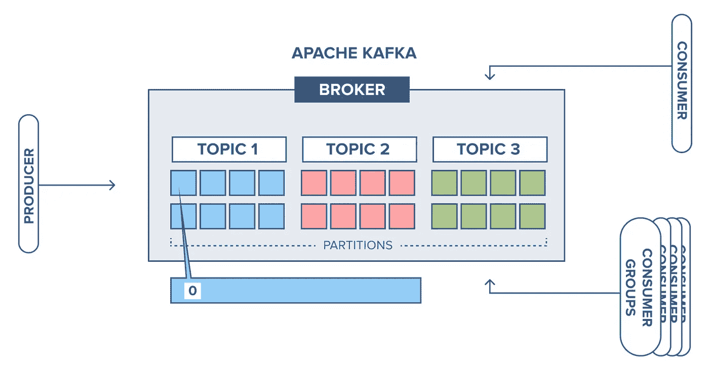

# 阿帕奇卡夫卡系列[第一部分]:阿帕奇卡夫卡简介

> 原文：<https://medium.com/codex/apache-kafka-series-part-1-introduction-to-apache-kafka-9b890832002?source=collection_archive---------3----------------------->

多亏了微服务，发展格局已经发生了变化。它们通过消除共享数据库层之类的依赖性来提高开发人员的灵活性。然而，您的开发人员正在创建的分布式应用程序将需要某种形式的数据共享集成。同步方法是最流行的集成选项之一，它使用应用程序编程接口(API)在用户之间传递数据。

异步技术是第二个集成选项，它需要在中间存储库中复制数据。这就是 Apache Kafka 的用武之地，它将来自其他开发团队的数据流填充到数据存储中，以便可以在许多团队和应用程序之间共享。



> Apache Kafka 是一个开源的分布式发布-订阅消息传递平台，专门用于处理实时流数据，以实现快速、可扩展的操作。

换句话说，它同时移动大量的数据——不仅仅是从一个地方移动到另一个地方，还可以从那个地方移动到你需要的任何地方。

它最初是一个 LinkedIn 内部系统，旨在每天处理数万亿条消息，但后来发展成为一个开源数据流解决方案，具有用于许多商业目的的应用程序。

# 什么时候用阿帕奇卡夫卡？

因为 Apache Kafka 是专门为实时日志流设计的，所以它适用于需要以下条件的应用程序:

*   独立组件之间可靠的数据交换
*   随着应用程序需求的变化划分消息传递工作负载的能力
*   用于数据处理的实时流
*   对数据/消息重放的本机支持

# 它是如何工作的？

Kafka 结合了排队和发布-订阅这两种消息传递模型的优点，为用户提供了这两种模型的优点。数据处理可以通过排队在众多消费者实例之间进行分割，这使得它具有高度的可伸缩性。另一方面，传统的队列不是多用户的。尽管发布-订阅方法是多订阅方的，但它不能用于在多个工作进程之间分配工作，因为每个消息都被发送到每个订阅方。为了连接这两个系统，Kafka 采用了分区日志架构。

日志是记录的有序集合，这些记录被组织成对应于不同订户的段或分区。这意味着订阅同一主题的众多订阅者可以被分配到不同的分区，从而实现更大的可伸缩性。



# 阿帕奇卡夫卡的主要成分是什么？

*   在发布/订阅消息传递中，主题是一个相当普遍的概念。主题是一个可寻址的抽象，用于展示对 Apache Kafka 和其他消息传递平台中特定数据流(一系列记录/消息)的兴趣。主题是一个抽象层，应用程序用它来表明对某个数据流的兴趣。可以发布和订阅。
*   **分区**:Apache Kafka 中的主题可以分成分区，分区是一系列的顺序队列。通过重复追加这些段来形成顺序提交日志。Kafka 系统中的每个记录/消息都有一个顺序 ID，称为偏移量，用于标识某个分区中的消息或记录。
*   **生产者**:Apache Kafka 中生产者的概念类似于大多数消息系统。数据生产者(记录/消息)指定特定记录/消息应该发布的主题(数据流)。因为分区用于提高可伸缩性，所以生产者可以选择将给定的记录/消息发布到哪个分区。生产者不需要标识一个分区，通过这样做，主题分区之间的负载平衡可以以循环方式执行。
*   消费者:消费者是 Kafka 中处理记录/消息的实体。可以将使用者设置为独立完成自己的任务，或者与其他使用者协作完成特定的工作负载(负载平衡)。消费者根据他们所属的消费者组来管理他们的任务处理。通过使用消费者组名称，可以将消费者分组到一个消费者组中。通过使用一个消费者组名称，可以在单个流程内、跨多个流程、甚至跨多个系统划分消费者。使用者可以使用使用者组名称来平衡整个使用者集(许多使用者具有相同的使用者组名称)中的记录/消息消耗，或者单独处理每个记录/消息(多个使用者具有唯一的使用者组名称)，其中订阅某个主题/分区的每个使用者都可以获得要处理的消息。

# 从本地机器上的 Apache Kafka 开始

他们说学习的最好方法是去做。在本节中，我们将了解如何在本地机器上运行单节点 Kafka 集群，以及如何通过 Kafka CLI 进行生产和消费。

## 启动集群

*   首先从官方下载页面[下载最新的 Apache Kafka 二进制文件。](https://kafka.apache.org/downloads)
*   把它提取出来。(对于 windows 用户，如果您稍后收到“输入行太长”错误，请将其解压缩到 C: drive 或其中的一个文件夹中，但不要解压缩到一个长的嵌套目录中)。
*   转到解压缩文件夹中的 ***config*** 目录，编辑***server . properties .***将默认情况下会被注释掉的 ***listeners*** 属性更改为下面的内容，其余部分保持不变。

```
listeners=PLAINTEXT://localhost:9092
```

*   现在打开 windows 的 ***bin/windows/*** 目录下的终端，Linux 或 Mac 的 ***bin/*** 目录下的终端。

注意:我将使用通过 bat 文件运行的 windows 命令。但是如果您使用的是 Linux 或 Mac，请从 bin 目录运行 shell 文件，并相应地更改参数的相对路径。

*   在 ***windows/*** 目录下运行以下命令，首先启动 zookeeper。

```
>zookeeper-server-start.bat ..\..\config\zookeeper.properties
```

*   然后使用下面的命令启动 Kafka 代理。

```
>kafka-server-start.bat ..\..\config\server.properties
```

如果一切顺利，您将看到输出，即记录了一个新的控制器以及您的代理连接字符串，如下所示。

```
INFO [broker-0-to-controller-send-thread]: Recorded new controller, from now on will use broker localhost:9092 (id: 0 rack: null) (kafka.server.BrokerToControllerRequestThread)
```

就是这样！您的代理现在运行在 localhost:9092 上，zookeeper 运行在 localhost:2181 上，这是它们的默认配置。您可以分别在它们的属性文件中更改它。

## 创建一个主题并从中产生/消费

*   在同一目录中打开另一个终端。
*   我们将使用以下命令使用 ***kafka-topics*** 脚本来创建一个主题。本主题将有一个复制因子 1(复制因子用于防止由于多节点群集中的代理故障而丢失数据)和一个分区，以简化使用。

```
>kafka-topics.bat --create --zookeeper localhost:2181 --replication-factor 1 --partitions 1 --topic MyFirstTopic
```

您将看到一个“*创建的主题 MyFirstTopic。*“主题创建成功时的消息。在 Kafka 控制台中，您还可以看到为分区 myfirstopic-0 创建了一个新日志及其属性。

*   现在，既然我们已经有了我们的主题，我们将使用下面的命令生成一些消息给它，该命令使用了***Kafka-console-producer***脚本。

```
>kafka-console-producer.bat --broker-list localhost:9092 --producer.config ..\..\config\producer.properties --topic MyFirstTopic
```

如果您看到光标闪烁的“>”，则您现在处于生产窗口中。写下任何消息并按下回车键，该消息将被发布到您的主题中。

*   消息生成后，您可以使用以下命令使用***Kafka-控制台-消费者脚本*** 来消费它。

```
>kafka-console-consumer.bat --bootstrap-server localhost:9092 --consumer.config ..\..\config\consumer.properties --topic MyFirstTopic --from-beginning
```

“-from-beginning”属性是可选的，仅在使用者希望从头开始阅读每条消息时使用。

就是这样！您现在将看到您生成的消息。

如果您希望看到消息被实时处理，请打开单独的生产者和消费者终端，这样您就可以看到消息在您生产它们时就被消费了。

# 结论

现在你对什么是阿帕奇卡夫卡有了基本的了解，我们为什么需要它，我们如何开始使用它。

在本系列的下一部分中，我们将看到如果我们想在生产中使用 Apache Kafka，我们有哪些安全选项，因为我们在本文中创建的集群还没有准备好用于生产级应用程序。我们还将研究如何决定何时使用哪个安全选项以及为什么使用。

在那之前，再见，祝你好运！