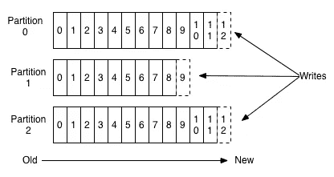
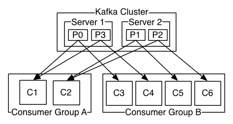

# Apache Kafka 系列(第 2 部分):分区、消费群和补偿管理

> 原文：<https://medium.com/codex/apache-kafka-series-part-2-partitions-consumer-group-and-offset-management-fbb08839edfa?source=collection_archive---------4----------------------->

在上一篇文章中，我们讨论了什么是 Apache Kafka，以及它如何帮助需要实时流事件的应用程序。如果你对此不熟悉，你可以去看看之前的文章。

在本系列的第二部分，我们将更深入地探讨阿帕奇卡夫卡的一些关键概念。这将有助于我们在较低的层次上更好地理解 Kafka，有了这些知识，我们可以以一种对我们的应用程序非常有益的方式来实现解决方案。

# 划分

在最后一部分中，我们简要介绍了一些主题，它们是可寻址的抽象，用于展示对特定数据流(一系列记录/消息)的兴趣，并且它由一些分区组成，这些分区是一系列顺序队列。

包含 3 个分区的主题

## 为什么我们需要分区？

我们之前已经创建了一个只有一个分区的主题，它满足了我们的目的。那么问题就来了:为什么还需要分区？

如果您的流量很大，以至于需要一个以上的应用程序实例，那么您必须对数据进行分区。对于下游应用程序，您的分区策略起到负载平衡的作用。生产者客户端决定将数据放入哪个主题分区，而决策逻辑由消费者应用程序对数据的操作驱动。

通过分区，我们还获得了以下好处:

*   多个消费者可以同时消费一个主题。单个代理可以支持的消费者数量是有限的，因为它服务于所有分区。多个代理的分区允许更多的消费者。
*   同一个消费者的多个实例可以连接到不同的代理分区，从而允许极高的消息吞吐量。一个分区将服务于每个消费者实例，确保每个记录都有一个明确的处理所有者。
*   在几个代理中，Kafka 保留了同一个分区的多个副本。复制品是这种重复拷贝的术语。如果一个代理失败了，Kafka 仍然可以向消费者提供失败的代理负责的分区的副本。

## 写入分区

默认情况下，Kafka 将以循环方式分配分区。这些记录将平均分布在给定主题的所有分区中。
但是，如果没有提供分区键，就不能保证分区内记录的排序。

因此，利用分区键将相关事件按照它们被发送的顺序分组到同一个分区似乎是一个更好的选择。

分区键允许生成器将消息定向到某个分区。可以从应用程序上下文中获得的任何值都可以用作分区键。合适的分区密钥是唯一的设备 ID 或用户 ID。
默认情况下，分区键通过散列函数传递，并创建分区分配。因此，用同一密钥制作的所有录像将到达同一分区。

如果键不是均匀分布的，基于键的分区会导致代理不平衡。这意味着，如果一个分区的键获得了几乎所有的流量，那么它的值将比另一个多得多。这就是为什么强烈建议确保密钥均匀分布的原因。

在某些情况下，生产者可以基于任何业务逻辑编写自己的分区实现，从而将消息相应地定向到正确的分区。

# 消费者群体

消费者组是消费者的集合，他们一起工作来消费关于特定主题的数据。所有主题的划分在组的消费者之间进行。

Kafka 的消费者群体允许它同时利用消息队列和发布-订阅架构。属于同一消费群的 Kafka 消费者共享一个群 id。然后，一个组中的消费者通过确保每个分区只由该组中的一个消费者使用，尽可能平均地在他们之间分配主题分区。

不同的使用者专门在一个使用者组中使用分区

由于消费者组的概念，一条消息只被消费者组中的一个消费者阅读。
当一个消费者群体消费一个主题的分区时，Kafka 确保每个分区正好被一个消费者消费。

## 它如何满足两种消息传递模型

如果所有的消费者都来自同一个组，Kafka 模型就像传统的消息队列一样工作。所有的记录和处理都是负载平衡的，每条消息只由组中的一个消费者使用。每个分区最多连接到一个组中的一个用户。

当存在多个消费者群体时，数据消费模型的流程与传统的发布-订阅模型一致。这些消息被广播给所有的消费者群体。

# 抵销管理

消息的偏移量充当消费者端的游标。通过跟踪消息的偏移量，使用者可以跟踪它已经消费了哪些消息。使用者将其光标移动到分区中的下一个偏移量，并在读取一条消息后继续。使用者负责推进并记住分区内的最新读取偏移量。

> “偏移量”是 Kafka 中的一种元数据，表示某个分区中消息的位置。分区中的每条消息都有自己唯一的偏移值，用整数表示。

卡夫卡坚持两种类型的抵消。

*   **当前偏移量**:当前偏移量是对 Kafka 已经提供给消费者的最近记录的引用。由于当前的偏移，消费者不会两次收到相同的记录。
*   **提交的偏移量**:提交的偏移量是一个指针，指向消费者已经成功处理的最后一条记录。我们使用提交的偏移量，以防应用程序失败或从事件流中的某个点重放。当谈到分区重新平衡时，提交的偏移量是至关重要的。如果有重新平衡的需要。

## 提交偏移量

当组中的使用者从协调器分配的分区接收消息时，它必须提交与读取的消息对应的偏移量。如果一个用户崩溃或关闭，它的分区将被重新分配给另一个成员，该成员将从以前提交的偏移量开始使用每个分区。如果消费者在提交偏移量之前失败，则接管其分区的消费者将使用重置策略。

提交偏移量有两种方式:

*   **自动提交**:默认情况下，消费者被配置为使用自动提交策略，该策略会定期触发提交。此功能通过设置两个属性来控制:

1.  *启用.自动提交*
2.  *auto.commit.interval.ms*

虽然自动提交是一个有用的功能，但它可能会导致处理重复的数据。

让我们看一个例子。

您在分区中收到了一些消息，并且您请求了您的第一次投票。因为您收到了十条消息，所以消费者将当前偏移量提高到十。你处理这十条信息，并在四秒钟内发起一个新的呼叫。因为五秒钟还没有过去，所以消费者不会提交偏移量。同样，您已经获得了一批新的记录，并且由于某种原因已经触发了重新平衡。已经处理了前十条记录，但是还没有提交任何内容。对吗？再平衡过程已经开始。因此，该分区被分配给不同的使用者。因为我们没有提交的偏移量，所以新的分区所有者应该从头开始读取，并重新处理前十个条目。

手动提交是这种特殊情况的解决方案。因此，我们可以关闭自动提交，并在处理完记录后手动提交。

*   **手动提交**:通过手动提交，您可以控制何时提交什么样的偏移量。您可以通过将 *enable.auto.commit* 属性设置为 *false* 来启用手动提交。

有两种方法可以实现手动提交:

1.  提交同步:同步提交方法简单可靠，但它是一种阻塞机制。它将在完成提交过程时暂停您的调用，如果有任何可恢复的错误，它将重试。Kafka 消费者 API 提供了一个预构建的方法。它的文档可以在这里找到。
2.  异步提交:如果使用异步提交，请求将被发送，进程将继续。缺点是 commitAsync 不会尝试重试。然而，这种行为是有正当理由的。

让我们看一个例子。

假设您正试图提交一个偏移量为 70。失败的原因是可以修复的，您希望几秒钟后再试一次。因为这是一个异步请求，所以您启动了另一个提交，而没有意识到之前的提交仍在等待。是时候承诺了——这次 100。提交-100 成功，但是提交-75 正在等待重试。现在我们该如何处理？因为你不想提交旧的偏移量。

这可能会导致问题。因此，他们创建了异步提交来避免重试。然而，这种行为是没有问题的，因为您知道如果一个提交由于可以恢复的原因而失败，那么下一个更高级别的提交将会成功。

Kafka Consumer API 也提供了这种提交方式，你可以在这里找到更多关于它的信息[。](https://kafka.apache.org/25/javadoc/org/apache/kafka/clients/consumer/KafkaConsumer.html#commitAsync--)

如果您想重放和处理过去某个时间点的记录，手动提交也很有用。要做到这一点，你实际上是在一个最近的偏移量上提交一个旧的偏移量。

# 结论

在这篇文章中，我们学习了一些关于阿帕奇卡夫卡的关键概念。有了它的理解，我们可以实现一个更加可扩展和健壮的 Kafka 模型，这不仅有助于我们的应用程序开发，而且还将提供更好的用户体验和更好的性能。

对于本文的范围来说，这就差不多完成了。在下一部分中，我们将研究 Apache Kafka 的安全性。

在那之前，干杯，再见！