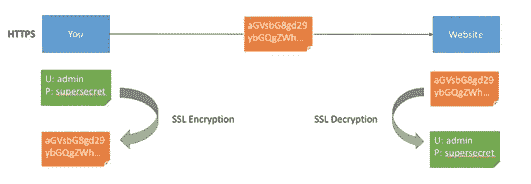
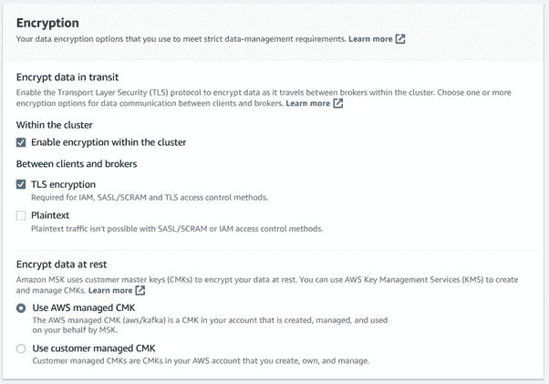
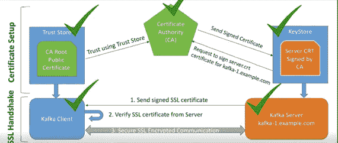
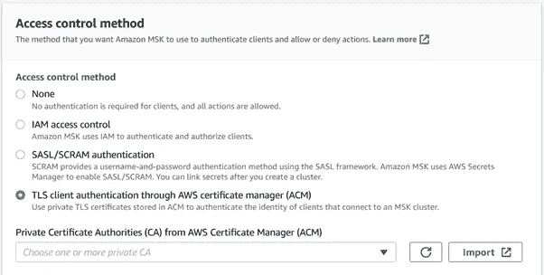
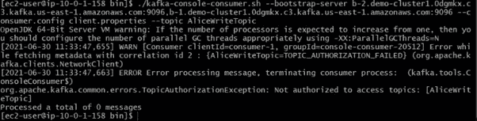
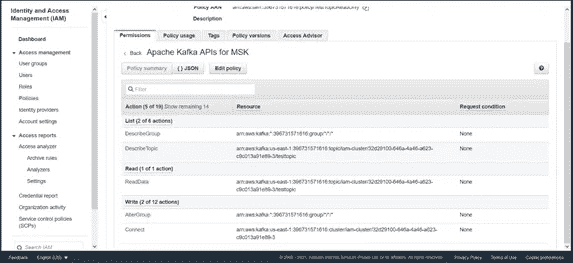

# Apache Kafka 系列[第 3 部分]:保护我们的 Kafka 集群

> 原文：<https://medium.com/codex/apache-kafka-series-part-3-securing-our-kafka-cluster-ba25ffcc5778?source=collection_archive---------3----------------------->

上一篇文章，我们看了阿帕奇卡夫卡的一些关键概念。我们在 Apache Kafka 中学习了分区和偏移管理。如果你不熟悉这些概念，你可以去看看[以前的文章](/@imanshumandubey/apache-kafka-series-part-2-partitions-consumer-group-and-offset-management-fbb08839edfa)。

在本系列的最后一部分，我们将看到 Apache Kafka 中的安全选项。我们还将研究如何决定何时使用哪个安全选项以及为什么使用。本文主要从 AWS MSK 的角度出发，关注一些具体的、广泛使用的安全选项。


卡夫卡安全性有三个部分:

1.  **SSL/TLS 加密**:这可以加密你的客户和 Kafka 之间的数据，以及经纪人对经纪人的通信。这是大家上网时遇到过的非常频繁的模式。
2.  **使用 SSL、SASL 或 IAM(特定于 MSK)进行认证**:这使您的生产者和消费者能够使用您的 Kafka 集群进行认证，确认他们的身份。这也是您的客户确认其身份的一种安全方法。
3.  **使用 ACL 或 IAM 策略进行授权(特定于 MSK)**:一旦您的客户端通过了身份验证，您的 Kafka 经纪人就可以将它们与 IAM 身份验证用户的访问控制列表(ACL)或 IAM 策略进行比较，以查看他们是否被允许对给定主题进行读写操作。

## 加密

Kafka 使用 TLS 加密，这是最常用的加密方法，广泛使用的例子是网络 HTTPS。



网络加密

因为 Kafka 中的加密选项很少，所以使用标准配置，包括分别在 *server.properties* 和 *client.properties* 中声明信任库和密钥库及其对应的密钥。

示例配置如下所示:

```
#security.protocol=SSL
#ssl.truststore.location=/tmp/kafka_2.12/kafka.client.truststore.jks
#ssl.keystore.location=/tmp/kafka_2.12/kafka.client.keystore.jks
#ssl.keystore.password=Your-Store-Pass
#ssl.key.password=Your-Key-Pass
```

**MSK 具体**

你可以使用亚马逊 MSK 的数据加密功能来满足严格的数据管理需求。亚马逊 MSK 使用的加密证书必须每 13 个月更新一次。对于所有集群，亚马逊 MSK 会自动更新这些认证。当它开始证书更新操作时，会将群集的状态设置为维护。更新完成后，它会将其恢复为活动状态。当集群处于维护状态时，您可以继续生成和使用数据，但不能更新数据。

这可以在集群创建期间使用以下部分进行配置:



MSK 集群创建加密配置

*   **静态加密** : AWS 密钥管理服务(KMS)与亚马逊 MSK 接口，提供透明的服务器端加密。在休息时，亚马逊 MSK 加密你所有的数据。您可以选择 AWS KMS 客户主密钥(CMK ),亚马逊 MSK 将在您构建 MSK 集群时使用它来加密您的静态数据。如果您不提供 CMK，亚马逊 MSK 将代表您创建并使用 AWS 管理的 CMK。有关 cmk 的更多信息，请参见《AWS 密钥管理服务开发人员指南》中的客户主密钥(cmk)。
*   **传输中的加密** : TLS 1.2 现在被亚马逊 MSK 使用。默认情况下，它会对 MSK 集群中代理之间传输的数据进行加密。创建集群时，可以覆盖此默认值。
    您必须在客户和经纪人之间的三种沟通方式中选择一种:
*   只允许 TLS 加密的数据。这是默认配置。
*   接受明文和 TLS 加密的数据。
*   只允许明文数据。

亚马逊 MSK 经纪人使用 AWS 证书管理器证书。因此，每个信任亚马逊信任服务的信任商店也信任亚马逊 MSK 经纪人的证书。

这里需要注意的重要一点是，启用加密会降低大约 30%的性能。但是，确切的百分比取决于集群和客户端的配置。

## 证明

在 Kafka 中实现身份验证有三种主要方式:

**卡夫卡原生:**

1.  **相互 TLS 认证**:在相互 TLS 认证中，服务器也在其信任库中验证客户端。它的工作方式如下:



关于 Apache Kafka 的加密工作流程

在服务器端和客户端都按照以下方式进行配置。

```
#security.protocol=SSL
#ssl.truststore.location=/tmp/kafka_2.12/kafka.client.truststore.jks
#ssl.keystore.location=/tmp/kafka_2.12/kafka.client.keystore.jks
#ssl.keystore.password=Your-Store-Pass
#ssl.key.password=Your-Key-Pass
```

在 MSK，使用下面的配置并提供一个证书颁发机构(CA)也可以做到这一点。



集群创建期间 TLS 身份验证的 MSK 配置

**注意**:不建议使用 TLS 认证，因为在这种情况下维护用户角色会很麻烦，因为访问规则是根据所提供证书的 CN(通用名称)存储的。

2.**SASL**:SASL 有很多方法可以使用，但最常用的是急停，我们也来看看，因为 MSK 也提供急停。在 SASL/SCRAM(简单认证和安全层/ Salted 挑战响应机制)认证中，用户凭证用于验证客户端的真实性。这些凭证被打乱并存储在 zookeeper 中。其配置如下所示:

```
sasl.mechanism**=**SCRAM-SHA-512
*# Configure SASL_SSL if SSL encryption is enabled, otherwise configure SASL_PLAINTEXT* security.protocol**=**SASL_SSL
sasl.jaas.config**=**org.apache.kafka.common.security.scram.ScramLoginModule required **\** username**=**”kafkaclient1" **\** password**=**”kafkaclient1-secret”;
```

您可以通过以下方式添加用户:

```
bin/kafka-configs — zookeeper localhost:2181 — alter — add-config ‘SCRAM-SHA-256=[iterations=8192,password=alice-secret],SCRAM-SHA-512=[password=alice-secret]’ — entity-type users — entity-name alice
```

在 AWS MSK 中，用户通过 AWS 机密进行管理，机密的名称必须采用格式 *AmazonMSK_*。*(其中通配符表示您的秘密名称)。

凭据以 json 格式存储，如下所示:

```
{
    "username": "alice",
    "password": "alice-secret"
}
```

然后，使用 AWS web 的 cli 或集群控制台将这些机密链接到集群。客户端配置与之前相同。有不同的方法可用于 SASL，但紧急停堆是最普遍的。你可以在这里阅读更多的方法。

**注意**:与 TLS 认证相比，这种方法要好得多，因为它支持加密以及易于管理的用户角色。但前提是你的动物园管理员在一个单独的 VPC 或通过其他方式是安全的。

**MSK 具体:**

3.IAM:Amazon MSK 的 IAM 访问控制允许您管理您的 MSK 集群的认证和授权。这消除了对两个独立的身份验证和授权机制的需求。例如，当一个客户端想要写入您的集群时，亚马逊 MSK 会使用 IAM 检查该客户端是否是一个经过身份验证的身份，是否被授权写入您的集群。

可以通过以下方式配置此类身份验证的客户端:

```
#ssl.truststore.location=<PATH_TO_TRUST_STORE_FILE>
#security.protocol=SASL_SSL
#sasl.mechanism=AWS_MSK_IAM
#sasl.jaas.config=software.amazon.msk.auth.iam.IAMLoginModule required awsProfileName=“your profile name”;
#sasl.client.callback.handler.class=software.amazon.msk.auth.iam.IAMClientCallbackHandler
```

配置中提供的回调处理程序和登录模块是 AWS 为 IAM 身份验证提供的 jar 的一部分。需要将下面的 jar 添加到类路径中，或者作为一个依赖项，以便可以在运行时找到这些类。

[https://github . com/AWS/AWS-MSK-iam-auth/releases/download/1 . 0 . 0/AWS-MSK-iam-auth-1 . 0 . 0-all . jar](https://github.com/aws/aws-msk-iam-auth/releases/download/1.0.0/aws-msk-iam-auth-1.0.0-all.jar)

默认情况下，IAM 用户和角色没有执行亚马逊 MSK API 操作的权限。IAM 管理员必须创建 IAM 策略，授予用户和角色在他们需要的指定资源上执行特定 API 操作的权限。然后，管理员必须将这些策略附加到需要这些权限的 IAM 用户或组。

**注意**:如果您的 Kafka 实现是在 AWS 上，那么这种方法是首选的，因为它确保一切都可以由 IAM 策略本身控制，并且它们易于配置。

## **授权:**

**ACL(访问控制列表)**:ACL 用于限制对经过身份验证的用户可以执行的不同操作的访问。ACL 只能与 Kafka 本机身份验证选项一起使用。

Apache Kafka 提供了一个可插拔的授权器，并提供了一个开箱即用的解决方案，将所有 ACL 存储在 Apache ZooKeeper 中。这个授权者是由亚马逊 MSK 在代理的 server.properties 文件中启用的。AclAuthorizer 是 Apache Kafka 版本 2.4.1 的授权者。SimpleAclAuthorizer 是 Apache Kafka 早期版本的默认设置..

Apache Kafka ACLs 具有以下格式。

> 主体 P 是[允许/拒绝]来自主机 H 的对匹配资源模式 RP 的任何资源 R 的操作 O

如果 RP 与特定的资源 R 不匹配，那么 R 没有关联的 ACL，因此除了超级用户之外，任何人都不允许访问 R。

以下命令是如何使用 kafka-acls 创建这些规则的示例:

```
$ kafka-acls.sh --authorizer-properties zookeeper.connect=z-1.demo-cluster1.0dgmkx.c3.kafka.us-east-1.amazonaws.com:2181,z-3.demo-cluster1.0dgmkx.c3.kafka.us-east-1.amazonaws.com:2181,z-2.demo-cluster1.0dgmkx.c3.kafka.us-east-1.amazonaws.com:2181 --add --allow-principal "User:bob" --operation Read --topic AnyTopic
```

当未经授权的资源试图访问任何内容时，会引发如下错误:



未经授权的例外

更多关于 ACL 的信息可以在[这里](https://docs.confluent.io/platform/current/kafka/authorization.html)找到。

**IAM 策略(特定于 MSK)**:IAM 策略代替 ACL 用于 IAM 认证。您描述在授权策略中允许或拒绝角色的哪些操作。如果您的客户机使用 Amazon EC2 实例，将授权策略链接到 Amazon EC2 实例的 IAM 角色。或者，您可以设置您的客户机使用一个指定的概要文件，然后将授权策略链接到那个指定的概要文件。

这些策略由动作和资源元素控制。

MSK 策略如下所示:



MSK IAM 政策的一个例子

可以使用基于 web 的复选框或编辑策略 json 本身来添加这些策略。基于 MSK 的策略的格式如下所示:

```
{
    "Version": "2012-10-17",
    "Statement": [
        {
            "Effect": "Allow",
            "Action": [
                "kafka-cluster:Connect",
                "kafka-cluster:AlterCluster",
                "kafka-cluster:DescribeCluster"
            ],
            "Resource": [
                "arn:aws:kafka:us-east-1:0123456789012:cluster/MyTestCluster/abcd1234-0123-abcd-5678-1234abcd-1"
            ]
        },
        {
            "Effect": "Allow",
            "Action": [
                "kafka-cluster:*Topic*",
                "kafka-cluster:WriteData",
                "kafka-cluster:ReadData"
            ],
            "Resource": [
                "arn:aws:kafka:us-east-1:0123456789012:topic/MyTestCluster/*"
            ]
        },
        {
            "Effect": "Allow",
            "Action": [
                "kafka-cluster:AlterGroup",
                "kafka-cluster:DescribeGroup"
            ],
            "Resource": [
                "arn:aws:kafka:us-east-1:0123456789012:group/MyTestCluster/*"
            ]
        }
    ]
}
```

## 结论

在本文中，我们研究了如何使用最常用和最广泛使用的方法来保护我们的 Kafka 集群，以及根据我们的需求，什么是我们的最佳选择。

有了这篇文章，这个系列就完成了。您现在对 Apache Kafka 有了深刻的理解，可以使用所学知识从非常基础的水平到高级水平的使用开始。

谢谢你陪我忍受这一长串；)

祝你好运，再见！