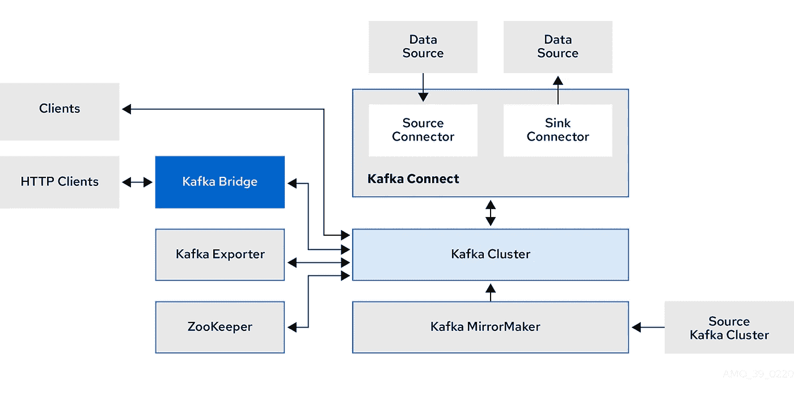
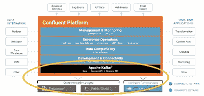
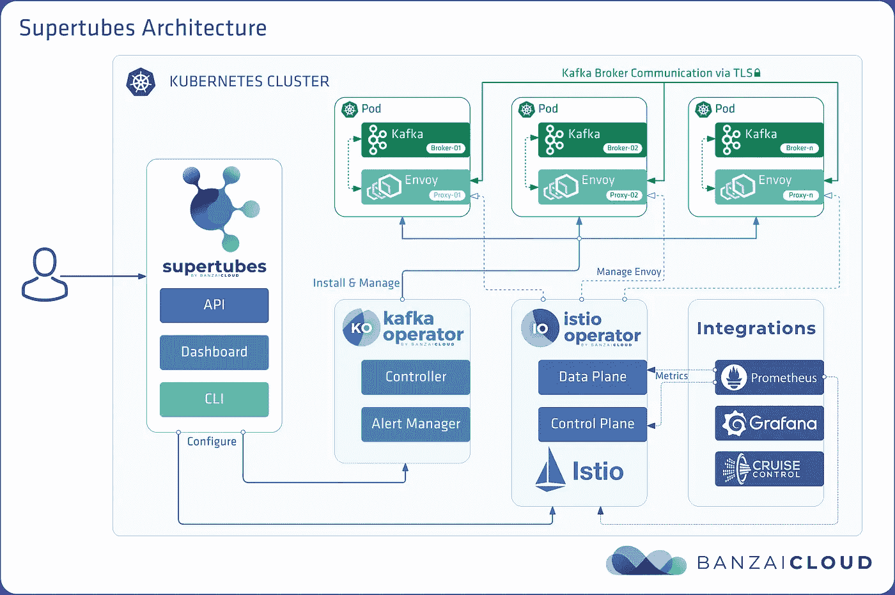

# 实践中的 Kafka 部署选项

> 原文：<https://medium.com/codex/apache-kafka-several-deployment-options-in-practice-4061db14d3d8?source=collection_archive---------2----------------------->

## [法典](http://medium.com/codex)

在这篇文章中，我将尝试为你提供一些选项，让你对真实项目中的人们如何使用卡夫卡有一个大致的了解。顺便说一句，如果你想简单地下载 Zookeeper 和 Broker，安装到一台机器上，像我一样运行一些“hello world ”,然后下一步你可以做的是尝试在几台机器上运行不同的实例，甚至更高级一点，使用 Docker。你会遇到一些挑战，但至少会获得一些实践经验，成为卡夫卡的初学者。

在一个真实的项目中，许多因素将决定 Kafka 应该如何部署。例如，它可以是您的项目基础设施所依赖的云平台，也可以是像 Kubernetes 这样的容器编排系统。在这篇文章中，我将列出几个实用的选项，一般来说，可以用于实际项目。

**斯特里姆齐——库伯内特斯上的阿帕奇卡夫卡**

我将解释 Strimzi 是如何进入画面的，以及与阿帕奇卡夫卡相比，从特性的角度提供了什么。

简而言之，Strimzi 有助于将您的“Hello world”系统迁移到 Kubernetes 平台(或 open shift—Kubernetes 的企业版)。如果没有 Strimzi，没有任何之前使用 Kubernetes 的实践经验，您需要使用 Kubernetes 做另一个“Hello world”练习，尽管我认为这样的练习是不够的。然后，没有 Strimzi，有了一些 Kubernetes 的经验，你开始自己做，解决任何问题。就我而言，在问题不断出现后，我通常会在这一步放弃。

假设您已经对 Kubernetes 中的一些概念有了大致的了解，您可以想象如何在 Kubernetes 的“机器”(pod、container、btw)上运行一个应用程序，并且可以自己完成，但不会那么顺利，因为您不是每天都这样做。然后 Strimzi 的人会给你提供一些脚本来实现这一点。这些脚本确保你不会有任何愚蠢的问题，比如没有安装正确的 Java 版本，在 *zookeeper.properties* 或 *server.properties* 中缺少一些配置。你所要做的只是复制并粘贴 Strimzi 的“入门”页面上提供的命令，并在你当地的 Kubernetes 上享受你的“Hello world”卡夫卡。

依我看，与现有的卡夫卡概念相比，Strimzi 中的新事物是卡夫卡桥，如下图所示。

image src:[https://strim zi . io/docs/operators/latest/images/overview/Kafka-concepts-supporting-components . png](https://strimzi.io/docs/operators/latest/images/overview/kafka-concepts-supporting-components.png)

不知道向/从 Kafka 集群发布/订阅消息使用的是哪种协议(可能是 TCP？).但是我很确定它不是宁静的。对于微服务架构，其中微服务通常通过 REST APIs 进行通信，Kafka bridge 似乎是拼图中缺少的一块。尤其是在 Kubernetes 上，通过除 HTTP/HTTPS 之外的任何协议来公开服务并不总是更好的选择。如果你不是团队中负责 Kafka 集群并使用 Kafka 开发一些应用程序的人，而不是使用一些库来发布/订阅来自 Kafka 的消息，那么你只需调用 Kafka bridge 公开的 API 即可。难道不值得一试吗？我想是的。

**汇流的卡夫卡**

我提到 Confluent 是因为我最近在我的脸书页面上看到了它的广告，并阅读了他们写得很好的关于事件驱动架构的书。事实上，实际上有许多解决方案可以为您提供 Kafka 的云原生部署。甚至你可以用你当地的 Kubernetes 来做，随便你怎么命名。通常，您可以从任何解决方案中找到所有基本的 Kafka 功能。这些解决方案之间的区别在于它们在支持、成熟度和功能集方面的基本业务模型，这不是本文的重点。

我给你简单描述一下，然后如果你有兴趣，你可以去合流文档网站找到更多关于它的信息。在 Kafka 和 cloud 的上下文中，您可能会关注我概述的融合组件架构图的底部。

https://docs.confluent.io/_images/confluentPlatform.png[图片 src](https://docs.confluent.io/_images/confluentPlatform.png)

基本上，合流公司给你提供一个平台。该平台旨在帮助您在任何云平台或融合云上部署自己。它的(平台)核心是 Apache Kafka，这意味着它有其他顶层功能，这些功能包装了 Kafka 功能，并为不同的应用程序提供 API 或任何东西(或一般的接口)。在某种程度上，这些接口为这些应用程序的开发人员提供了一种工具，例如，可以是可理解的语法、简单的输入参数、有效的默认配置设置等等。从**理论**的角度来看，它是一个备份解决方案，因为 Apache Kafka 是它的核心，在最糟糕的情况下，如果那些外部应用程序需要目前不可用的东西，可以有一个变通办法，使应用程序能够直接访问其核心 Kafka。

目前，我这边的一些值得注意的特性/概念包括融合运算符，它利用 Kubernetes 运算符模式将 Kafka 作为后端服务进行有状态部署，融合 REST 代理。当我有机会玩它的时候，其他的可能会来。

**班仔云的卡夫卡**

我没有机会玩 Banzai Cloud Supertubes 工具，因为它对资源的要求很高。从其整体架构来看，我认为其思路与 Confluent 相同，即建立一个以 Kafka 为核心的系统，部署几个由基于 Kubernetes 的运营商安装和管理的组件，实现与 Prometheus for monitoring、Grafana for reporting 等流行系统的集成。这种集成增加了在团队的现有基础设施中采用 Banzai 架构的成功率。

https://banzaicloud.com/docs/supertubes/supertubes-arch.png[图片 src](https://banzaicloud.com/docs/supertubes/supertubes-arch.png)

**谷歌云发布会**

你不愿意了解 Kubernetes，或者像我一样，只是认为它是可以允许 CRUD container 的东西，只是想使用 Kafka，而不关心可伸缩性、健壮性、维护等等，那么你可能会看一眼 GCP。我提到 GCP 是因为我看到它提供的界面与卡夫卡提供的非常相似。然而，GCP 还通过 REST APIs 为订阅特性提供了一种推送机制以及批处理能力。不知道后端用不用卡夫卡。

从他们的 Python 库的源代码中，我看到任何请求都使用 gRPC 协议发送到 GCP 后端。

你呢，你在用什么系统或者知道什么系统？如果你能留下评论让我看看，我真的很感激。