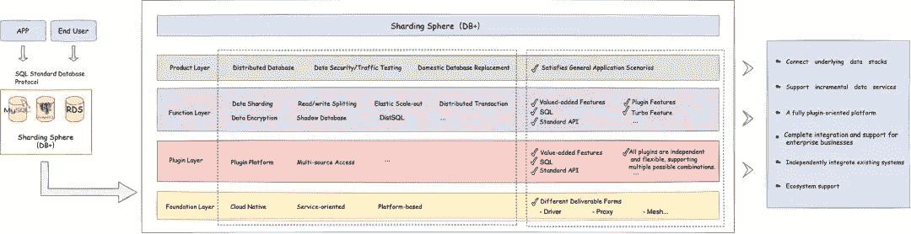
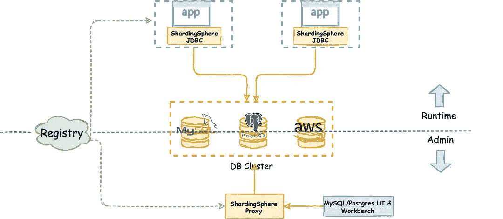
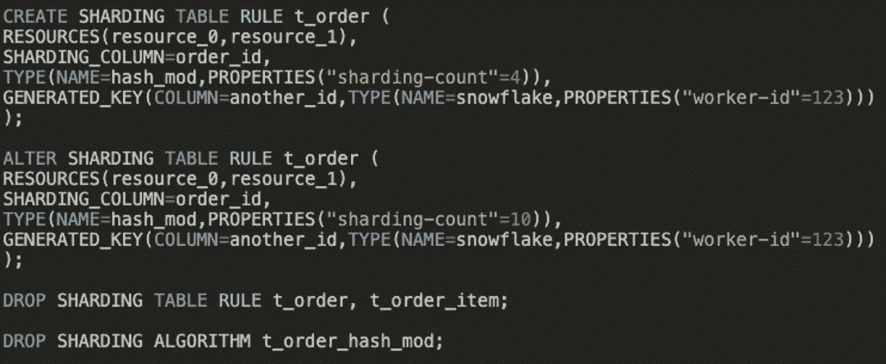
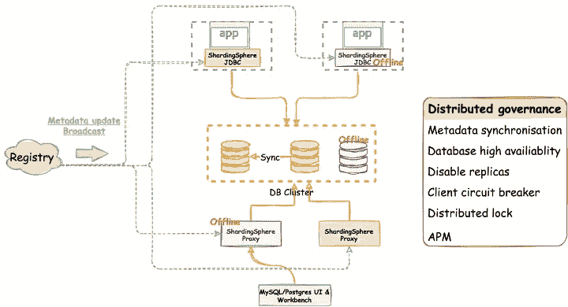
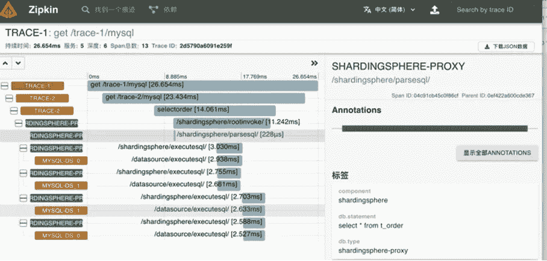
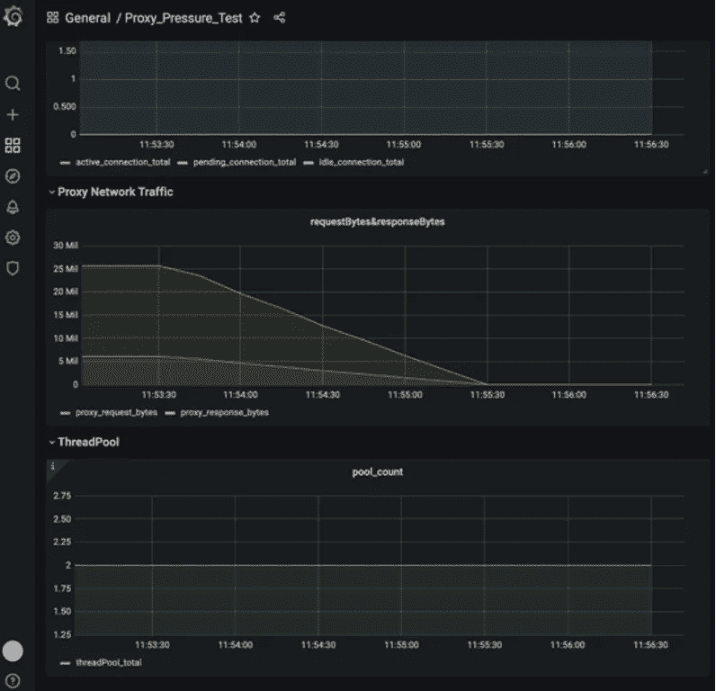
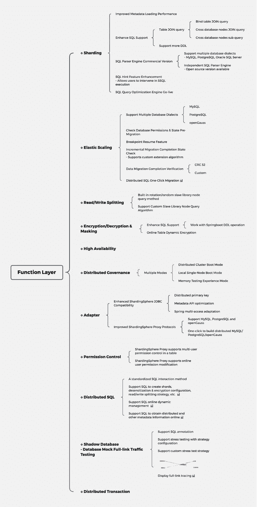

# Apache ShardingSphere 5.0.0 新特性:中间件到生态系统的演变

> 原文：<https://medium.com/codex/apache-shardingsphere-5-0-0-new-features-middleware-to-ecosystem-evolution-e69de00bfb1b?source=collection_archive---------5----------------------->

经过近两年的开发和 5.0.0-Alpha 和 5.0.0-Beta 版本的完善，Apache ShardingSphere 5.0.0 GA 版本终于将于 11 月发布。

巧合的是，11 月 10 日是 ShardingSphere 加入 Apache 软件基金会的三周年纪念日。ShardingSphere 核心团队一直在与社区一起努力工作，以满足这一特殊的截止日期，并发布 5.0.0 GA 版本，与更广泛的社区以及整个分布式数据库和安全生态系统一起庆祝三周年。

从版本 5.0.0 的早期开发阶段开始，ShardingSphere 开始脱离作为简单的分布式数据库中间件解决方案的行业定位。开发北极星一直是数据库加概念，这将允许 5.0.0 的新定位和未来版本的发展前景。

ShardingSphere 重新创建了分布式可插拔系统，连接了实际的用户实现场景，并为社区和数据库行业贡献了有价值的解决方案。

Database Plus 着手在碎片化数据库的基础服务之上构建一个标准层和一个生态系统层。为上层应用提供统一、标准化的数据库使用规范，尽可能降低业务因底层数据库碎片化而面临的挑战。为了链接数据库和应用程序，我们使用流量和数据呈现和解析，并为用户提供增强的核心功能，如分布式数据库、数据安全、数据库网关和压力测试。在这一概念的支持下，5.0.0 版 GA 带来了以下升级和优化:

# **架构层**

## 完成 Database Plus 的可插拔内核架构

*   **基础层:**提供多种接入终端和接入形式，灵活满足用户不同场景的需求。
*   **插件层:**作为可插拔的核心架构，提供基础设施支持。
*   **功能层:**提供多种满足用户需求的功能插件，让用户在插件选择和组合上有高度的灵活性。
*   **产品层:**为终端用户提供面向行业、面向特定场景的标准产品解决方案。

数据库加平台

## **多接入终端混合模式生产可用**

ShardingSphere JDBC 和 ShardingSphere Proxy 经过两年的打磨和测试，现已投入生产。很多社区用户提供了相关的生产社区案例，生产可行性得到了验证。

此外，SphereEx 利用了 ShardingSphere 生态系统，并将在 2022 年初基于 ShardingSphere 生态系统为 Cloud Native 提供 ShardingSphere Sidecar 访问终端 POC 版本(to do)。

通过共享核心架构和不同的 ShardingSphere 适配器，如果生产环境需要，用户还可以选择混合适配器部署(如下图所示)。

混合部署

## 使用 DistSQL 实现标准化集群管理

Apache ShardingSphere 最早提出 DistSQL(分布式 SQL)这种独特的 SQL 方言，将 ShardingSphere 生态系统的所有元素连接在一起。作为 ShardingSphere 分布式数据库生态系统的标准交互语言，DistSQL 允许用户使用一个 SQL 命令来创建、修改或删除分布式数据库表，或者对其进行加密或解密。DistSQL 还支持分布式调度管理。

DistSQL

## 显著改进的分布式治理能力

在计算和存储分离的 ShardingSphere 生态系统中，新版本中的功能得到了极大的增强，包括:数据库(即存储节点)和代理/JDBC(即计算节点)的分布式治理，在线用户元数据 DDL 更改，开/关运行的存储节点和计算节点，断路器和禁用，以及高可用性。此外，新特性分布式锁也将很快发布。

## 全面升级的 APM 和监控显示功能

在新版本中，我们优化并添加了更多的运行时状态指示器来监控 ShardingSphere。通过代理动态加载机制，我们为用户提供了各种指标和跟踪，方便了 APM 系统与 Grafana 仪表板的集成。

# **功能层**

ShardingSphere 功能层

在未来，社区将继续优化 ShardingSphere，并整合新的想法和行业场景，同时始终听取用户的反馈。同时，ShardingSphere 社区的核心团队成员愿意指导任何对开源感兴趣的人，并为对开源感兴趣的学生提供更多实践“问题”。我们也希望新的朋友或贡献者加入社区，促进思想交流，创建一个真正的全球开发者社区。

## Apache ShardingSphere 的第一次开发会议

由 Apache ShardingSphere 主办的 Apache ShardingSphere Dev Meetup 将于 11 月 13 日在北京海淀区中关村大街 32 号智能制造创新中心举行。

活动主题是“为了一个开放、创新和包容的生态系统:Apache ShardingSphere 5.0 新版本发布”。在 meetup 上，演讲者将分享更多关于新的 Apache ShardingSphere 5.0.0 GA 版本的特性。

顶级 Apache 开源项目 Apache APISIX、Apache SkyWalking 将共同宣布他们与 Apache ShardingSphere 的最新合作项目。

## **作者:**

胡安·潘|特里斯塔

Sphere Ex 联合创始人兼首席技术官；阿帕奇成员；Apache ShardingSphere PMC，Apache brpc(孵化)& Apache AGE(孵化)导师；中国木兰开源社区导师。

她曾负责京东数码科技智能数据库平台的设计和开发。她现在专注于分布式数据库和中间件生态系统以及开源社区。“2020 中国开源先锋”奖和“2021 奥斯卡 2021 顶级开源先锋”的获得者。

## **链接:**

***生物:***[https://tris zero . github . io](https://tristazero.github.io/)

***领英:***[https://www.linkedin.com/in/panjuan](https://www.linkedin.com/in/panjuan)

***GitHub:***[https://github.com/tristaZero](https://github.com/tristaZero)

***推特:***[https://twitter.com/tristaZero](https://twitter.com/tristaZero)

## **开源项目链接:**

***sharding sphere Github:****[https://github.com/apache/shardingsphere](https://github.com/apache/shardingsphere)*

****ShardingSphere 推特:****[https://twitter.com/ShardingSphere](https://twitter.com/ShardingSphere)**

*****ShardingSphere Slack 频道:***[https://join . Slack . com/t/Apache sharding sphere/shared _ invite/ZT-sbd de 7 ie-sjdqo 9 ~ I 4 rycr 18 bq 0 sytg](https://join.slack.com/t/apacheshardingsphere/shared_invite/zt-sbdde7ie-SjDqo9~I4rYcR18bq0SYTg)**