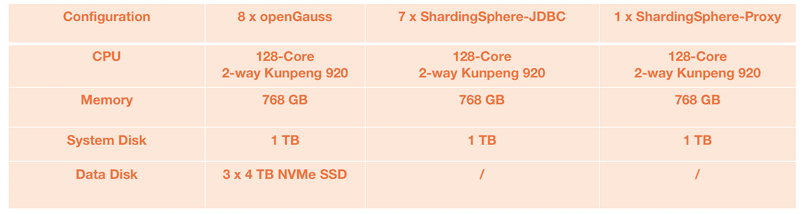
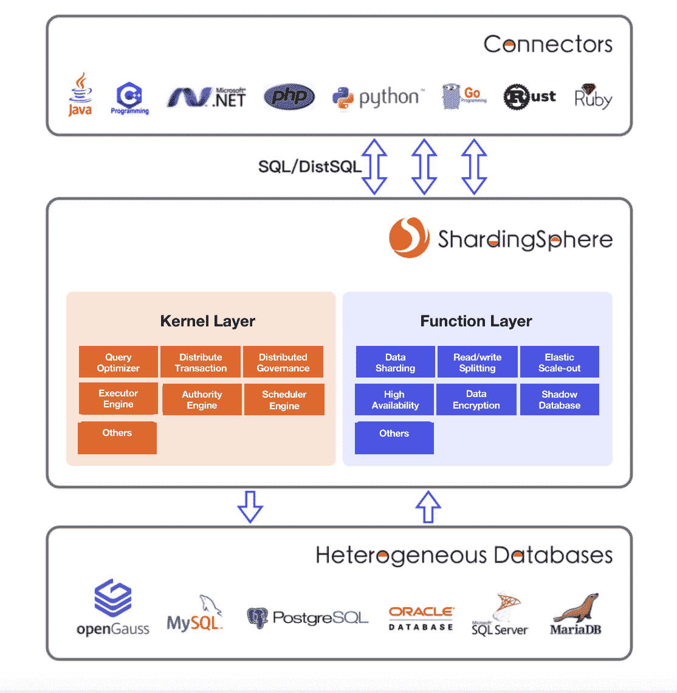
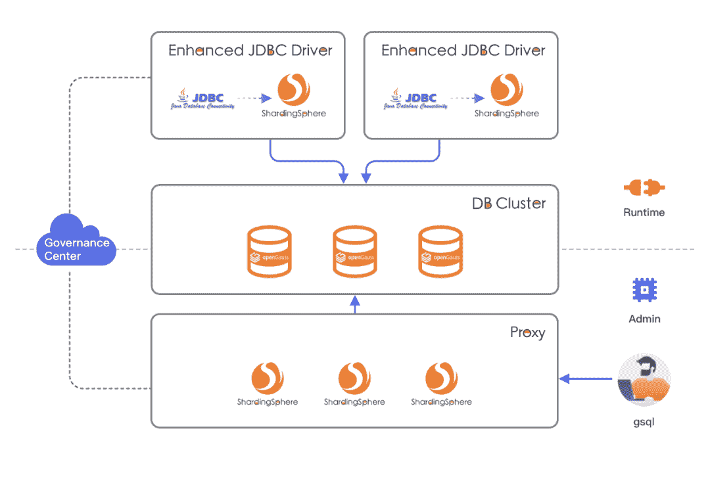

# Apache ShardingSphere & openGauss:以 1000 万 tpmC 打破分布式数据库性能记录

> 原文：<https://medium.com/codex/apache-shardingsphere-opengauss-breaking-the-distributed-database-performance-record-with-10-b8ced05daa37?source=collection_archive---------12----------------------->

我们的开源社区已经与[华为](https://support.huaweicloud.com/intl/en-us/productdesc-opengauss/opengauss_01_0002.html)的 openGauss 合作，用 [Apache ShardingSphere](https://shardingsphere.apache.org/) 和 [openGauss](https://opengauss.org/en/) 构建了一个分布式解决方案。

我们在 16 台服务器上与 openGauss 一起测试了一个多小时的性能。结果非常好:我们的联合解决方案打破了单台机器的性能瓶颈，基准测试结果为平均每分钟 1000 万个事务(tpmC)。

# **突破 1000 万 tpmC 大关**

在这个测试中，openGauss 社区在 [BenchmarkSQL 5.0](https://www.postgresql.org/message-id/CAGBW59f9q2Y4v-B3D8gje3xUsWz2Z-WaK9wYx4%3DhCY1zN%3D7%2BBQ%40mail.gmail.com) 上运行了这个 TPC-C 测试，这是一个流行的 TPC/C OLTP 数据库基准的开源实现。

单机性能方面，带 ShardingSphere 的 openGauss 打破了多核 CPU 的极限:双向 128 核华为鲲鹏达到 150 万 tpmC，内存优化表(MOT)引擎达到 350 万 tpmC。

这些都是很好的结果，但是我们还没有完成。我们将永远不会停止对更好的数据库性能的挑战，特别是在当今的大数据场景和他们对顶级数据库性能的渴望中。

在这种情况下，openGauss 团队使用 7 台机器运行适应 [ShardingSphere-JDBC](https://shardingsphere.apache.org/document/current/en/overview/#shardingsphere-jdbc) 的 BenchmarkSQL，连接 8 个 openGauss 数据库，部署 1 个 [ShardingSphere-Proxy](https://shardingsphere.apache.org/document/current/en/overview/#shardingsphere-jdbc) 用于数据初始化、一致性验证和其他维护操作。

得益于其数据库分片功能，ShardingSphere 能够在 8 个 openGauss 节点上分布总共 8，000 个数据仓(超过 800 GB)。经过 1 个多小时的测试，不仅分片非常完美，而且平均结果也超过了 1000 万 tpmC，这是该规模中最好的行业性能。

# **sharding sphere&open gauss:建立生态系统合作**

自 2021 年以来，Apache ShardingSphere 社区一直与 openGauss 社区密切合作。

面对业务场景的多样化和数据量的膨胀，将数据集中存储到单个节点的传统解决方案已经无法满足性能、可用性和可承受的运营成本方面的需求。

数据库分片可以解决独立数据库的性能、可用性以及单点备份和恢复问题，但它也使分布式体系结构变得更加复杂。

作为 Database Plus 概念的支持者，Apache ShardingSphere 的目标是在异构数据库之上构建一个标准和生态系统，并通过分片、弹性伸缩、加密特性等增强生态系统。置于数据库之上，ShardingSphere 专注于数据库的协作方式，以合理充分地利用数据库计算和存储能力。

目前 Apache ShardingSphere 拥有一个微内核加面向插件的架构模型，并在此基础上继续改进其内核和功能的能力，以提供越来越灵活的解决方案。

得益于其可插拔架构的设计理念，ShardingSphere 无需额外改动即可支持 openGauss，只需根据每个 ShardingSphere 模块提供的 SPI 扩展点增加相应 openGauss 数据库的实现即可。

通过将 openGauss 强大的独立性能与 Apache ShardingSphere 生态系统提供的分布式功能相结合，我们的两个社区合作创建了一个适用于高并发在线事务处理(OLTP)场景的分布式数据库解决方案。

# **使用 ShardingSphere 构建基于 openGauss 的分布式数据库解决方案**

Apache ShardingSphere 包括许多特性，如数据库分片、读/写分割、数据加密和影子数据库。这些功能可以单独使用，也可以组合使用。

目前，ShardingSphere 为用户提供了两种访问方式，即 ShardingSphere-JDBC 和 ShardingSphere-Proxy。

ShardingSphere-JDBC 可以轻松透明地在数据库上执行分片和读/写拆分等操作，同时满足高并发和低延迟需求。

部署 ShardingSphere-Proxy 是为了在代理级别添加一些数据库功能和操作，使用户能够像操作原生数据库一样操作 ShardingSphere，从而获得更好的用户体验。

ShardingSphere-JDBC 和 ShardingSphere-Proxy 可以一起部署。我们建议使用这种混合部署，以便使系统用户友好，性能更好。

从 openGauss 系统的角度来看，Apache ShardingSphere 可以对数据库进行水平分片，从而大大增强计算和存储能力以及数据库性能。

这意味着它可以有效地解决单个表中数据量增加所带来的问题，并可以与业务数据流相结合，以灵活、平滑地横向扩展数据节点，智能地拆分读取和写入，并实现分布式数据库的自动负载平衡。

# 结论

Apache ShardingSphere 和 openGauss 可以寻求潜在的合作机会。

考虑到日益多样化的应用场景和不断增长的数据量，对数据库性能的要求达到了前所未有的高度，并且在未来只会继续增加。

我们两个社区合作的成功仅仅是我们两个社区建立协作数据库生态系统的开始。

**💡关于 openGauss**

openGauss 是一个开源的关系数据库管理系统。具有多核高性能、全链路安全、智能运营等企业级特性。

它融合了华为在数据库领域多年的内核开发经验，在架构、事务、存储引擎、优化器、ARM 架构等方面进行了适配和优化。

**💡关于 TPC-C**

事务处理性能委员会基准 C 或 TPC-C 是用于比较在线事务处理(OLTP)系统性能的基准。它是由事务处理性能委员会(TPC)于 1992 年发布的。最新的更新是 2010 年发布的 TPC-C v5.11。

TPC-C 混合了五个不同类型和复杂性的并发事务，要么在线执行，要么排队等待延迟执行。该数据库由九种类型的表组成，记录和人口规模各不相同。

TPC-C 以每分钟事务数(tpmC)来衡量。虽然基准描述了批发供应商的活动，但 TPC-C 并不局限于任何特定业务部门的活动，而是代表了必须管理、销售或分销产品或服务的任何行业。

# Apache ShardingSphere 项目链接:

[ShardingSphere Github](https://github.com/apache/shardingsphere/issues?page=1&q=is%3Aopen+is%3Aissue+label%3A%22project%3A+OpenForce+2022%22)

[ShardingSphere Twitter](https://twitter.com/ShardingSphere)

[切割球松弛度](https://join.slack.com/t/apacheshardingsphere/shared_invite/zt-sbdde7ie-SjDqo9~I4rYcR18bq0SYTg)

[投稿指南](https://shardingsphere.apache.org/community/cn/contribute/)