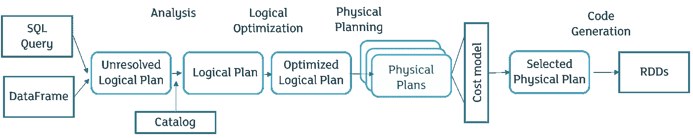

# Apache Spark 优化技术和调优

> 原文：<https://medium.com/codex/apache-spark-optimization-techniques-and-tuning-52cc446c07f5?source=collection_archive---------1----------------------->

# **简介**

众所周知，数据是新的石油。数据呈指数级增长；随着时间的推移，数据分析和客户预测方法一直在变化，现在有些技术已经过时，有些技术即将过时。大多数组织都在向微服务和大数据处理和处理机制发展。

架构正朝着快速可靠的技术和工具发展。在开始优化技术和 Spark 架构之前，让我们了解什么是大数据，以及 Apache spark 与大数据的关系。

# 大数据

传统工具和技术无法存储和处理的大量数据的集合被称为大数据。

谷歌迈出了解决这个问题的第一步。他们在 2006 年发布了一个框架，命名为 [*Hadoop*](https://hadoop.apache.org/) ，后来捐赠给了阿帕奇基金会。该框架使用 map-reduce 编程范式，能够分别存储和处理大量数据(HDFS)和(蜂巢、猪等)。但是，由于 Hadoop 运行在商用硬件上，大多数处理都是在存储级别完成的，这最终会增加读写操作，从而导致更多的处理时间。这个后来被阿帕奇 Spark 解决了。

# 阿帕奇火花

Apache Spark 是一个用于大规模数据处理的统一分析引擎。你可以把它想象成一个处理引擎，与 Hadoop 相比，它可以更快地处理你的数据(无论大小)。

# 是什么让阿帕奇火花更快

## 1.内存计算

Spark 将大部分内容存储在 RAM 中，这减少了磁盘 IO。类似的处理在其他技术中需要更多的时间。

## 2.懒惰评估

一旦一个语句被执行，Spark 就创建一个 RDD 的 DAG(有向无环图)。只有当一个动作语句被执行时，处理才开始。我们将在 spark 架构中看到这一点。

让我们举一个例子，惰性评估会影响执行时间和处理时间。

假设我们有一个包含考试分数的表，我们需要过滤掉分数在 90%以上和 91%以下的学生(学生人数大约为 1000 万)。

然后我们写一个这样的代码。

*df = spark . read . parquet(" some location ")
df = df . filter((col(marks)>90)&(col(marks)<91)
df . show()*

一个传统的工具首先试图读取所有的数据，将其存储在某个位置然后根据条件过滤出来并显示数据，而 Spark 会取满足上述条件的记录，然后开始其他操作。

## Apache Spark 架构(用简单的语言)

Spark 基于主从架构，其中在连接到集群管理器的主节点上将有一个驱动程序，集群管理器将任务分配给工作器。接下来，任务的执行完成，工作者将结果发送到主节点。

# 优点和局限性

尽管有很多好处，Spark 仍然有一些局限性。让我们一个一个来看。

## 利益

1.  内存计算——这意味着更少的 IO、更少的执行和处理时间。
2.  容错-基本数据结构是 RDD(弹性分布式数据集)。一旦将程序提交给驱动程序，DAG 调度程序就会在工作线程上调度作业和任务。如果在某个时刻，任何 RDD 变换/操作失败，则调度器检查 DAG，并且它可以再次重新处理失败的 RDD。
3.  实时流处理——使用 Spark 流，我们可以轻松处理流数据。在数据帧添加到 Spark 流之后，它变得非常好用。
4.  多语言支持——我们可以用 Python、Java、Scala 和 r 编写 spark 代码。
5.  兼容 Hadoop 和各种对象存储。

**限制**

1.  没有文件管理系统 Spark 没有提供文件系统，我们需要将数据存储在 hdfs/s3/local 文件系统中。
2.  实时数据处理——尽管 Spark 提供了一个流特性，但它在内部将数据转换为分区，将分区转换为微批处理，并一次处理一个微批处理。所以没有实时处理。
3.  昂贵——因为主存储(RAM)总是比辅助存储(硬盘)昂贵，并且 Spark 在主存储器中完成大部分操作，所以这是一个昂贵的工具。
4.  内存不足问题——有时，您的数据消耗的内存比可用的 RAM 多，在这种情况下，就会出现内存不足问题。

尽管存在这些问题，但有一些技术可以减少处理时间和内存问题。我会试着在博客中列出一些我知道并实现的。

# 优化技术

1.  **尽早过滤数据**:这是我们在数据处理中可以运用的最有效、最简单的技术。我们可以应用两种类型的过滤。
    *a .列级过滤*——只选择那些需要进一步处理和执行的列。
    示例:df.select (col("col1 ")，col("col2 ")，col("col3 ")，col(" col 4 ")
    *b .行级过滤*:过滤掉不需要进一步处理的数据。
    Example-df . filter(some condition)
    当你尽可能早地过滤掉数据，那么有效地处理数据所花费的时间就更少，最终导致处理时间更少。
2.  **文件格式选择:**文件格式对处理时间起着重要的作用。由于读取时间和写入时间也计算在处理中，我们需要在选择文件格式时记住这些指针。
    我*。* ***拼花***——拼花是一种柱状格式。将拼花作为一种文件格式的好处是——它占用的空间更少:拼花存储提供了更好的汇总数据，并遵循特定类型的编码。Parquet 支持压缩——比如 snappy、gzip、lzo。Parquet 的限制:当我们试图从 Parquet 中读取一个记录时，这是一个开销很大的操作，因为这是一个列文件格式。与 Avro 等其他二进制文件格式相比，编写一个 Parquet 文件需要更多的时间。
    二。 **Avro** — Apache Avro 是一个语言中立的数据序列化系统。Avro 有一个基于模式的系统。Avro 有两个组成部分:a)二进制数据:数据以二进制格式存储，并用 Avro 模式序列化数据。b)Avro 模式是 json 格式的字符串/文件，用于序列化/反序列化数据。
    三。**CSV/TSV/分隔文件** —数据以明文和表格格式存储。**优点** -这种文件格式是人类可读的，可能在标题中包含列信息。数据解析非常简单，因为 CSV 可以被视为 2D 数组。**限制** -需要更多存储空间来存储数据(最高)。结构和数组数据类型的实现可能有点麻烦，因为它不太支持特殊字符，不支持列类型，而且文本列和数字列之间没有区别。
    四**。JSON/XML**——这些是以键值模式表示的半结构化数据文件类型。JSON 现在被更广泛地使用，因为它比 XML 使用更少的内存。**优势** - JSON 支持复杂的数据结构。用 JSON 处理数据非常简单，因为 JSON 解析器在所有主流编程语言中都可用。
3.  **API 选择-** Spark 提供了三种类型的 API 来处理数据，即 RDD(弹性分布式数据集)、数据帧和数据集。为了获得最佳性能，我们应该通过观察用例来使用上述三个 API。
    1。**RDD**——RDD 是 Spark 工作的基本数据结构。当用例要求低层次的计算和操作，如文本提取时，这将是有用的。Spark 中没有默认提供的优化，因此我们必须非常精确地应用逻辑并自行优化代码。这里的数据过滤在早期阶段是非常重要的。
    2。 **DataFrame -** 你可以把数据帧想象成一个 SQL 表或者二维数组，能够存储复杂的数据类型，比如结构/数组。对于我们必须处理表格数据的用例，这是最好的选择。DataFrame 使用 catalyst 优化器创建查询计划，并有一个优化流程，即分析- >逻辑优化计划- >物理计划- >代码生成(如下图所示)。
    3。数据集是高度类型安全的，并使用编码器作为其序列化的一部分。他们还使用钨作为二进制格式的串行器。因为数据集是类型安全的，所以您需要在使用数据之前定义一个模式。使用数据集的主要优点是编译时错误分析和数据类型修正，这样，在数据读取/转换时，您就不会面临数据类型的问题。与数据帧相比，它需要更少的内存。因此，在我们必须坚持使用模式，而不想在阅读时生成模式的用例中，我们应该选择数据集。

催化剂优化器

5.**提前变量的使用-** Spark 提供两个提前变量:累加器和广播变量。
累加器是仅通过关联操作“添加”到 Spark 的变量，因此可以有效地并行支持。它们可以用来实现计数器(作为 Hadoop 中的计数器)。
广播变量是在作业/程序执行时存储在集群中每个节点的变量。同时处理大数据和小数据可以节省大量时间。它将小数据集发送到所有节点，因此 Jon 在执行作业时花费的时间更少。

6.**使用 Coalesce/Repartition 的并行性** -并行性是大数据中数据处理的核心。当您在 Spark 上的 console/submit 中创建代码时，它会创建一个操作符图。当我们调用 action 时，这个操作符图被提交给 DAG 调度程序。DAG 调度程序将操作员分成不同的任务阶段。一个阶段包含一个基于数据分区数量的任务。这些阶段将被传递给任务调度程序。通过集群管理器，这些任务在工作节点(执行器)上执行。玩分区是一把**双刃剑**，因为当我们增加代码中的分区数量时，执行器级别的并行性会增加，但与此同时，执行器会将其执行结果传递给驱动节点。然后，驱动程序节点需要组合所有结果，这又需要时间，这会影响执行的总体时间。所以要小心玩转排比。

7.**数据串行化-** 串行化有助于将对象转换成字节流，反之亦然。当我们进行任何类型的计算时，我们的数据都会被转换成字节并通过网络传输。如果通过网络传输的数据越少，作业执行所需的时间就越少。Spark 提供了两种类型的序列化。

1.  **Java 序列化**——Object output stream 在 spark 中序列化对象。由 java.io.Externalizable 控制的序列化的性能很灵活，但非常慢。相反，我们可以使用 Kyro 序列化。
2.  Kyro 序列化是一个快速高效的 Java 二进制对象图序列化框架。它对字段使用直接字节码级别的访问。要使用 Kyro，首先我们需要注册一个类。否则，它将从 50 多个默认类别中选择。如果仍然没有找到任何类，那么它将选择 fieldserializer。Kyro 序列化比 Java 序列化快。你可以在这里 阅读关于连载 [*。
    登记一个班级-
    -*。registerKryoClasses(Array(class of[employee]，class of[class])*
    在定义 spark session 时，我们需要将序列化设置为 kyro
    *spark _ session = spark session \
    。构建器\
    。config("spark.serializer "，" org . Apache . spark . serializer . kryoserializer ")\
    。config(" spark . kryo . registration required "，" false")\
    。appName("appname")\
    。主人('纱')\
    。getOrCreate()**](https://github.com/EsotericSoftware/kryo)

8.**缓存和解析** —正如我们所知，spark 有一个惰性评估，即它不会开始处理数据，直到一个动作被调用。每次调用一个动作，你的 RDD dag 就会被调用。每当这种情况发生时，所有的进程都会被调用，数据会从头开始处理。让我们举一个例子

我们有 2 个数据帧:DF1 和 DF2，通过连接它们我们得到 DF12 的结果，然后我们需要连接 DF12 和 DF3，得到结果数据帧 DF123。
所以如果我们运行下面的代码:

*df12=df1.join(df2，on =[df1[" some key "]= = df2[" some key "]，how = " inner ")
df12 . write . parquet(" some _ location _ 1 ")
df 123 = df12 . join(df3，on=["somekey"]，how = " inner ")
df12 . write . parquet(" some _ location _ 2 ")*

在这种情况下，首先调用 df12 操作，第 2 行和第 2 行将保存在 some_location_1，一旦调用 df123 操作和第 4 行，spark 将再次读取 df1 和 df2，并将连接此数据帧并计算已经计算的数据。因此，为了节省时间，我们可以使用 cache/persist 将 df12 保存在内存/磁盘上。所以，上面的程序可以这样写。

*df12=df1.join(df2，on =[df1[" some key "]= = df2[" some key "]，how = " inner ")* ***df12 . cache()*** *df12 . write . parquet(" some _ location _ 1 ")
df 123 = df12 . join(df3，on=["somekey"]，how = " inner))* 

**何时不使用缓存/持久化** -当数据的大小很大并且有多个 dfs 可用于缓存时。

9.**减少混洗操作**——混洗是 Spark 中开销最大的操作，因为它在网络和磁盘上移动数据。所以洗牌越少，你的操作执行时间就越少。由于现在我们大多使用 df，所以我不会建议你使用 reduceByKey 或 groupByKey。过一会儿我们将学会如何做那件事。
通过设置`**sparkSession.conf.set("spark.sql.shuffle.partitions",x),**` 我们可以启用洗牌分区。
理想情况下，每个分区的一个任务应该是 100-200 MB。

最佳结果的公式是
`spark.sql.shuffle.partitions` =(洗牌阶段输入大小/目标大小)/核心总数)*核心总数。

在 Spark 3.x 中，我们新增了一个自适应查询执行的特性。当**spark . SQL . adaptive . enabled**置为真并且**spark . SQL . adaptive . coalesce partitions . enabled**置为真时，那么洗牌分区的数量可以由 spark 动态更新。为了获得更好的效果，您可以在默认大小为 64mb 的**spark . SQL . adaptive . advisorypartitionsizeinbytes**附近玩。

10.**设置广播加入的限制** —当我们在 Spark 中广播一个表时，该表将被分发给所有工作人员，执行时间将会更短，但有一个默认值设置为 10MB。我们可以通过设置**spark . SQL . autobroadcastjointhreshold .**来增加

11.**SQL 执行时压缩数据-** 虽然这不会显著减少执行时间，但它将:a)防止内存不足问题，b)在执行时压缩数据。这可以通过将一个参数`**spark.sql.inMemoryColumnarStorage.compressed**`设置为真来轻松完成。

12.**内存和资源分配-** 当我们在集群或本地运行 Spark 作业时，最重要的事情是只为应用程序分配所需数量的内存和内核。如果操作不正确，您将无法并行运行作业，并且大多数作业将会失败。所以回到基础。

Spark 有驱动者、执行者和我们(我们的 spark 集群；可以是独立的)具有用于工作人员和驱动程序的内核和内存。让我们举一个例子来理解其中涉及的数学，然后我们将根据它来设置属性。
假设我们有 128 GB 内存和 32 个内核用于驱动程序(主节点), 64GB 内存和 16 个内核用于 4 个工作节点。因此，总内存为 384GB (4*64 +1*128)，总共有 96 个内核(16*4 + 1*32)。

现在，如果我们想要运行 200GB 的作业。假设数据计算会有一些分组和计数操作，所以驱动程序也需要一些内存。

每个节点的执行器数量=每个执行器 4 个
内存=每个执行器 15GB
内核=3 个
执行器总数= 15 个
驱动程序内存=20GB

现在让我们来看看计算。
每个节点的执行器数量将=15/4 ≈ 4，这意味着在 3 个工作线程上将产生 4 个执行器，在第 4 个节点上将产生 3 个执行器。
分配的总内存将=执行器的总数量*每个执行器的内存= 15*15= 225GB，这大于数据大小(开销和中间输出应分配一些内存)。

让我们看看 Spark 提交命令。我将使用 **pyspark 提交。**

> spark-submit—master local—conf "**spark . executor . cores = 45**"—conf "**spark . cores . max = 3**"—executor-memory**15g**—driver-memory**20g**—py-files " some _ py _ files " " python _ file _ to _ be _ executed . py "

# 结论

通过这篇文章，我们看到了 Spark 是如何帮助处理数据的。我们也看到了 spark 的局限性，然后我们了解了如何优化执行时间和空间管理。我希望这能对你在 Spark 上的工作有所帮助。如果我需要增加更多的分数，请告诉我。建设性的反馈总是令人感激的！