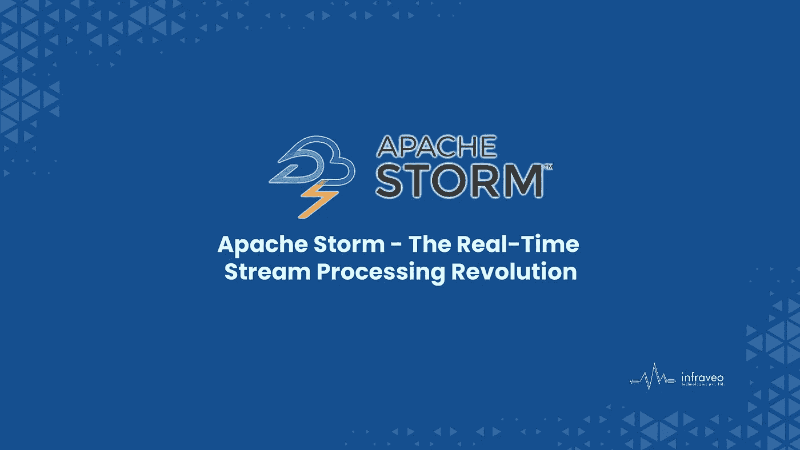

# Apache Storm:实时数据的天气 API

> 原文：<https://medium.com/codex/apache-storm-the-weather-api-for-real-time-data-80fd5c2d992e?source=collection_archive---------11----------------------->

## Apache Storm 是一个开源的分布式实时计算系统。

Apache Storm 使可靠地处理无限数据流变得容易，为实时处理做了 Hadoop 为批处理做的事情。Apache Storm 很简单，可以与任何编程语言一起使用，并且使用起来很有趣！

# 什么是阿帕奇风暴？

Apache Storm 是一个免费的开源分布式实时计算系统。Apache Storm 旨在通过容错机制可靠地处理无限数据流，同时提供最终一致性(在不一致的状态下不会收到两条消息)和强一致性(在不一致的状态下不会收到两条消息)。Apache Storm 是专门设计的，具有许多专门针对处理大容量、低延迟模式的功能，这些模式通常出现在流应用程序中，如金融交易系统或媒体流管道，如网飞的推荐引擎！如果这听起来像是你的问题，那么继续读下去…

Storm 是一个分布式、容错的实时计算系统，用于处理快速、大量的数据流。它是由 Twitter 数据平台团队创建的，现在被许多公司用于每秒处理数百万条消息。Storm 的设计使得在 Apache Storm 上使用 Storm 变得简单，而且还让您可以控制数据在系统中的流动方式。

# 阿帕奇风暴拓扑

Storm 使用名为“bolts”的技术处理数据流，该技术对数据流进行单独计算。Bolts 是用 Apache 编程语言编写的，在分布式集群中运行。这有效地将数据分析分布在整个集群中，使得计算的每个步骤都可以并行化。它允许实现快速、并行的计算机程序，实时处理大量数据，几乎在计算完成后立即向应用程序提供结果。

*   定义喷口和螺栓。
*   在拓扑中连接喷口和螺栓。
*   将拓扑提交给集群执行。这在概念上类似于 MapReduce，但是不需要为每个执行的计算创建新的数据处理作业。

# 使用 Apache Storm 的组织

# 推特

Twitter 是一个发展迅速的微博平台，用户已经达到 1.4 亿。Storm 对 Twitter 的其他基础设施是一个很好的补充，包括强大的消息系统、监控和警报系统以及数据库系统。

# 信息黑猩猩

数据交付服务依靠 Storm 提供数据收集和传输的云服务。它提供了可线性扩展的高级流内处理。

# Spotify

Spotify 使用 Storm 为每个兴趣和个人开发个性化的音乐和播客，在全球拥有 5000 万用户和 1000 万订户。

# 火箭燃料

自动化媒体发布和优化流程的领先技术公司。我们强大的技术平台 RocketFuel::Hadoop 在幕后复制关键的基于 Hadoop 的 ETL 管道工作流，并提供对展示、点击、出价请求等的实时跟踪。

# 结论

Storm 集成了您已经使用的排队和数据库技术。Storm 可以从硬盘、新消息队列或文件系统等来源读取数据，然后将它们分发到节点进行处理。每个节点基于给定的数据执行一些计算，然后将一些结果输出到新消息队列、HDFS (Hadoop 分布式文件系统)、CouchDB 或拓扑配置中指定的其他目的地。Storm 的语义类似于 MapReduce，但是具有更一般的计算概念。

更多阅读阿帕奇风暴， [**此处**](https://www.infraveo.com/blog/apache-storm-the-weather-api-for-real-time-data/) 。