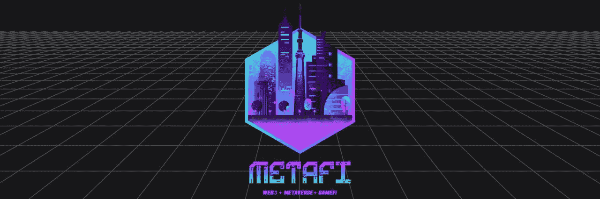

# 硬币价格暴跌

> 原文：<https://medium.com/codex/apecoin-price-tumble-b958698dac63?source=collection_archive---------37----------------------->

成功的象征在困境中跌倒

最近，加密技术的下降导致了许多问题。在 crypto 和 web3 的每个领域都可以感受到失落感，许多人想知道事情何时会有所好转。昨天[我们在](/@metafihack/bored-drop-30e9ba9b3d38)采访了无聊猿游艇俱乐部，看到他们的地板自 2021 年 8 月以来第一次下降到 10 万以下，今天这个生态系统的另一个组成部分也发生了变化——Ape coin

## Apecoin 是什么？

Apecoin 于 2022 年早些时候推出，是一个由无聊猿团队创造的令牌。ApeCoin DAO 于 2021 年 4 月为 BAYC 揭幕，BAYC 已经是 NFT 顶级社区之一。令牌是 ERC-20，用于 DAO 的实用程序和治理。APE 令牌持有者集体做出项目治理的所有决策，投票并决定资金分配、规则、合作伙伴关系、项目选择和许多其他问题。

ApeCoin 基金会实施社区做出的治理决策。第三方用户可以使用硬币与生态系统合作，将硬币用于他们的游戏或其他赚钱活动。硬币也是另一面元宇宙的主要经济标准，它已经被创造出来，目前正处于测试阶段，供所有人试用。

代币只有 10 亿的上限，没有办法创造更多，也没有燃烧机制，这意味着不会少于 10 亿。其中 62%由社区所有。BAYC 的持有者可以为他们拥有的每辆 NFT 申领 10，094 枚 APE，MAYC 的持有者可以为每辆 NFT 申领 2，042 枚 APE。宇迦实验室拥有 16%的令牌，14%归协议的贡献者，最后 8%归宇迦实验室的创始人。所以总的来说，你可以说宇迦实验室拥有 24%的代币份额。

## 下降

代币的最初下跌让许多人通过首发股票获得了巨额利润，然而，随着代币价值的大幅下跌，这种盈利能力最近受到了质疑。目前，这种代币的价值已经下跌了 65%,与 ETH 目前的价值下跌相一致。这是目前比其他游戏代币更难的崩溃。

本周初，该硬币曾跌至每枚 3.11 美元的历史低点，目前已反弹至 3.54 美元。与 27.51 美元的历史高点相比，这一价格仍明显较低。其他代币也下跌了，但没有一个比硬币的跌幅更大。在过去的 30 天里，这枚硬币的价值下降了 63%,而其他硬币如沙子只下降了 42%,法力值下降了 39%。请记住，各地的代币都在流血，甚至在撰写本文时，BTC 的代币也下降了 32%。

BAYC NFT 项目的价值大幅下跌，底价也远低于这个 NFT 巨人创下的 42.9 万美元的历史最高价。随着以太坊继续走下坡路，其他代币也会步其后尘，代币的价值和非功能性交易可能会继续流失。