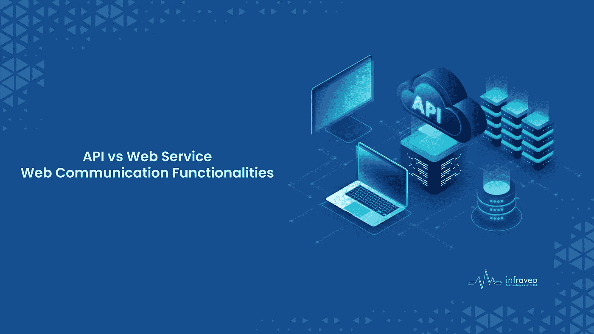

# API 与 Web 服务:显著的区别是什么？

> 原文：<https://medium.com/codex/api-vs-web-service-what-is-the-significant-difference-9767854e1bb?source=collection_archive---------16----------------------->

API(应用程序编程接口)和 web 服务不同，但在在线通信功能方面是可以比较的。

API v/s Web 服务

另一方面，API 和 web 服务这两个术语被广泛用作解决问题的各种技术的同义词。机器通信由 web 服务提供，而应用程序通信由 API 实现。RESTful APIs 已经部分取代了 web 服务、SOAP 和 XML，因为 REST(表述性状态转移)和 JSON (JavaScript 对象表示法)更轻、更快、更独立于平台。

# 什么是 API？

应用程序编程接口被称为“API”。它是一个软件框架，能够实现几个应用程序之间的自动通信。开发人员可以使用多种 API 工具来整理和简化他们的程序。此外，API 为开发人员提供了一种有效的方法来发展他们的产品程序。然后，API 提供了编程组件应该如何互连的基本定义。API 使得浏览器可以访问服务数据。

# **什么是 Web 服务？**

数据经常通过 Web 服务在不同的系统或应用程序之间传输，Web 服务是开放标准和协议的集合。可以使用多种平台和编程语言来制作软件应用程序。Web 服务用于通过计算机网络实现数据共享。Web 服务需要通过网络进行通信，这两个框架使用最多的网络协议是 HTTP。Web 服务支持众多平台和应用程序之间的数据传输。

# **功能**

**API:**

*   效率
*   范围更广
*   可定制的
*   个性化
*   数据谱系关系
*   易于与 GUI 集成
*   时间有效
*   独立于语言

# **网络服务:**

*   松散耦合
*   同步或异步功能
*   支持远程过程调用的能力
*   支持文档交换。

# **结论**

所有的 web 服务也是 API，因为它们公开了应用程序的数据和/或功能，但是并不是所有的 API 都是 web 服务。由于这些 API 只是支持客户机-服务器关系的终端，所以 web 服务是一种架构风格，用于在 Internet 协议主干上集成使用 XML、SOAP 和 WSDL 开放标准的基于 Web 的应用程序。