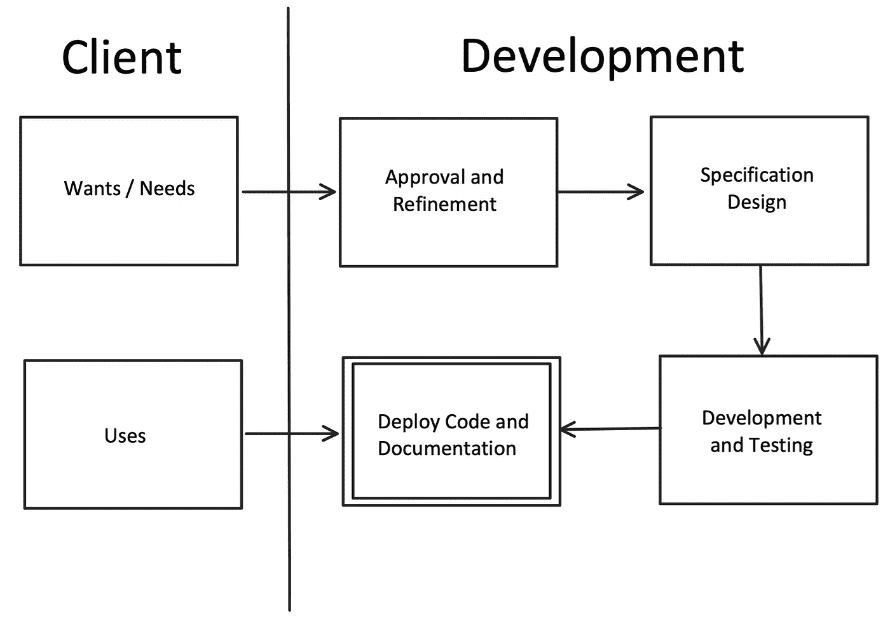
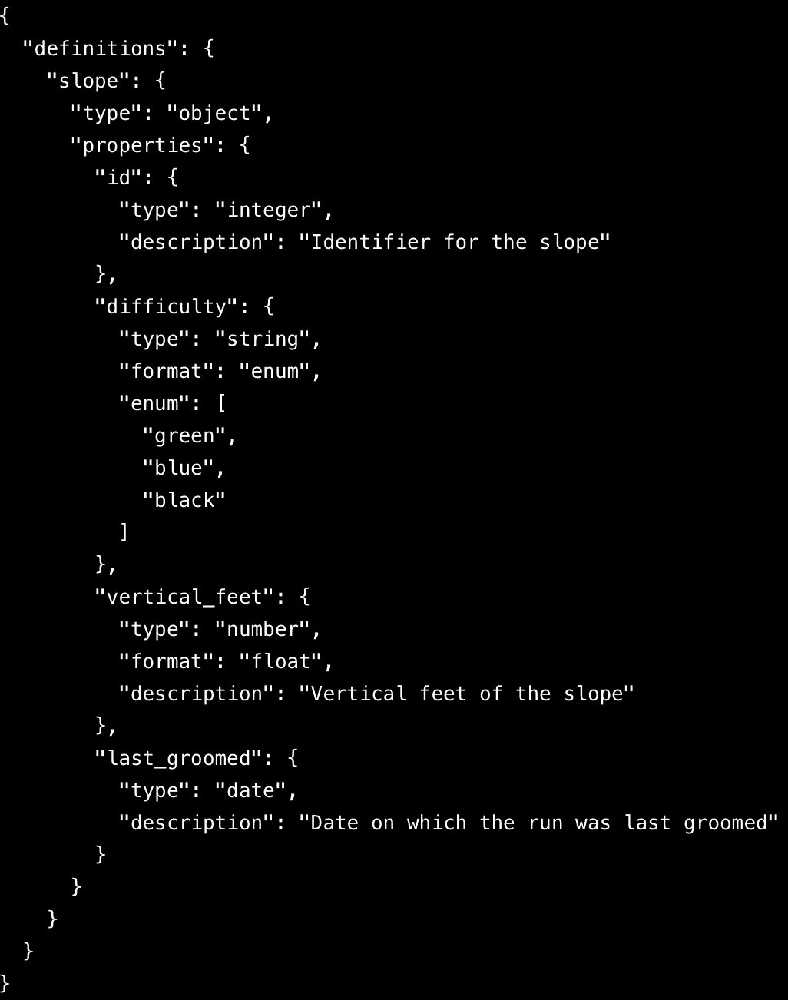
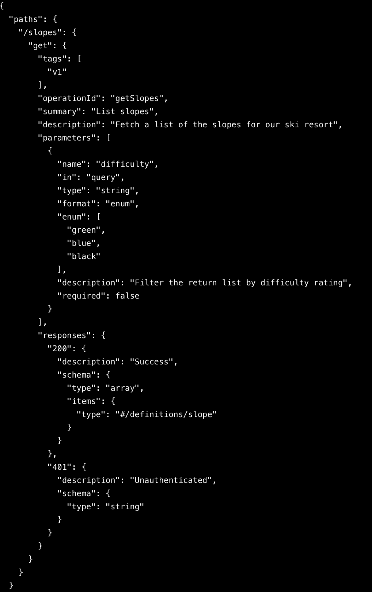
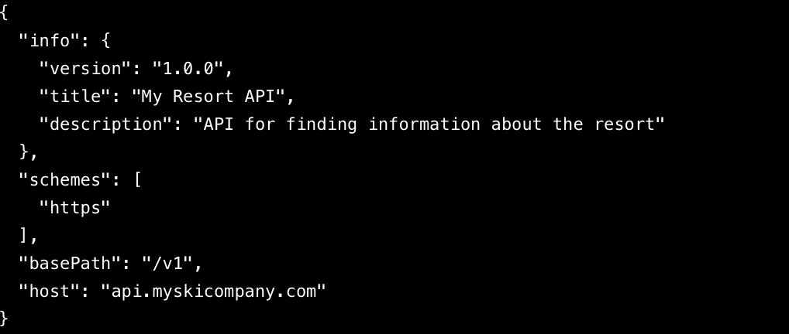

# API:定义驱动的开发和 Swagger 的力量

> 原文：<https://medium.com/codex/apis-definition-driven-development-and-the-power-of-swagger-13b29b3eba33?source=collection_archive---------5----------------------->

## [法典](http://medium.com/codex)

# 动机

随着技术联系更加紧密的世界的发展，计算设备之间的距离缩短，互联网带宽和速度增加，较小设备与更多动力机器通信的能力变得更加重要。这些“更强大”的设备可以被称为具有更多 CPU、更多 RAM、更多 GPU 甚至更多存储的计算机。这些更小的设备能够利用这些更强大的设备的能力来运行有价值的计算复杂的程序。在一个计算越来越接近边缘的世界，需要这些更强大的机器能够与较小的机器进行通信。一种广泛使用的方法是开发 REST APIs 来提供对资源的编程访问。我将在另一篇文章中更多地讨论 REST API 设计，但是我想在这里重点讨论这个过程。是什么让一个好的 API 可以被所有客户使用和理解？在软件社区中，第一个答案通常被认为是四个字母:文档。

对于典型的开发人员来说，没有什么比花时间写文档更不愉快的了。另一方面，少数几件事情之一是与不像描述或期望的那样交互的系统一起工作。因此，这种权衡可以表述为:编写文档占用了开发人员的时间，在短期内会让你焦头烂额。但是文档的缺乏会长期困扰你，因为你的开发人员会浪费时间去弄清楚代码，API 用户会因为试图弄清楚接口而受挫。你肯定会在这个等式的一边亏损，所以问题是什么是最好的亏损？计算最佳损失的一种方法是，您期望支持这个 API 多长时间。如果它是为了迁移，或者没有任何持久的价值，那么承担重新编写代码并重新部署的损失可能是最好的情况，因为您甚至可以提出更好的设计。然而，大多数 API 不仅需要长期支持，还需要长期稳定性。如果这是一个货币化的 API，你不能期望用户为了架构中的小的突破性变化而一直调整他们的客户端程序。管理这些客户期望和可用性可以留到第一次发布稳定的 API 时进行 API 版本控制。获得稳定的 v1 版本意味着开发人员和业务团队跨团队工作，甚至跨组织工作，以完成设计和部署。很少有业务团队成员(甚至可以说很少有开发人员)想要通读代码，甚至是代码中的注释，以构建正在发生的事情的思维图来解释每个参数和端点的值。但是 API 的全部目的是允许客户，无论是内部的还是公共的，快速理解和采用接口中每个端点、参数和响应背后的价值。如果这些都没有价值，为什么要包括在内呢？因此，如果有一种清晰一致的方法来学习和跟踪文档，那么在 API 开发和设计过程中，每个人都是赢家。进入 OpenAPI 和 Swagger 规范，作为定义驱动开发的一部分，我见过很多这样的东西。

# 什么是定义驱动的开发？

定义驱动的开发 API 工作流程如下图所示:

定义驱动的开发周期

客户端，无论是内部的还是外部的，实际上只与 API 生命周期进行两次交互。他们有需求，他们使用部署的资源。对他们来说，一个额外的好处是一个文档站点，允许他们浏览部署的内容。假设你想为他们提供一个更好的体验和更少的电子邮件/电话的文档网站，在这个过程中一个非常有用的工具被称为 OpenAPI 或 Swagger 规范文档。

本文档的目标是详细说明 API 所有可能的端点、参数、定义和响应。这份文件代表了推动这一进程的“定义”。让我们在一个例子的上下文中，探索这个文档的价值如何在开发过程的每一步和迭代中增长。在这个例子中，让我们做一个从未开发过 API 的滑雪场。

# 批准和改进

当有一组特定的想要和需要带给你时，它们通常代表着与你系统中的一些实体的交互。在规范文档中，您可以定义您想要公开的实体的范围，并根据用户的需要授予访问权限。在我们的例子中，假设一个用户真的想获得关于他们可以在你的度假村滑雪的斜坡的信息，并通过难度等级进行过滤。作为滑雪胜地，你可能会跟踪每个斜坡的大量信息。也许你跟踪它最后一次被整理的时间，每天的流量估计，难度等级，以及跑步的垂直距离。作为批准过程的一部分，您澄清每天的流量是您不想向外部客户公开的。因此，在文档的这个阶段，您将能够在“定义”一节中捕获一个完全合格和批准的坡度实体表示。这里需要进行的另一个对话是找出在您的 API 生态系统中，这个资源在哪里得到最好的服务。在我们的例子中，这是我们的第一个 API，所以我将把它留到部署步骤中。

Swagger 规范中的定义

# 规格设计

有了通过批准和细化过程提供的定义，规范设计就能够大幅缩小其范围。这使得围绕客户访问定义的资源、允许的参数和他们期望得到的响应的最佳体验的对话更加集中。我们知道，如果成功，他们至少会想要回过滤后的斜率列表，但我们也可以让他们做好准备，以便在身份验证失败时能够处理响应。此时，您还可以将文档作为反馈提供给客户，或者甚至部署到预发布文档站点，这样用户就可以在 API 发布时集成它。

Swagger 规范中的端点、参数和响应定义

# 开发和测试

随着规范迭代的完成，开发和测试变得非常简单，因为您只需要朝着规范文档的实现前进。这种文档格式的一个优点是，通过简单的导入，您可以将它集成到许多 API 工具中，如 Postman 和 API Gateway。为您的测试设置路径就像在验证响应的同时处理路径和参数的排列一样简单。

# 部署代码和文档

现在开发和测试已经完成，您知道您已经有了一个符合完整规范的功能 API。如果这是你的第一个 API，就像我们的这个例子一样，我们必须决定用户访问它的基本 URL。我们将选择在 https://api.myskicompany.com/v1 举办它作为我们的第一个 API 版本。现在，除非您的客户非常喜欢解析 JSON 文件，否则他们可能会喜欢使用更好的 UX 来查看文档。

这种风格的规范文档的一个优点是，有很多选项可以用极其有限的开销来呈现一个很棒的 UI。一些最常用的是 Dapperxox、Redoc 和 Swagger UI。使用这三者中的任何一个都将使您的客户机启动并运行，您唯一要做的工作就是将规范链接到呈现工具。

Swagger 规范中的顶级 API 数据

# 更多资源

如果您喜欢这个过程，并且有兴趣查看完整规范文件的最终视图，可以在

[https://github . com/OAI/open API-Specification/blob/master/examples/v 2.0/JSON/pet store-simple . JSON](http://Sample Petstore Swagger)

这些文件支持的另一种格式是 YAML，所以你可以在 GitHub 中找到这两种格式的例子。