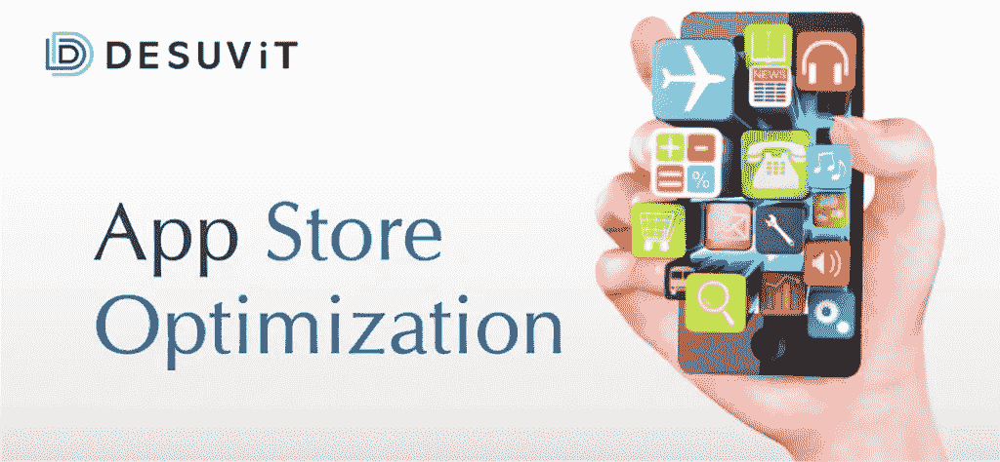

# 应用商店优化:综合指南

> 原文：<https://medium.com/codex/app-store-optimization-a-comprehensive-guide-6676f12d8c29?source=collection_archive---------16----------------------->

应用商店优化，通常被称为 ASO，是一种提高你的应用在应用商店排名的方法。我们已经有了基于关键词、可读性和价值的搜索引擎来索引或排列我们的网站和内容。和这个概念类似的还有 ASO 的概念。

## 以下是影响你的 app store 评分的因素: