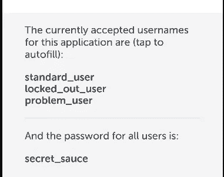
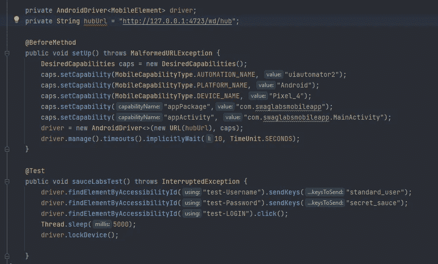
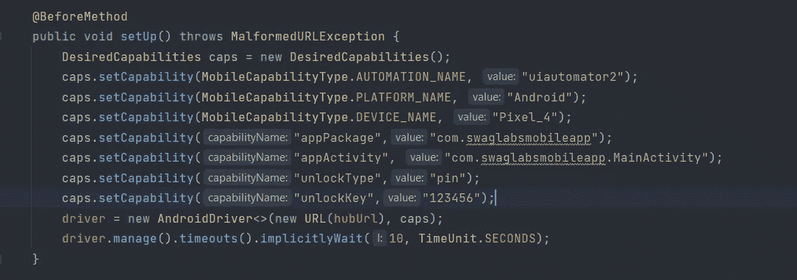
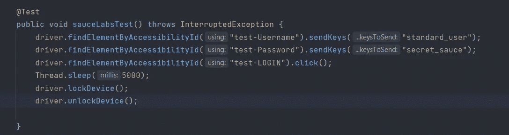
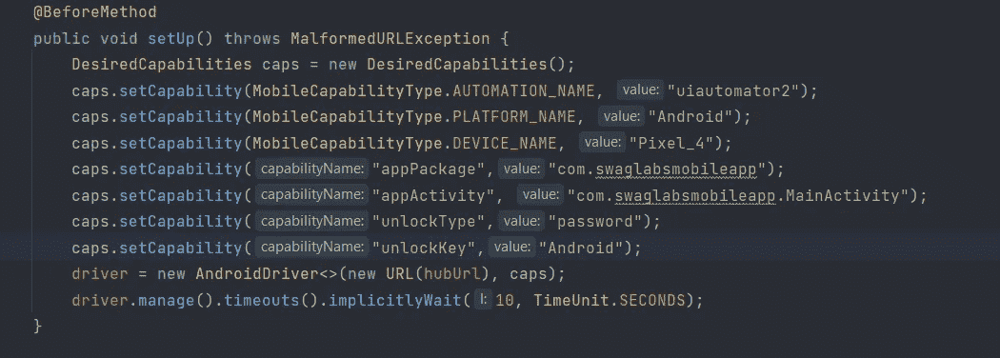
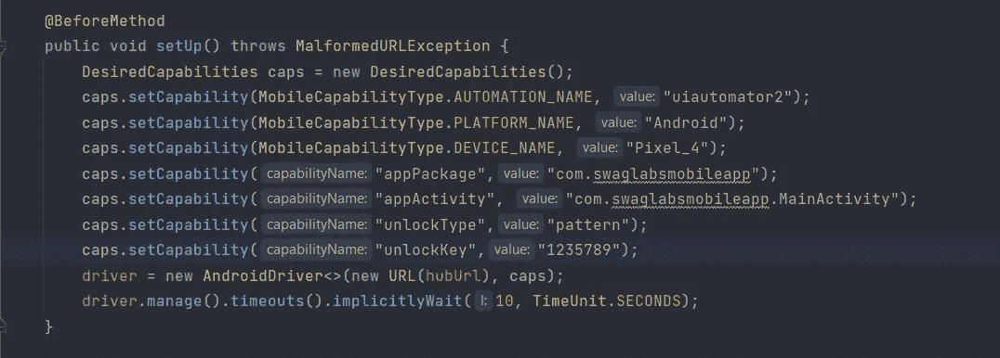

# Appium:如何处理 Android 模拟器的设备锁定和解锁操作

> 原文：<https://medium.com/codex/appium-how-to-handle-device-lock-and-unlock-actions-for-android-emulators-44b962698e89?source=collection_archive---------6----------------------->

大家好！！在这篇简短的文章中，我们将探讨如何使用各种技术，如 PIN、模式、密码等，使用 Appium 所需的功能来锁定和解锁 android 仿真器设备。让我们开始吧。


假设您需要用您的移动应用测试一个场景，其中我们需要在执行设备锁定后检查应用状态。例如，假设您正在使用安全应用程序，如一些银行应用程序或任何交易应用程序，您可能希望验证用户每次登录应用程序、执行一些操作，然后锁定设备，下次他们解锁设备时，移动应用程序的状态应被重置，他们将需要再次登录。反之亦然，在用户完成锁定/解锁操作后，您可能需要保存应用程序状态，让我们看看如何处理这种情况。

> 出于我们的测试目的，我使用了一个在我的系统中本地运行的 Android 模拟器，我们将使用本地运行的 Appium 服务器在 Sauce Labs 提供的 [Swag Labs app](https://github.com/saucelabs/sample-app-mobile/releases) 上进行测试。
> 
> 当您在 android 模拟器中启动 Swag labs 应用程序时，您需要使用用户名和密码进行登录。


> 移动应用程序有一些可以使用的预配置用户名。所有用户的密码如下所示(“secret_sauce”)



SauceLabs 的用户名

## 如何在 android 模拟器设备中锁定、解锁以及检查锁定状态？

> AndroidDriver 提供了以下方法来锁定、解锁和检查设备`isDeviceLocked()`、`lockDevice()`和`unlockDevice()`的锁定状态。

*这些方法在 AndroidDriver 中是可用的，所以如果你的驱动是 AppiumDriver 类型，那么你需要将它转换成 AndroidDriver。*

```
((AndroidDriver<MobileElement>)driver).unlockDevice();
```

> 方法 isDeviceLocked()将返回一个布尔值(真或假)
> 
> lockDevice()还有一个重载方法，我们可以在其中指定它需要被锁定的持续时间。

## 让我们看一下我们将要执行的步骤

启动已经安装在仿真器设备上的 Swag Labs 应用程序。
使用用户名:standard_user 和密码:secret_sauce
进行登录，等待 5 秒钟
锁定设备。



目前，我没有使用任何单独的驱动程序类来初始化，也没有使用任何页面对象模型的概念，这只是最基本的脚本。说吧，你可以说我懒！！😜


试运行—锁定设备

*现在，我们已经了解了如何锁定设备，让我们看看解锁设备的各种方法。*

> 您可能知道，我们可以通过多种方式解锁 Android 设备，这可以是默认选项，您只需按下电源按钮即可锁定/解锁设备(即没有 PIN/密码/模式设置)，也可以是您设置了一些 PIN 或密码或模式。

所有这些选项都可以通过 Appium DesiredCapabilities 进行处理，您需要为其指定“unlockType”和“unlockKey”详细信息。

## 使用 PIN 解锁 Android 模拟器设备

> 在这种情况下，我们为我们的 android 模拟器设备设置了一些 PIN。这可以通过设置应用程序>安全>设备安全>屏幕锁定来完成

在我们的例子中，我将为我的设备设置一个 PIN: 123456。

相应地，在我的脚本中，我已经使用期望的功能提到了这些细节，现在我的设置方法将如下所示。

> *同样在我的测试方法 post lockDevice()中，我们必须添加 unlockDevice()*



增加了设备解锁功能



测试类已更新

这是我的测试运行现在看起来像 post 添加这些行，正如你看到的 post 设备锁它会自动解锁它使用我们设置的 PIN。


## 使用密码解锁 Android 模拟器设备

这种方法将类似于 PIN，我们将需要指定细节:unlockType 为“密码”，unlockKey 为您在设备中设置的密码文本。期望的能力如下。

*在我的例子中，我将密码设置为“Android”*



## 使用模式解锁 Android 模拟器设备

您可能知道，模式如下所示。


现在，在 Appium 中这是如何解锁的，每个点对应一个从 1 开始的特定数字。

> **顶行:三个点将是 1 2 3
> 中间行:三个点将是 4 5 6
> 最后一行:三个点将是 7 8 9**

假设，我已经设置了一个模式，它是英文字符“Z ”,假设我决定从左上角开始。

> 我的模式应该是“1235789”


让我们将这些细节添加到我们的设置脚本中(期望的功能)



就是这样，这就是你如何使用 Appium DesiredCapabilities 锁定和解锁你的 android 模拟器设备。😎

感谢阅读！！！