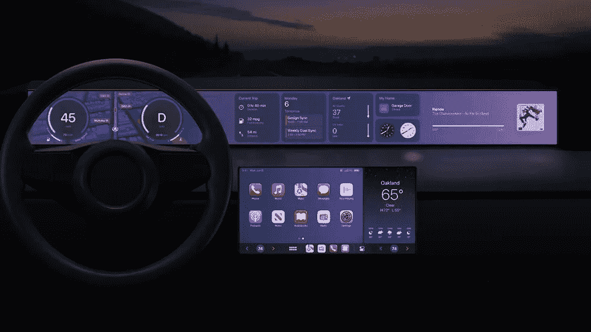

# 苹果汽车不会有方向盘或踏板

> 原文：<https://medium.com/codex/apple-car-will-not-have-a-steering-wheel-or-pedals-cbc3b6c587c0?source=collection_archive---------22----------------------->

## 苹果汽车的设计目标包括:没有方向盘或刹车踏板，用于睡觉的平座椅，大屏幕，以及其他功能

下一代 CarPlay 体验将于 2023 年上市。

这项研究披露了关于所谓“苹果汽车”的有趣数据。

