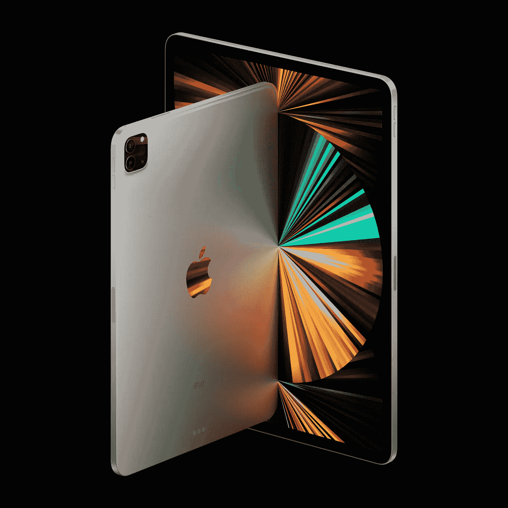

# 苹果廉价 iPad 泄露专业级功能

> 原文：<https://medium.com/codex/apple-cheap-ipad-leaks-with-pro-level-features-7191d07b426e?source=collection_archive---------6----------------------->

基线版 iPad 10.9 英寸是迄今为止最受欢迎的 iPad 之一。它仍然是唯一一款体现怀旧指纹 home 键的 iPad，拥有 10.9 英寸的大屏幕，价格在 329 美元左右。

来源-Apple.com

这款平板电脑主要面向需要在工作中快速输入电子邮件的成年人，需要用苹果电脑在最近的一次讲座上草草记下一大堆笔记的学生…