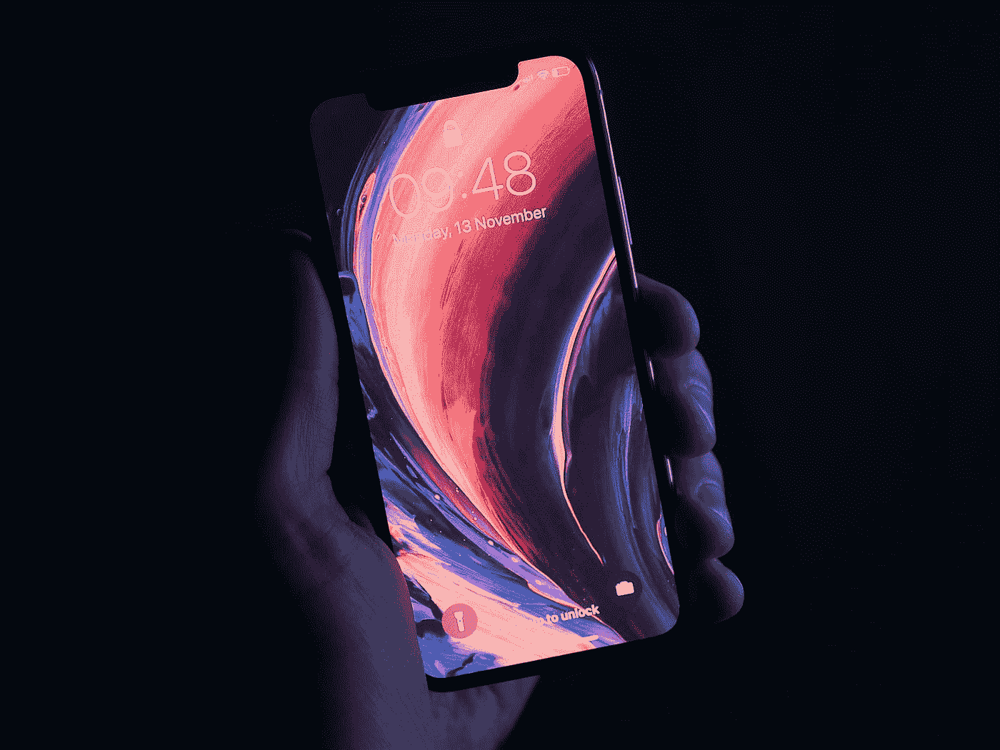

# 苹果不在乎 iPhone

> 原文：<https://medium.com/codex/apple-doesnt-care-about-the-iphone-ccfbce5f4fac?source=collection_archive---------1----------------------->

优素福·萨尔汗在 [Unsplash](https://unsplash.com?utm_source=medium&utm_medium=referral) 上的照片

所以我看了 iPhone 的主题演讲，我的印象是“哇，iPhone 被冷落了。”不相信我？让我们只看事实。

会上发布了三大产品:iPad Mini、Apple Watch 和 iPhone。以及一些次要的服务公告，我们就不看这些了。所以:

**iPad Mini** :新设计，边框更小，USB-C 充电。