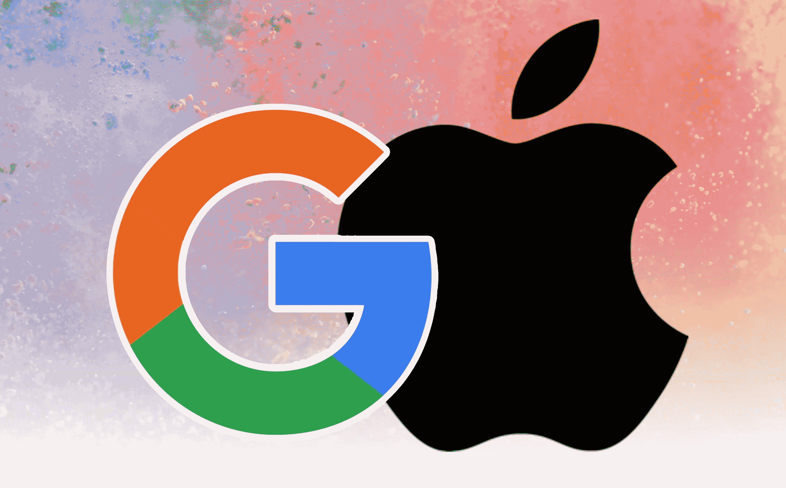
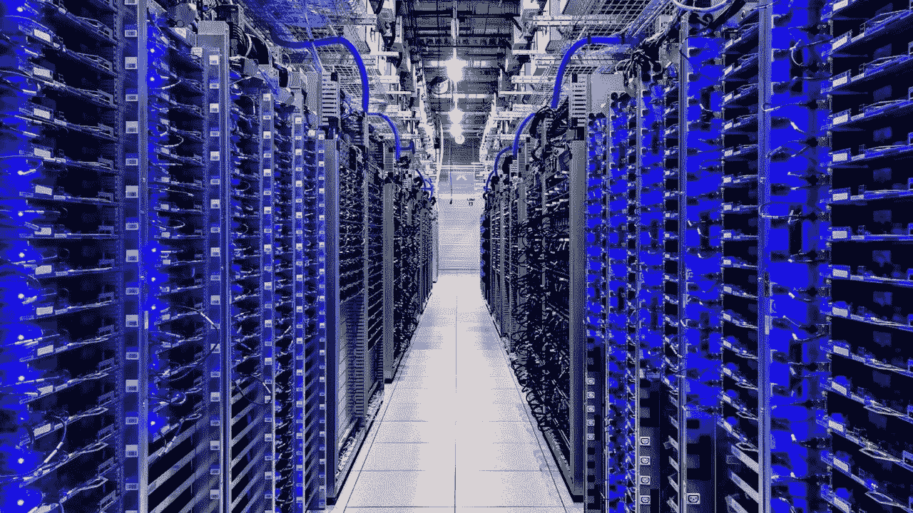

# 苹果和谷歌——最好的伙伴？

> 原文：<https://medium.com/codex/apple-google-best-buddies-97e8d35a7983?source=collection_archive---------2----------------------->

## 他们是两个最大的科技巨头，但奇怪的是，也是好朋友

处于非常相似的领域，你很容易被原谅认为这两个庞然大物很可能是主要竞争对手。然而，如果你稍微揭开表层，就会发现，没有什么比这更偏离事实了。事实上，他们碰巧关系很好！

 [## iCloud+完美的存储解决方案

### 如果您在 MAC 和 iOS 设备上工作，您是否利用了这种备份和存储解决方案？

medium.com](/codex/icloud-the-perfect-storage-solution-741e0c9e1bd4)  [## 大小真的很重要

### 我的 16 英寸难题

medium.com](/codex/size-really-does-matter-3782df55faf6) 

## 价值 150 亿美元的甜味剂

当你购买新的 Mac、iPhone 或 iPad 时，我们都知道并且非常清楚 Safari 是我们点击打开浏览器的蓝色小按钮。下意识地，当我们在后台输入*‘how to etc’时，*谷歌开始成为默认的搜索引擎。这不是错误，也绝不是苹果的多愁善感和善良。这是一项长期的商业协议，将两家公司和谐地结合在一起。最近，它也吸引了一些不必要的关注。

这是十八年前，他们各自的律师同意这一合同。那时，苹果只零售苹果电脑(也就是支持搜索的电脑)，谷歌签署了一份协议，这份协议在几年后成为了黄金。它与苹果捆绑在一起，让谷歌成为所有 MAC 电脑的默认搜索引擎。正如我们现在所知，事后看来，苹果很快就会推出 iPhones 和 iPads。这些产品以 MAC 电脑从未有过的方式在大众中流行起来，而且它们也嵌入了谷歌作为搜索引擎。谷歌非常时髦。意识到尚未开发的增长，他们继续向苹果支付越来越多的金额，以保持他们有点甜。广告成了谷歌的主要赚钱工具，全世界每天都有数百万台苹果设备在使用。蒂姆·库克承认谷歌在他们所做的事情上是最好的，他非常乐意保持这种安排。然而，其他人不太高兴，这就是今年民事诉讼背后的原因。正如我们即将发现的那样，这笔交易比初看起来要复杂得多。

 [## 我的 Mac 及其邮件

### 尽管竞争激烈，我仍然热爱原生应用

medium.com](/codex/my-mac-and-its-mail-9ca6b02f762e) 

## 离我的厨房远点

虽然蒂姆·库克非常乐意赞美谷歌的奇迹，但谷歌自己似乎已经与苹果就未来开发搜索引擎与谷歌竞争达成了一项特别明确的协议。在今年 1 月在加州提起的民事诉讼中，两家公司在互联网搜索业务中的不竞争协议违反了美国反垄断法，这是有争议的。基本上，苹果已经告诉谷歌，只要他们继续付费让谷歌成为他们所有消费设备的默认搜索引擎，他们就不会开发苹果搜索引擎。据称，在定期的秘密会议上，谷歌承诺与苹果分享其广告收入，只要它在苹果设备上获得优惠待遇。集体诉讼认为，反过来，这也推高了广告费用，比竞争系统更高。

尽管涉及的实际金额是一个高度保密的秘密，但 2020 年《纽约时报》报道称，苹果每年获得 80-120 亿美元。基于这一数字，分析师们现在认为这一数字很可能高达 150 亿美元。如果这是真的，那么这将是迄今为止谷歌每年支付的最大一笔款项，也将占苹果年度利润的五分之一。

苹果首席执行官蒂姆·库克和谷歌首席执行官桑德尔·皮帅无疑会争辩说，是的，付费是为了让谷歌保持默认搜索选项，用户可以选择其他搜索引擎，如微软的必应或雅虎。

但这不仅仅是单向交通。苹果也向谷歌付费。

## 它是双向的

苹果现在也是谷歌的最大客户。为什么云存储和使用他们的服务器。

苹果公司需要存储的数据量大幅增长。事实上，它已经成指数增长了。他们的服务器已经无法满足需求，因此转向了谷歌。

去年，苹果为谷歌云存储支付了约 3 亿美元，同比增长 50%。我将要输入一些听起来像科幻小说的术语，你已经被警告了…

仅在 2020 年 11 月，苹果就在一个月内将存储在谷歌服务器上的数据量增加了 470。当时，这意味着存储的总容量为 8eb。在现实世界中，如果你录制了一段视频 FaceTime 通话，那么它必须持续 20 多万年才能达到相同的数据量。他们对谷歌来说是一个巨大的客户，在他们的行列中，苹果甚至有了一个昵称*大脚*。与其他大型谷歌客户端相比，苹果存储的数据是海量的。我提到的苹果*在一个月内增加了*470 Pb 的存储空间，相当于《抖音》的制造商字节跳动所用的*总量*。谷歌第三大客户端 Spotify 仅存储了*460 Pb。*

虽然苹果也使用亚马逊网络服务来存储 iCloud 数据，但他们在谷歌上存储的数据量似乎需要打很大的折扣。他们使用的 8eb 存储通常预计每月花费约 2 . 18 亿美元。苹果似乎只有*每年*付给谷歌*3 亿美元*。一切都很舒适，对吗？

亚马逊仍然是云存储的大玩家，事实上，它仍然是所有玩家中最大的。但是，为了捍卫自己的地位，谷歌一直忙于为自己打造一个独特的利基市场。谷歌创造了一种被称为对象存储的数据存储形式，仅供苹果公司使用。它是为苹果设计的，帮助他们存储音频和视频文件(当然都是 iCloud 存储的一部分)，以及文档。

**走之前**

你订阅媒体了吗？我只是高端博客网站 Medium 上众多作家中的一员。这是如此好的价值，你可以在这里加入[https://medium.com/membership](https://medium.com/membership)

加入我的幕后邮件列表[https://www.talkingtechandaudio.com](https://www.talkingtechandaudio.com)

最初发表于 2022 年 3 月 2 日 https://www.talkingtechandaudio.com/blog。

*查看并订阅我的减十六播客。每两周在 Spotify、苹果播客和谷歌播客上发布新剧集。*[https://podcast . apple . com/GB/podcast/the-MINUS-16-podcast/id 1608899642？i=1000550310853](https://podcasts.apple.com/gb/podcast/the-minus-sixteen-podcast/id1608899642?i=1000550310853)