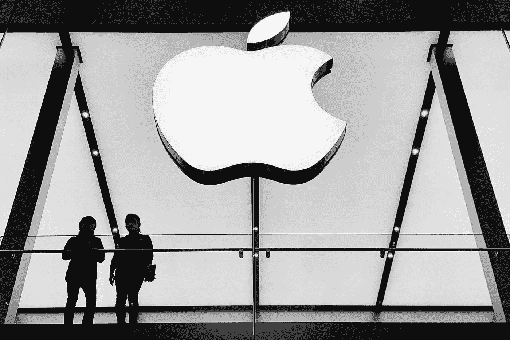

# 苹果在欧盟被指控违反反垄断法

> 原文：<https://medium.com/codex/apple-has-been-charged-with-antitrust-violations-in-the-eu-909a4a155c1c?source=collection_archive---------14----------------------->

## 欧盟对苹果的反垄断调查迈出了新的一步。根据欧盟发布的初步判断，Apple Pay 是反竞争的。

在 [Unsplash](https://unsplash.com?utm_source=medium&utm_medium=referral) 上由[智悦](https://unsplash.com/@zhiyue?utm_source=medium&utm_medium=referral)拍摄的照片

**欧盟对苹果的反垄断调查迈出了新的一步** …