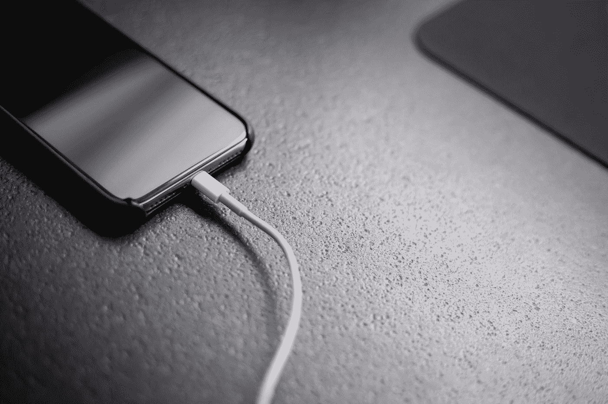

# 苹果要转 USB-C，我很矛盾

> 原文：<https://medium.com/codex/apple-has-to-switch-to-usb-c-and-im-conflicted-52cb5ff84341?source=collection_archive---------4----------------------->

## 再见，闪电港

安德里亚斯·哈斯林格在 [Unsplash](https://unsplash.com?utm_source=medium&utm_medium=referral) 上拍照

根据欧盟最近的立法，苹果似乎将被迫在即将推出的 iPhone 型号上切换到 USB-C。一方面，我想庆祝这是一场胜利，但另一方面，我有点犹豫这样做。

# 什么是强制的？