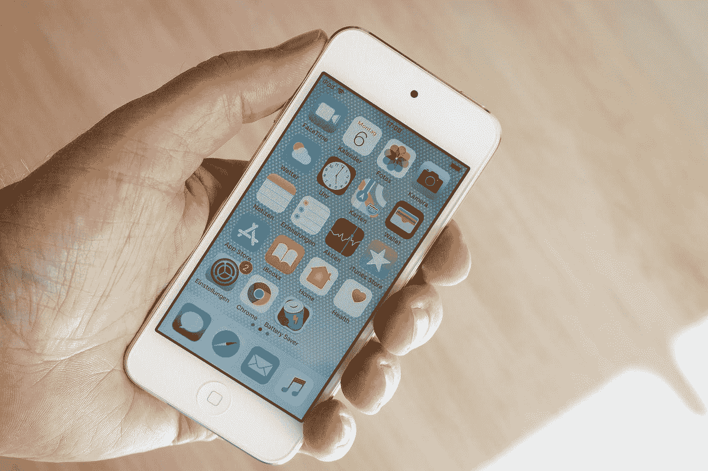

# 100 美元以下的苹果 iPhone—iPhone 6s 评论 2022

> 原文：<https://medium.com/codex/apple-iphone-under-100-iphone-6s-review-2022-9f7556b5802e?source=collection_archive---------13----------------------->

不到 100 美元的 iPhone 听起来很诱人，你同意吗？嗯，我们是这么想的。所以这就是我们今天要做的，这是 2022 年 iPhone 6s 的回顾，也是一个可能比 iPhone 更好的 android 等价物！

迈克尔·魏德曼在 [Unsplash](https://unsplash.com?utm_source=medium&utm_medium=referral) 上的照片

# iPhone 6s 规格

iPhone 6s 配有 **1715 毫安时电池**(相当糟糕)，4.7 英寸(对角线)视网膜高清显示屏…