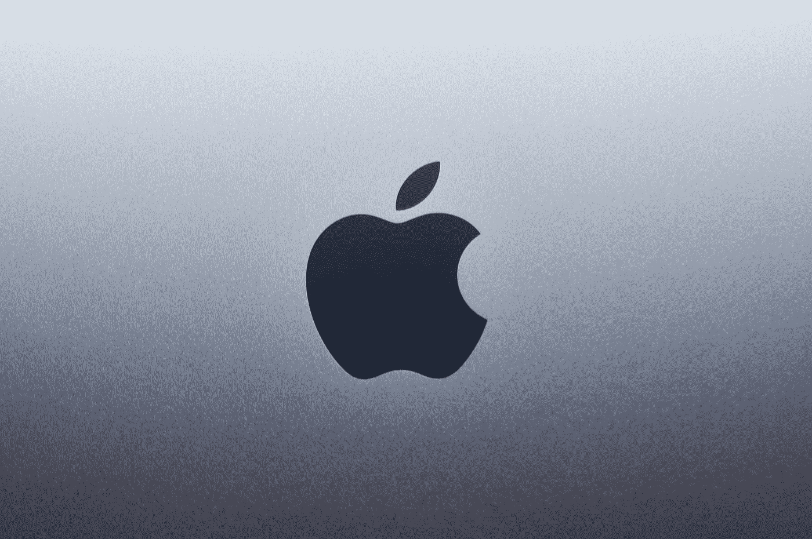

# 苹果公司正在给 iPhone 的软件添加广告，以赚取更多的钱

> 原文：<https://medium.com/codex/apple-is-adding-ads-to-iphones-software-to-make-more-money-9ab72d2e1098?source=collection_archive---------11----------------------->

照片由 [Sumudu Mohottige](https://unsplash.com/@stm_2790?utm_source=medium&utm_medium=referral) 在 [Unsplash](https://unsplash.com?utm_source=medium&utm_medium=referral) 上拍摄

# 广告将出现在哪里

**苹果**正在给你的 iPhone 添加广告，原因如下，来自*彭博社*的报道。 *com* 暗示**苹果**正在向**苹果**服务* * * *添加广告，如**苹果地图、书籍和播客。**

**彭博的**马克·古尔曼说公司*“已经内部测试了地图中的搜索广告，可以显示* …