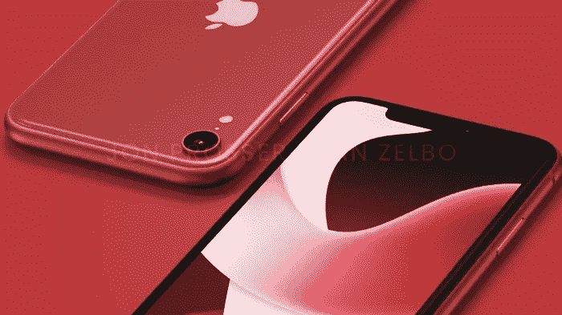

# 苹果正在转售采用新处理器的 iPhone XR，并保留它:iPhone SE 4

> 原文：<https://medium.com/codex/apple-is-reselling-the-iphone-xr-with-a-new-processor-and-remaining-it-iphone-se-4-c69d6a24a3bf?source=collection_archive---------7----------------------->

众所周知，苹果旗舰系列手机的价格高得离谱，从 2007 年的 599 美元到现在的 799 美元。

许多人买不起最高端的手机，或者可能不需要太“花哨”的东西，所以这就是新款 iPhone SE 的用武之地。

