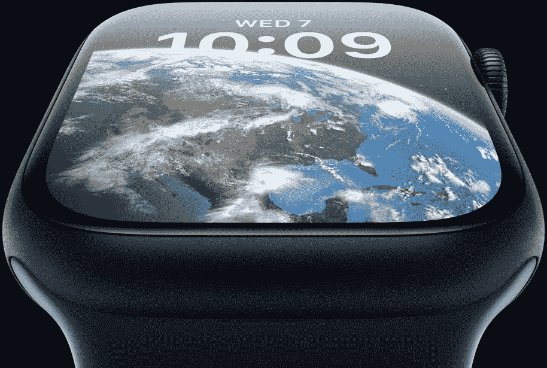

# 为什么苹果降级 Apple-Watch S8，为什么 S7 更好！

> 原文：<https://medium.com/codex/apple-just-removed-a-feature-from-the-apple-watch-s8-2edd40de268f?source=collection_archive---------8----------------------->

苹果刚刚发布了他们的新 Apple Watch 系列八，我们遇到了一个问题。

在添加了这么多伟大的功能后，该公司决定突然取消有史以来最重要的功能之一，芯片。

来源——苹果

这款手表配备了新的 S8 芯片，这是 S7 芯片的克隆，事实上，基本型号 iPhone 14…