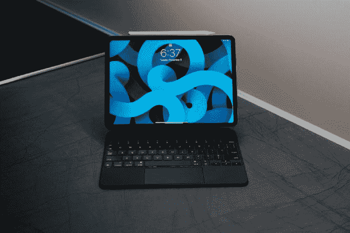

# 苹果泄露新预算 iPad 10.9 英寸先看

> 原文：<https://medium.com/codex/apple-leaks-about-new-budget-ipad-10-9-inch-first-look-4d5862168373?source=collection_archive---------21----------------------->

基线版 iPad 10.9 英寸是迄今为止最受欢迎的 iPad 之一。它仍然是唯一一款体现怀旧指纹 home 键的 iPad，拥有 10.9 英寸的大屏幕，价格在 329 美元左右。

欧内斯特·欧杰在 [Unsplash](https://unsplash.com/?utm_source=medium&utm_medium=referral) 上拍摄的照片

这款平板电脑主要面向需要在工作中快速输入电子邮件的成年人，需要在最近的一次讲座上草草记下一大堆笔记的学生…