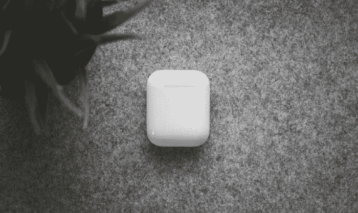

# 苹果泄露 AirPods Pro Two

> 原文：<https://medium.com/codex/apple-leaks-about-the-airpods-pro-two-c05c925fb1b8?source=collection_archive---------11----------------------->

来自专门研究音频泄露的 [52audio](https://appletrack.com/52audio/) (准确率 83.3%，[来源](https://www.52audio.com/archives/123351.html))的一份新报告最近发表了一篇关于新款**苹果 Airpods Pro 2、**的文章，我们将在今年晚些时候收到，以下是他对它们的评论。

它们将包括每个 bud 中的一个扬声器和一个新的**查找我的**功能的外壳，该功能将像去年苹果公司最近发布的**查找我的 iPhone** 和**新的 AirTag** 跟踪器一样工作。

照片由 [Sid Ramirez](https://unsplash.com/@sidneyramirez?utm_source=medium&utm_medium=referral) 在 [Unsplash](https://unsplash.com/?utm_source=medium&utm_medium=referral) 上拍摄