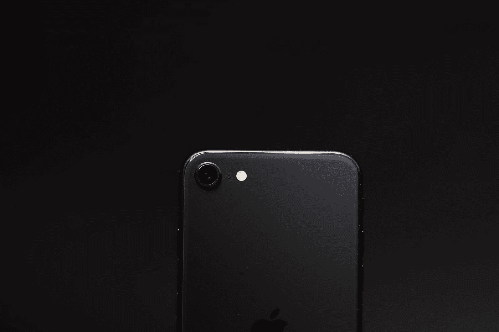

# 苹果泄露了将于三月推出的新 Pro 系列！

> 原文：<https://medium.com/codex/apple-leaks-about-the-new-pro-line-up-coming-in-march-bc41820c9ab1?source=collection_archive---------3----------------------->

# 介绍

苹果泄密的**男主角**、**、**都在报告我们将在 2022 年 Q2(3 月或 4 月)举办一场数字活动。

让我们来谈谈我们对苹果即将到来的虚拟活动有什么期待吧！

照片由[大卫·齐格根斯伯格](https://unsplash.com/@davidzz?utm_source=medium&utm_medium=referral)在 [Unsplash](https://unsplash.com?utm_source=medium&utm_medium=referral) 拍摄

# iPhone SE

因此，看起来苹果将坚持其黄金法则，即 **SE、** **“如果它没坏，就不要修理它”，**这些年来，这让他们获得了一定程度的成功。

新的 **SE w** 将采用与 SE2 相同的 **4.7 英寸机身，带有华丽的 home 按钮，但将采用 **n** 更新的**芯片组，**这里看不出太大的东西，但如果你打算购买当前的 SE，那么就推迟并等待这个。**

# 苹果笔记本电脑

照片由 [Howard Bouchevereau](https://unsplash.com/@howardbouchevereau?utm_source=medium&utm_medium=referral) 在 [Unsplash](https://unsplash.com?utm_source=medium&utm_medium=referral) 上拍摄

期待已久的 **M2 Macbook Air** 正在路上，预计将在春季发布会上首次亮相，采用全新设计，带有 **Magsafe、Notch、平边和 M2 芯片。**

别忘了漂白过的表圈，我已经能感觉到怀旧了！

如果你想知道从 Macbook**上能期待什么，那么看看我在这台机器上发布的故事吧！**

[https://medium.com/codex/m2-macbook-air-7b834204f9f5](/codex/m2-macbook-air-7b834204f9f5)

# iMac Pro

苹果将采用 **24 英寸 M1 iMac** ，并将尺寸扩展到 **27 英寸**，并将引入一些更无聊的颜色，使其更薄更轻，就像 **24 英寸 M1 iMac、**搭配 **M1 Pro** 和 **M1 Max。**

我们为这一个最兴奋，让我们都只希望在这个模态上没有**下巴**，不像其他的！

# 结束…

自从第一代 iPhone 诞生以来，苹果一直是全球消费科技行业的主要动力，在这里的 **H.Q，**我们的目标是给你所有的“内幕消息”，当涉及到整个社区的所有小 Nic Naks 时。

我们报道的你最喜欢的产品是什么，如果这篇文章值得你花时间，请在下面评论并关注更多内容。

在这一点上我们对任何事情都是开放的！😉

由[粘土银行](https://unsplash.com/@claybanks?utm_source=medium&utm_medium=referral)在 [Unsplash](https://unsplash.com/?utm_source=medium&utm_medium=referral) 上拍摄