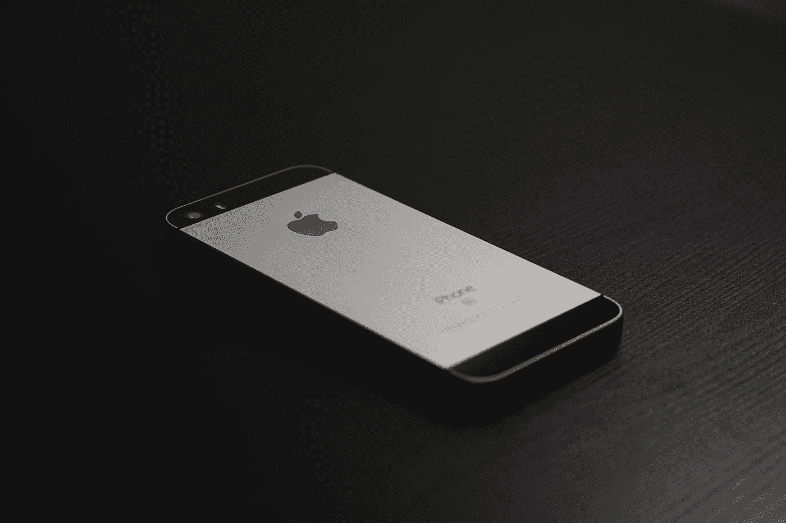
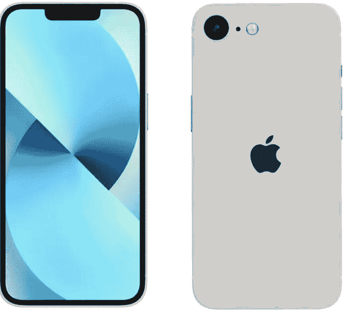
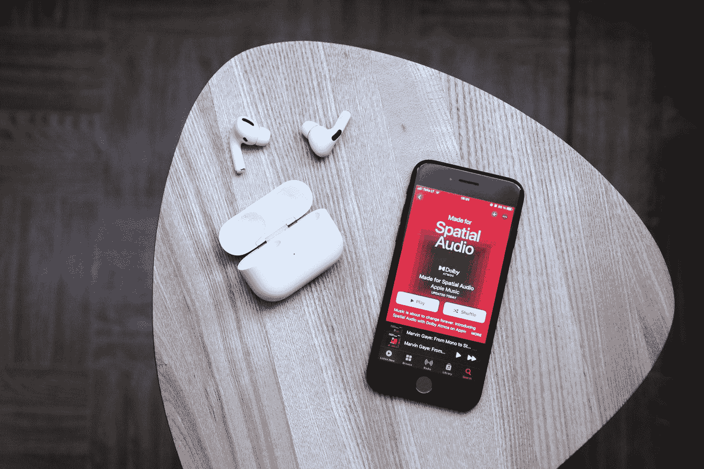

# 苹果泄露迄今最便宜的 iPhone！

> 原文：<https://medium.com/codex/apple-leaks-cheapest-iphone-yet-c0dd17ac472e?source=collection_archive---------3----------------------->

# 介绍

iPhone SE 是苹果对中端手机的一次尝试，苹果传统上瞄准了试图涉足苹果生态系统的 T2 安卓用户和老年人，他们对规格要求很低，预算也不高。

如果你属于上面列出的任何一类，那么我们会高度考虑留下来，也许会有适合你的东西！

# iPhone SE Plus (Q1 2022)

下一代 iPhone SE 预计将在未来几个月内推出(2022 年 Q1)，它将采用与上一代相同的 4.7 英寸液晶显示屏，但现在将支持 5G，售价为 499 美元。

我们希望看到它与 Magsafe 一起出现，这样苹果就能在一定程度上证明这个设计的未来，但我怀疑这是否值得任何人花钱，除非你尽快需要一个新的廉价 Iphobe。

# iPhone SE 3

现在奇迹发生了， **Ross Young (100%准确)说****iPhone SE three**将有两种尺寸增加的 5.7 英寸和 6.1 英寸 LCD。

照片由[克里斯蒂安·阿拉德](https://unsplash.com/@christianallard?utm_source=medium&utm_medium=referral)在 [Unsplash](https://unsplash.com?utm_source=medium&utm_medium=referral) 上拍摄

其他传言暗示，iPhone SE 3 将(最终)剥离其厚重、过时的边框，并将配备闪亮的新矩形侧面(像新的**旗舰 iPhone 12 和 13)** ，侧面的电源按钮将包含指纹 ID，还将包含 **A14 或 A15 芯片。**

SE3 预计将被推迟到 2024 年，但郭明志(75.9%的准确率)认为我们可以期待在 2023 年发布。

# 买什么？

就像我之前说的，如果你尽快需要一部手机，那么就去买当前的 **SE (2020)** 吧，因为你可能不会要求太多的功率，并且会喜欢小巧的外形和放心的财务 home 键。

# 其他人…

如果你想让你的钱花得值，并且能够再等一段时间，那么就等着 **SE 加**吧，它的价格将与当前的 **SE (2020)相同。**

# 结束…

自第一代 iPhone 诞生以来，苹果一直是全球消费科技行业的主要动力，在这里的 **H.Q，**我们旨在为您提供所有来自整个社区的所有小 Nic Naks 的“内幕消息”。

如果你还想让我介绍什么，请在下面评论，如果这篇文章值得你花时间，请关注更多 **ONLY** ，如果不值得，请评论！

😉 👏🏽

照片由[奥古斯塔斯·皮皮拉斯](https://unsplash.com/@obuol?utm_source=medium&utm_medium=referral)在 [Unsplash](https://unsplash.com?utm_source=medium&utm_medium=referral) 上拍摄