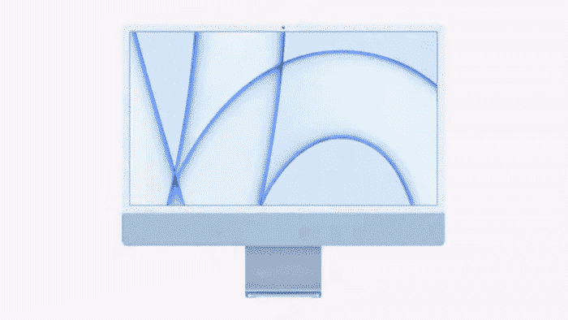

# 苹果 M1 iMac:只是 2021 年的超大 MacBook

> 原文：<https://medium.com/codex/apple-m1-imac-its-just-an-oversized-macbook-in-2021-d2a981690882?source=collection_archive---------0----------------------->

## 一样一样，但是不一样。

苹果原创动画

苹果 Spring Loaded 活动标志着该公司在 2021 年的第一次虚拟活动。其中一个亮点是新款 iMac 的发布。现在它配备了苹果开创性的 M1 芯片。然而，由于我们已经了解了关于这款芯片的一切，我将把公告的这一部分总结为“相同，但…