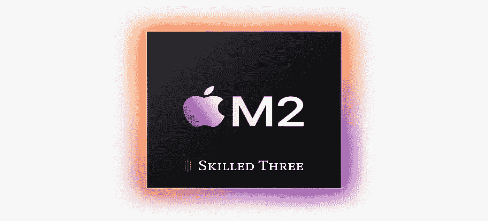

# 苹果 M2

> 原文：<https://medium.com/codex/apple-m2-94a73267fa2d?source=collection_archive---------8----------------------->

## 你应该知道的七件事

我们在今年的 WWDC22 开发者大会上看到了一些新东西。可以预见的是，苹果推出了 iOS 和 iPadOS 16、macOS 13 Ventura 和 watchOS 9 等新系统。然而，除此之外，我们还看到了苹果在 13 英寸 MacBook Pro 和完全重新设计的 MacBook Air 中采用的新 M2 芯片。在这篇文章中，我们来看看新的 M2 芯片，并告诉你关于它你应该知道的七件事。

图片由作者提供