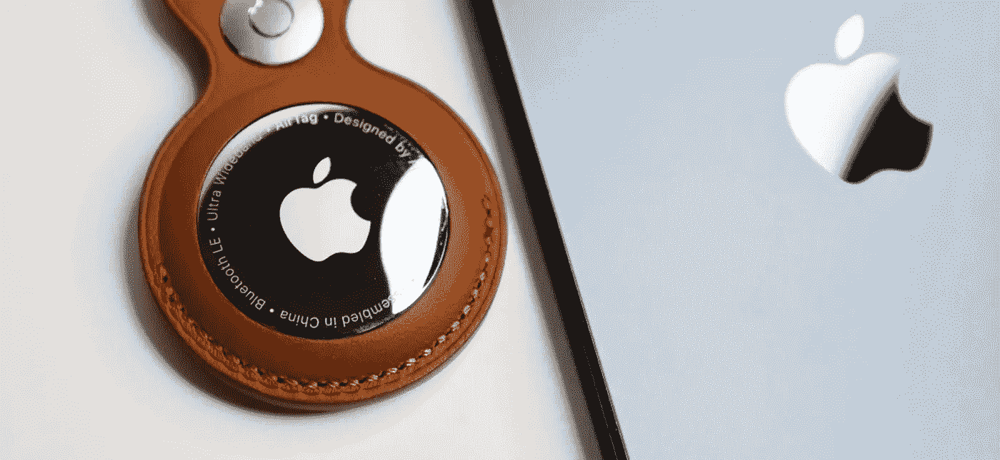
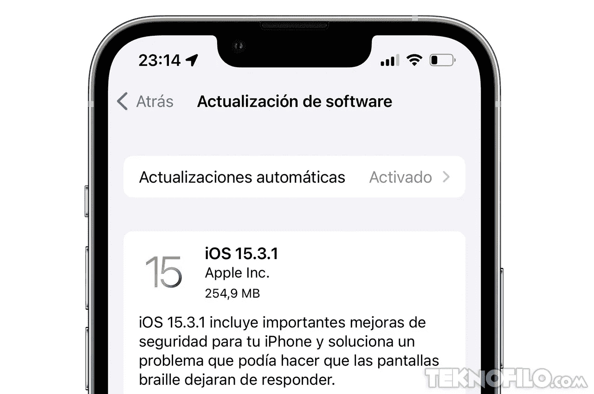
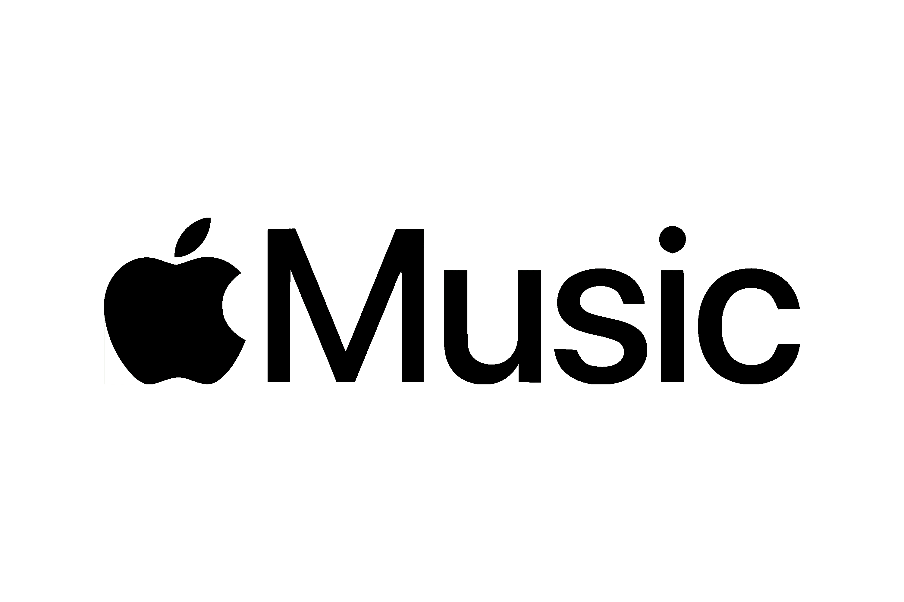
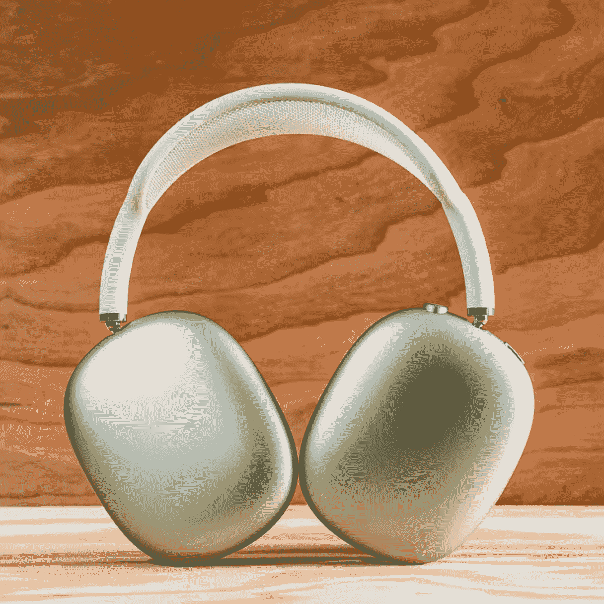

# AirTags、iPads 和 AirPods Max

> 原文：<https://medium.com/codex/apple-news-582a0fea713a?source=collection_archive---------5----------------------->

## 本周苹果新闻综述

## (2022 年 2 月 11 日)

## 航空标签

经过许多不必要的关注和恶意滥用的故事后，AirTags 本周获得了迄今为止最大的更新，以至于几乎感觉像是一个全新的产品发布会。

看起来好像苹果已经听到了 AirTags 被用来跟踪人们的故事，而不是通过一些重大更新来追踪丢失的钥匙、钱包和袋子。首先，在设置 AirTags 时，屏幕上会显示一条严厉的隐私信息，明确警告你滥用是不可容忍的，在任何此类情况下，苹果都会全力配合执法部门的工作。就其本身而言，我知道的不多，但这只是采取的众多步骤中的第一步。我们不要忘记，如果你的目的一直是使用 AirTags 进行跟踪，这是你可能选择的最糟糕的设备，因为它们注册在你的设备*和* Apple ID 上。精确查找到目前为止，只能用来查找*你的*标签，但是有了这个更新，如果通知你一个不想要的标签正在跟踪你，你现在可以使用精确查找来定位它。有许多关于 AirTags 扬声器被禁用以防止听到音频警告的故事。为了避免这种情况，现在会显示一条消息，同时还会有声音更大的警告。最后，如果附近有未识别的标签，您会很快得到通知。可以理解的是，苹果公司并没有公布具体时间，但是看起来好像是在 30 分钟左右。这些都是很大的进步，我相信你会同意的。

## iOS 和 iPad 15.3.1

继续……这里没什么可读的，只是两个非常小的安全修复，因为我们在等待 3 月份到期的 15.4 更新，它将预示着令人兴奋的东西，如 Face ID，通用控制和一些新的表情符号。

## 春季活动

到目前为止，苹果公司仍未证实，但似乎有很好的理由相信它将在 3 月 8 日星期二举行。预计将公布的产品只有一款新的 iPad Air 和 iPhone SE 5G。激动…没那么多！

 [## 你害怕 iOS 更新吗？

### 不要…你会更安全

medium.com](/codex/are-you-afraid-of-ios-updates-a60c037ec0a) 

## 供应链放松

一件应该让苹果微笑的事情是，他们的主要供应商之一，富士康，预计今年供应问题将大大缓解。根据彭博的一份报告，iPhones 和 iPads 的最大组装商表示，令人鼓舞的迹象是，2022 年期间，芯片等零部件短缺将有明显改善。

 [## 苹果标签——朋友还是敌人？

### 他们让你成为受害者了吗？

medium.com](/codex/apple-airtags-friend-or-foe-f23318a1b5b3) 

## Apple Music 订阅更改

Apple Music 从 2015 年开始就在我们中间了。让它与众不同的一个因素是最初的三个月免费试用期。好吧，苹果觉得他们现在已经在音乐流媒体市场足够成熟，这最终将被放弃。新用户现在只能获得一个月的免费，之后自动续费将开始生效。然而，Beats 产品 AirPods Gen 3、AirPods Max、AirPods Pro 和 HomePod 的买家仍将有权享受现有的 6 个月试用期。

在相关的音乐流媒体新闻中，苹果已经展示了他们的手，并给了我们更多关于即将推出的古典音乐流媒体服务的细节。去年苹果收购 Primephonic 时，谣言开始流传。在 AndroidOS 最新的 Apple Music 测试版中，现在可以找到 Apple Classical。预计今年晚些时候将在 iOS 上看到它。定价尚未决定，或者它是否只是标准订阅的一部分。

## AirPods Max 重新设计？

很少有关于 AirPods Max 2 的泄露流传，但苹果新授予的一项专利可能会给我们一些事情发展的线索…可能！随着触摸控制手势进入 AirPod Max 2，数字皇冠似乎很快就会成为过去。AirPods Max 2 上的触摸控制可以更容易地跳转歌曲，调用 Siri，调高或调低音量等。

## AR/VR 耳机开发

苹果公司自己似乎已经确认了一款名为 RealityOS 的新软件。该软件可以在 App Store 日志中找到。操作系统有自己的二进制文件和操作系统。还将有一个开发人员模拟器，这将使开发人员能够工作的编码和 X 代码，帮助他们看到它将如何看起来和功能。但是，如果你急切地等待苹果 AR/VR 的未来，不想给它带来太多的负面影响…它们的价格可能在 2000 — 3000 英镑之间。还动心？

## 新的阿联酋苹果商店

苹果公司着眼于在阿联酋再开一家商店。继亚斯购物中心店的“重新设计”之后，下一家店似乎将位于 Al Maryah 岛上的商务和豪华酒店区。到目前为止，它的官方说法是“为时过早”，但它将会发生。目前，该网站是在一个基于珍珠和采珠人图像的包装中。

## 最后…

苹果公司本周公布了最近假日季的惊人销售数据。本周的一份报告显示，他们售出了 4000 万部 iPhones 手机！举例来说，三星 Galaxy S1 系列旗舰手机在*整个*年售出了 2000-2500 万部。2021 年秋季才发布的 iPhone 13，在四分之一的时间里，销量几乎是这个数字的两倍！！

在你走之前

[T5 加入我的幕后邮件列表 ](https://www.talkingtechandaudio.com)

**原载于 2022 年 2 月 11 日**[**【https://www.talkingtechandaudio.com/blog】**](https://www.talkingtechandaudio.com/blog)**。**

查看并订阅 Spotify、Apple Podcasts 和 Google Podcasts 上的 my Minus-sixth podcast too[https://podcast . Apple . com/GB/podcast/the-Minus-sixth-podcast/id 1608899642？i=1000550310853](https://podcasts.apple.com/gb/podcast/the-minus-sixteen-podcast/id1608899642?i=1000550310853)