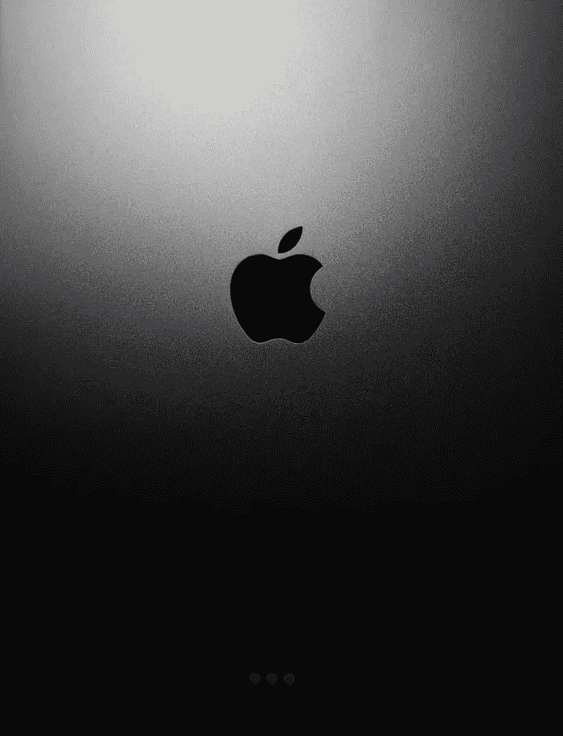

# 苹果发布新款 iPhone，Mac 等！

> 原文：<https://medium.com/codex/apple-released-new-iphone-mac-and-more-4a6dc949ded8?source=collection_archive---------9----------------------->

# 苹果手机

我们为 iPhone 13 和 13 Pro 推出了两种有趣的新颜色:阿尔卑斯绿和大胆绿，将于 3 月 18 日接受预购。

iPhone SE 今年也获得了**规格的提升**，配备了 **A15** 芯片组，支持**实时文本、**相同的 **4.7 英寸 Retina HD** 显示屏，带专用 home 按钮，1200 万像素摄像头，IP67 防水防尘…