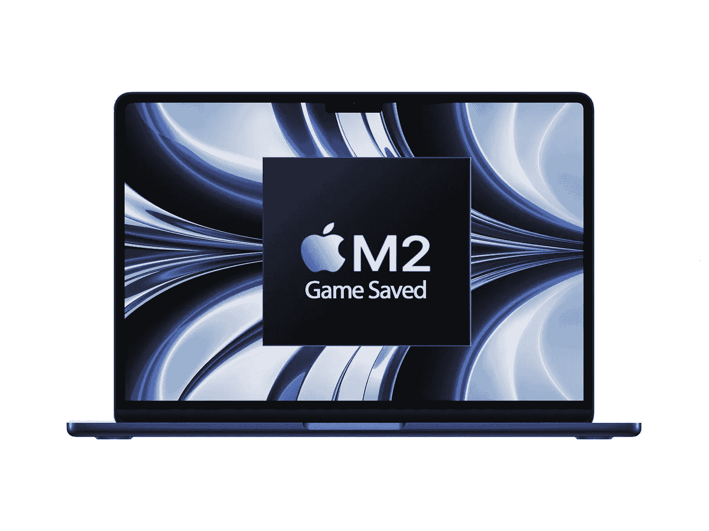

# 苹果硅拯救了苹果

> 原文：<https://medium.com/codex/apple-silicon-saved-apple-cf8e640b4f42?source=collection_archive---------1----------------------->

## 除了苹果电脑，所有电脑的销量都在下降

苹果硅芯片已经设法削弱了世界。苹果设法带来了它的解决方案，完美地解决了以前 MAC 的所有问题，并将苹果电脑带到了一个新的水平。这也难怪。采用苹果芯片的新 MAC 电脑提供了更大的功率和更低的功耗，使它们更高效，电池寿命更长。

图片由作者提供