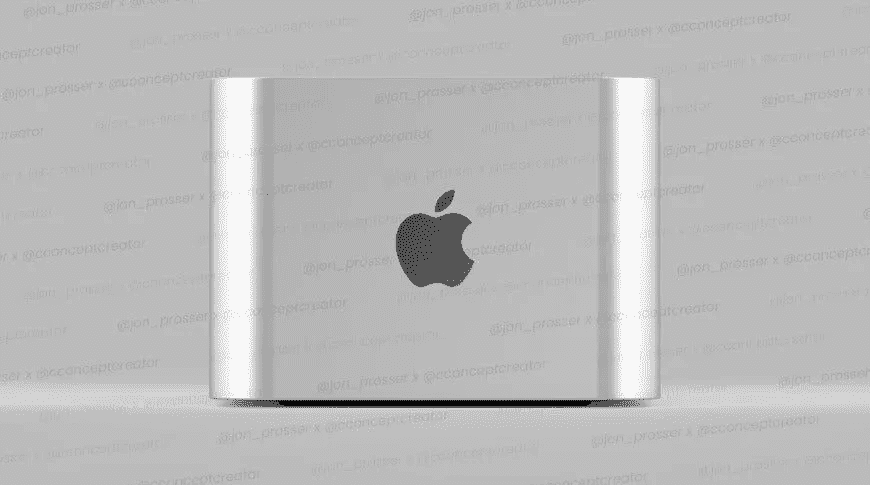
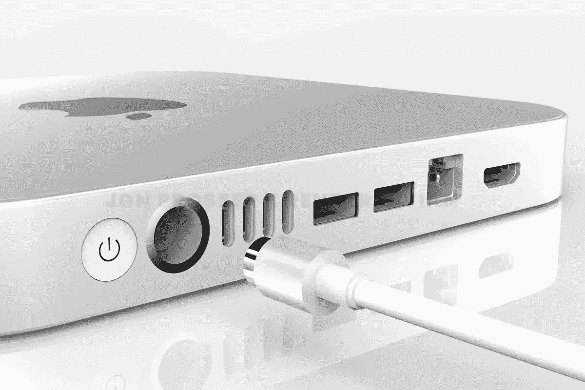

# 苹果工作室是个东西！

> 原文：<https://medium.com/codex/apple-studio-is-a-thing-82848e4db458?source=collection_archive---------8----------------------->

## 苹果再次做到了这一点，并一直致力于一个全新的品牌线的 Mac Pro

我决定等一天左右，再写下周二备受期待的苹果活动——***Peek 表演*** 。我很高兴我现在这样做了，因为新的故事突然开始出现，表明一个全新的 Mac Pros 阵容或层次正在开发中，很可能在今年晚些时候与我们一起出现。

 [## 我永远不会折叠，事件和教训回来了

### 苹果观点——我对本周的看法

medium.com](/codex/never-will-ifold-the-event-lessons-are-back-69555dae31ce) 

## 首先是监视器

让我们先来看看显示器。基于所有可靠的推测，我和许多其他人，已经写了今年显示器加入阵容的前景。自从他们的影院显示器在 2014 年消亡以来，如果你想要一个苹果显示器放在你的桌子上，那么你将会有一笔巨额投资。你目前唯一的选择就是专业显示器 XDR。有了支架，这总是很有用的，这将花费你 6000 英镑(或美元)。现在，随着所有关于今年将有更多 Mac minis 的讨论，一个更实惠的显示器似乎是自然的发展。这完全说得通。发布一些新的 Mac minis，当然没有外设，并提供一个令人惊叹的新显示屏。如果你看过我最近的博客，你就会知道，我一直是 mini 的忠实粉丝。唯一拖我后腿的事情*是找到一个可以与我已经习以为常的视网膜显示器相媲美的显示器。然而，最近的故事似乎表明，他们正在朝着完全相反的方向发展，并且正在进行一场更加专业的展示！*

*它的开发代号一直是 **J327** ，内部会自带 A13 芯片。目前还不清楚这种新显示器是会取代目前的显示器，还是会成为该系列的新成员。它被设置为 7K 显示器，但最终大小未经确认。专业显示器 XDR 32 英寸是一个 6K (6016 × 3384)面板，每英寸 218 像素(PPI)。这款新显示器的像素密度可能会更高，达到 245 PPI。另一个选择是面板可能会增加到 36 英寸，但保留当前显示器的 218 PPI。我不排除我们可以看到两个显示器可用。这将是对电影放映时代多种尺寸阵容的一种倒退。至于其他规格，如峰值亮度和对比度，我想我们必须等待。*

*该显示器将被称为**工作室显示器，**它只是这一系列新专业机器的一部分。*

*** [## 这是一个敏感的话题

### 去年，MacBooks 告别了 Touch Bar。你怀念吗？

medium.com](/codex/its-a-touchy-subject-3d0e920971c2) 

## 工作室背后的智囊

因此，studio 系列的整个精神是，它将整齐地位于 Mac mini 和 Mac Pro 之间，并且主要基于 Mac mini。两个版本正在开发中，项目名为 **J375** 。他们将使用与 2021 年 MacBook Pro 型号相同的 M1 Max 芯片，而另一款将使用比‌M1 Max‌.更强大的苹果硅芯片

尺寸方面，Bloomberg**mark gur man**描述了‌Mac Pro‌的一个新版本，它的特点是底盘更小。在我看来，那很可能是 Mac 工作室。如果猜测是可信的，那么 Mac Studio 最终可能会有 40 个 CPU 核心和多达 128 个 GPU 核心。

也可能会有设计上的变化，增加端口选择，大小可能会介于 Mac mini 和 Mac Pro 之间。

这整个工作室系列将针对专业用户。为了取悦苹果本土的核心用户——专业用户，Studio 系列也将让他们有更多的时间来开发基于苹果硅胶的成熟 Mac Pro。奇怪的是，有传言称 T4 公司仍计划发布另一款新的基于英特尔的 Mac Pro。

工作室的名字可能会改变，可能会在夏天晚些时候宣布，虽然不太可能在下周。彭博新闻似乎认为这些更有可能在六月的 WWDC 首次亮相。

*

## *下周会发生什么*

*嗯，我们可能需要做的第一件事，就是把邀请函拉开一点，看看前面会有什么。*

*如果我们回顾去年春季活动的邀请函，它充满了明亮、鲜艳的色彩。然后，我们得到了彩色系列的 iMacs，它们非常针对市场的消费者端。回顾过去，在我开始写这篇博客之前，使用的颜色总是预示着将要发生的事情。因此，随着今年邀请函上的颜色变得更深，似乎一些专业设备可能会被提供。看看最近的 iPhone 公告。更小的消费手机在活动中经常以更活泼的方式被提及，针对他们的最终用户。然而，专业系列手机是在一个更黑暗和更严肃的对话中谈论的。我的感觉是，这可能也适用于这一事件。这将负责邀请措辞中的*性能*部分。至于 Peek 的用法和拼写，我认为这可能意味着一种期待，可能是对 WWDC 和 pro-MAC 工作室范围的期待。对我有意义，你呢？*

**

## *我们所知道的*

*截至目前，我们似乎可以肯定的是，我们将获得 2022 年的 iPhone SE。它看起来就像 2020 年的 SE 型号，预计不会改变设计元素，并基于 iPhone 8。至于 iPad Air，同样会有很少或没有设计变化，但可能会有一些额外的颜色选择。它将赶上去年发布的 iPad Mini，并将在内部安装 A15 芯片。它还将为蜂窝模型和中央舞台提供 5G 功能，用于前置摄像头。*

*因此，和以往一样，我们所能做的就是推测，分析我们目前所掌握的信息。我们唯一可以确定的是，到了周二，我们会知道更多。该活动将于本周二格林威治时间下午 6 点开始。*

*在下周的 Peek 表演活动中，你最希望或最期待的是什么？让我知道。*

## *在你走之前*

## *你订阅媒体了吗？*

*我只是高端博客网站 Medium 的众多作者之一。这是如此好的价值，你可以在这里加入 https://medium.com/membership*

*[T5 加入我的幕后邮件列表 ](https://www.talkingtechandaudio.com)*

***原载于 2022 年 3 月 5 日 https://www.talkingtechandaudio.com/blog****的** [**。**](https://www.talkingtechandaudio.com/blog)*