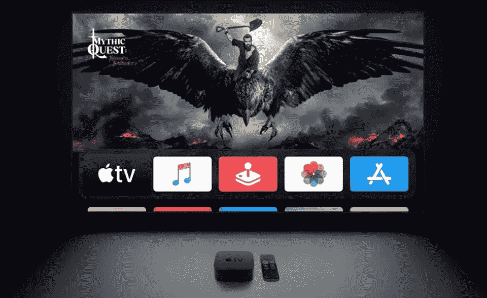

# 苹果电视 2023 将比 iPhone 11 更强大，而且…

> 原文：<https://medium.com/codex/apple-tv-2023will-be-more-powerful-than-the-iphone-11-and-e59b45faf8ec?source=collection_archive---------19----------------------->

据[马克·古尔曼](https://appletrack.com/mark-gurman/) (86.5%的准确率，通过[接通](https://www.bloomberg.com/news/newsletters/2022-06-26/apple-aapl-plans-iphone-14-apple-watch-series-8-m2-macs-for-2022-and-2023-l4vd5unx))，**苹果**正在研发一款经过改良的**苹果电视**，这款电视可能会改变我们今天所热爱和熟知的游戏。所以**马克·古尔曼**告诉了我们所有的基本信息，比如代号，“新的苹果电视，代号 J255”，但他接着说了一些更有趣的消息，比如如何将会有*“新的 Siri 遥控器也可能会出现，* [*因为在 iOS 16 beta 2 中发现的代码暗示了*](https://www.macrumors.com/2022/06/23/ios-16-new-siri-remote-for-apple-tv-rumor/) *”。*

来源——福布斯