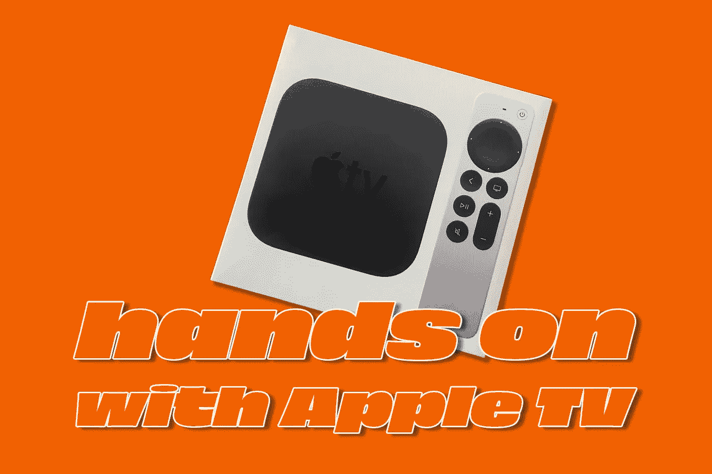
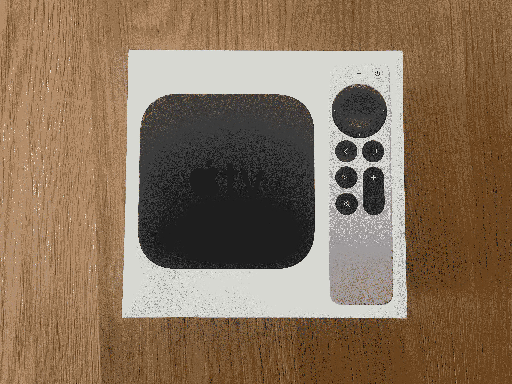
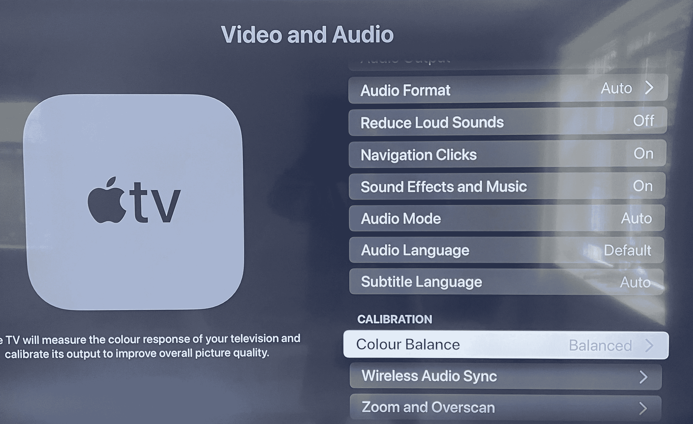
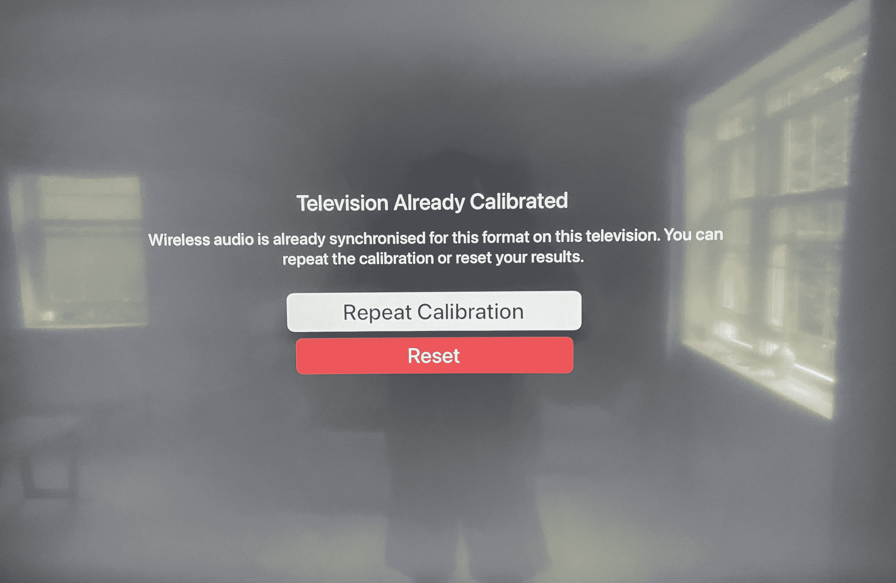
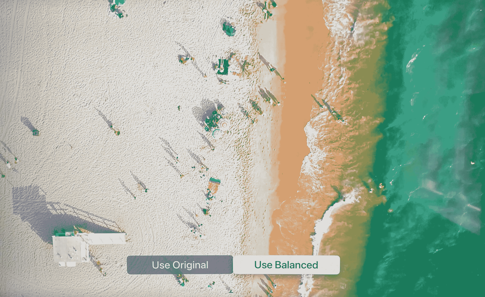
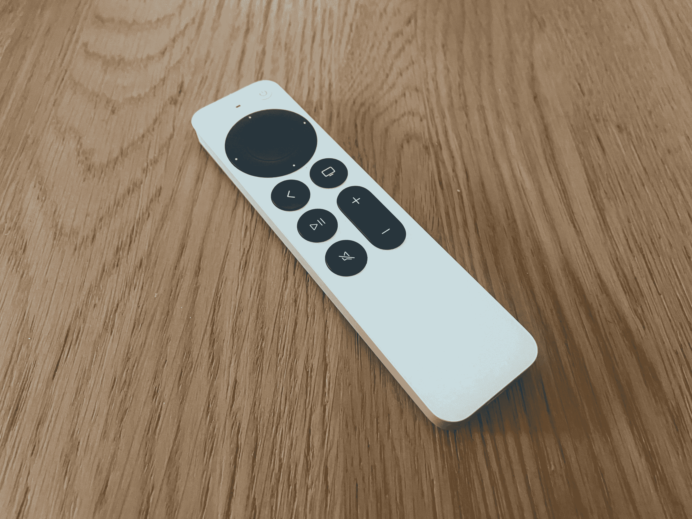
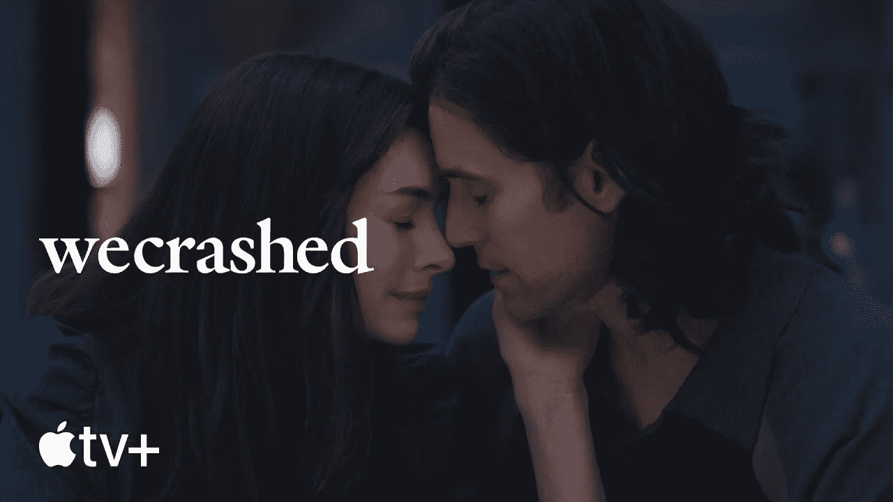
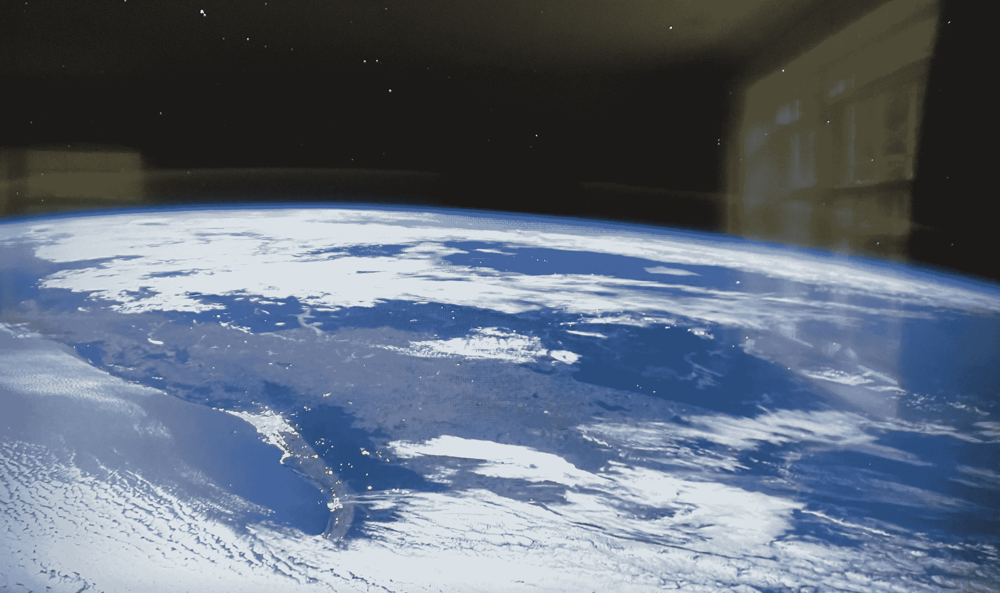

# Apple TV…值得吗？

> 原文：<https://medium.com/codex/apple-tv-is-it-worth-it-1f3c01f142?source=collection_archive---------3----------------------->

## 我大胆尝试，以下是我的想法。

***最近写了一篇博客，是关于改变我在电视付费和消费方式上的习惯。被天空电视台和最近的天空 Q 捆绑了很多年，我决定是时候开始四处看看了。欢迎，苹果电视。***

苹果电视的未来…

## 你得到了什么

上周，我采取了行动，给自己买了一台 4K 苹果电视。到了就是很典型的苹果。触感，诱人，简单却包装精美。在盒子里，真的没有什么可报告的。一根电源线，一个遥控器，还有盒子本身。哦，还有一根 USB-A 转 lightning 线给遥控器充电。事实上，这是一个惊喜，事实是*仍然是* USB-A。因为这是全新的，我本来以为它现在是 USB-C。

色彩校准——微妙但值得

## 安装

只是被警告，如果你正在购买并且打算马上安装，确保给你自己买一根质量好的 HDMI 线，因为那不包括*而不是*。我以前去过那里……热切地期待着连接上一点新的技术，却因为深夜没有所需的电缆而泡汤。我的是直接从苹果买的…只是为了确认一下！

安装真的不能再简单了。它会自动登录你的苹果 ID。那些试图在遥控器上输入电子邮件的日子已经一去不复返了，现在你可以用手机做一些事情了。我建议你进行一次色彩校准。你可以在 ***视频&音频>校准>色彩平衡*** 中找到它，然后你就可以对着电视使用 iPhone 上的前置摄像头了。这一切都很苹果，虽然差异很小，但它确实增强了苹果电视盒子给你的电视带来的色彩。不过，这是很重要的一点，它不是全局调整你的电视的颜色设置，而是 Apple TV 发送给你的电视的图片。

另一个我喜欢的小细节是屏保。你可以选择新的下载频率，城市的景色让你感觉就像真的在那里一样。细节是惊人的。我知道这很傻，但这只是另一种爱。

将您的音频设定为与 Apple TV 同步

## 声音的

最近，随着天空和我的外部扬声器，YouTube 将失去同步(音频和图片——我相信你知道我的意思。)好吧，苹果的武器库中的另一个诀窍是克服这一点的巧妙方法。再一次，头部**到*音频&视觉>校准>无线音频同步。*** 它通过你的扬声器播放一些声音，你的 iPhone 可以听到，并为你校准音频。我还把我的 AirPod Pro 和 Apple TV 配对了。我还没有尝试过空间声音，但正如你所料，它们的声音非常清晰。实际上，我可以想象自己经常这样听电视。

Apple TV 的色彩校准

## 第一印象

印象非常非常深刻。图像质量是我在电视上看到的最好的。我有一个用了一年的 55 英寸三星超高清面板，从我的苹果电视传来的图像实际上比天空好得多。甚至天空超高清也比不上我现在看到的画质。

开箱即用，电视上的应用程序相当全面，例如 BBCs iPlayer、My5 和 ITV HUB，但添加应用程序非常简单。只需进入 App store，你就可以搜索你想要的东西，点击并下载。我的手机上已经安装了欧洲体育、YouTube 和 Spotify，我敢肯定还会有更多。

重新设计的苹果电视遥控器

## 遥控器

关于这件事，我只有好话可说。点拨轮实际上很像 iPod，是一种可爱的复古。而且，它很好用，既直观又精确。Siri 现在已经被挪到一边了。我用它来查找应用程序，效果非常好。有一个独立的电源开/关按钮，使用箭头来重新安排应用程序等，已被证明是一种乐趣。让这款电视感受到*你的*超级简单。

## 并使用它

因此，我给自己设定了一个目标，试图通过苹果盒子尽可能多地消费电视。在自由天空的生活中，我唯一失去的是录音功能，但有这么多+1 服务和电视，我怀疑这将证明是多大的损失。我还没有静下心来看任何 Apple TV+ Originals。即使通过 Sky 上的应用程序，Apple Originals 上的图像也总是很出色，所以我真的很兴奋看到它在经过颜色校准的 Apple TV 上看起来有多好。我们坠毁可能是我对它的第一次测试。我知道有一部大卫·爱登堡系列片即将上映。你能想象那会是什么样子吗？

苹果电视屏幕保护程序的例子

## 结束的

一旦我有了一个月左右的时间，我会让你知道我的进展，但从我目前所看到的来看，这就像一个全新的电视消费世界。这是一个漫长的过程，但最终，我可以看到一个 HDR，60 帧每秒，天空自由的未来即将到来。不仅如此，我还会每月多挣 80 英镑。

## 在你走之前

## 你订阅媒体了吗？

我只是高端博客网站 Medium 的众多作者之一。它是如此物有所值，你可以在这里加入[https://medium.com/membership](https://medium.com/membership)

[**加入我的幕后邮件列表**](https://www.talkingtechandaudio.com)

**原载于 2022 年 5 月 9 日 https://www.talkingtechandaudio.com/blog****[**。**](https://www.talkingtechandaudio.com/blog)**