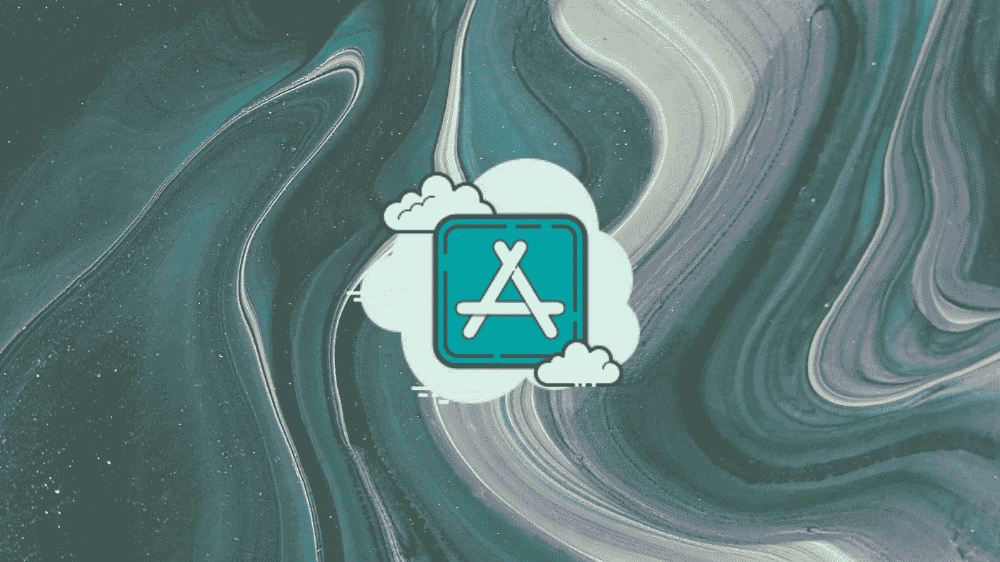
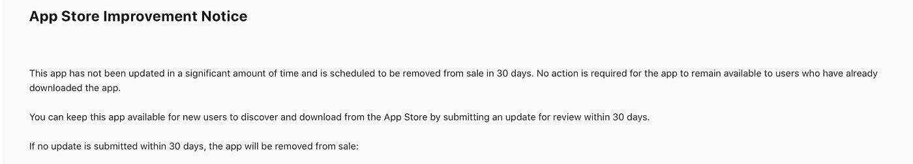

# 苹果保存游戏的方法正在削弱应用商店

> 原文：<https://medium.com/codex/apples-approach-to-game-preservation-is-crippling-the-app-store-f418f621da16?source=collection_archive---------13----------------------->

## 移除“过时的”应用和游戏让开发者们忧心忡忡

来源:图片由作者创作。

苹果公司发布了一份“应用改进通知”,这家位于库比蒂诺的巨头似乎正在从应用商店中清除那些没有更新的应用。

虽然这家价值万亿美元的公司的动机可能是高尚的，但应用程序开发者要求苹果看到理由。苹果给开发者 30 天的时间来更新他们的应用程序，否则将面临被从应用商店中删除的风险。任何以前下载的应用程序将保留在用户的设备上，但如果开发者不更新它们，它们将不再在商店上。

> [@苹果](https://twitter.com/Apple)正在删除我的一些旧游戏 b/c 它们已经“很长时间没有更新了”
> 游戏可以作为已完成的对象存在！这些免费项目不适合更新或实时服务模式，它们是多年前完成的作品。
> - [Em](https://medium.com/u/8115021888ca?source=post_page-----f418f621da16--------------------------------) 上[推特](https://twitter.com/lazerwalker/status/1517849201148932096)

像 Protopop Games 开发商 Robert Kabwe 这样的应用程序制造商担心他们的应用程序，无论多么完整，都有被去平台化的风险。FlickType 键盘的创造者[提出了一个合理的担忧](https://twitter.com/keleftheriou/status/1517907548623437824):曾经风靡一时的游戏[口袋神](https://apps.apple.com/us/app/pocket-god/id301387274)已经 7 年没有更新了，但却安然无恙。其他创作者和罗伯特有着同样的恐惧。

通过一次未经宣布的清洗，苹果疏远了它希望结交的独立开发者。

> 我今天早上收到一封电子邮件，对我的一个应用程序说了同样的话，它没有任何崩溃报告，5 年后仍然可以下载，不需要 v2，苹果决定是时候退出了，因为版本变化太快，我没有时间推动有意义的变化
> - [西蒙·巴克](https://medium.com/u/522ab51d524a?source=post_page-----f418f621da16--------------------------------)在[推特](https://twitter.com/allthecode_/status/1517970758575824896)

Protopop Games 收到的邮件。来源:[推特](https://twitter.com/protopop/status/1517701619374338050)。

## app 和游戏可以不作为自己完整的版本存在吗？

苹果似乎搬起石头砸了自己的脚，要求开发者更新已经为他们的目标受众完成的体验。从 App Store 下架的后果可能会摧毁大大小小开发者的生计。随着开发社区的喧嚣，我希望苹果听。

苹果的“ [App Store 改进](https://developer.apple.com/support/app-store-improvements/)”页面对此事鲜有说明。

虽然这次[不是苹果第一次从应用商店下架过时的应用，但苹果这些年来是否一直在执行它的政策还有待观察。随着视频游戏保护成为游戏机制造商微软和索尼之间的争论点，令人惊讶的是移动应用商店却没有同样的说法。对于从已有应用转向新项目的开发者来说，数字店面清理其“杂乱”是个坏消息。](https://www.theverge.com/2016/9/1/12755260/apple-removing-abandoned-iphone-apps)

几十年前的游戏仍然可以在游戏机和个人电脑上玩。

移动应用商店偏离这一标准是一个值得关注的问题。

当然，没有多少人想在 2022 年下载喝啤酒的应用程序和古老的游戏。但如果苹果不尊重其开发者和创造者，它作为数字店面的历史就有被淡化的风险。下一代移动应用应该能够与过去的热门应用比肩。

苹果并不是唯一应该受到指责的平台。

谷歌也明确表达了自己的意图:符合两年前的 API 水平，否则 Play Store 的可见性会受到限制。我希望开发者们表达的担忧能促使谷歌和苹果找到一个对各方都有利的替代方案。随着开发者受到两方面的质疑，独立开发者将不得不重新审视他们的应用程序，如果他们不想冒损失或更糟的风险，被去平台化的话。