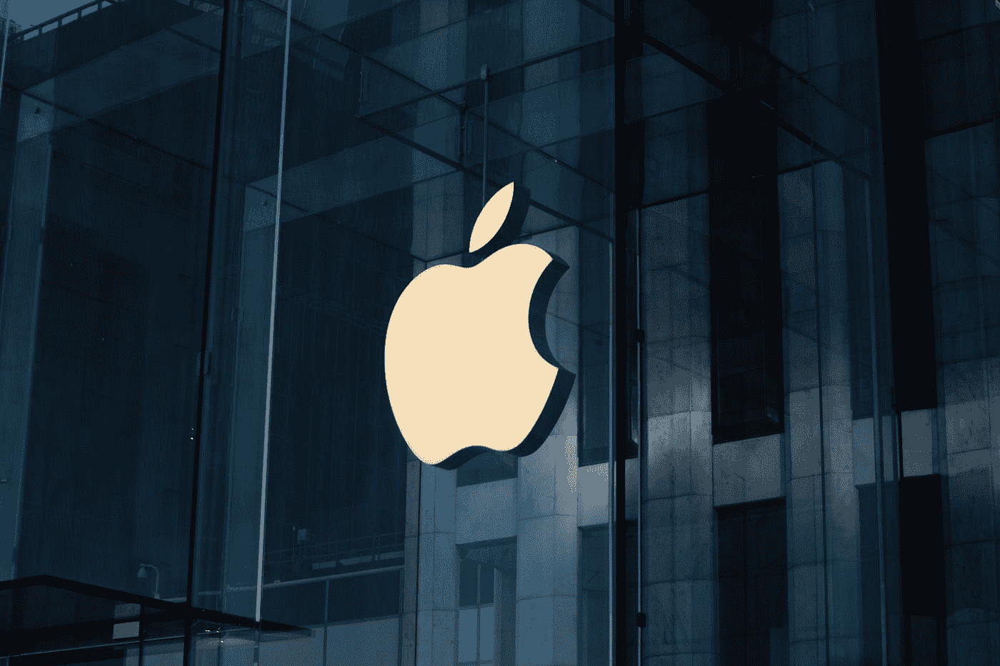

# 苹果被美国联邦法官驳回了！

> 原文：<https://medium.com/codex/apples-been-rejected-by-us-federal-judge-93b53888f705?source=collection_archive---------9----------------------->

劳伦茨·海曼在 [Unsplash](https://unsplash.com?utm_source=medium&utm_medium=referral) 上拍摄的照片

Cydia(越狱**苹果**设备的替代应用商店)对硅谷巨头[**【Apple.com】**](http://Apple.com)**提起反垄断诉讼，苹果**向法院提出无视诉讼，但法院表示并非如此。

提起诉讼是因为 Cydia 的创始人 Jay Freeman 说苹果通过‌App Store‌.非法垄断了 iOS 应用程序的分发他的诉状还声称…