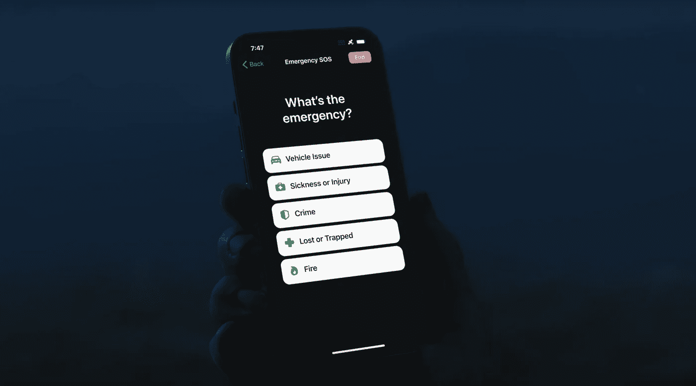

# 苹果公司通过卫星发送的紧急求救信号简直不可思议

> 原文：<https://medium.com/codex/apples-emergency-sos-via-satellite-is-out-of-this-world-literally-ce32afc307bc?source=collection_archive---------5----------------------->

## 这得益于 4.5 亿美元的投资和与 Globalstar 的合作

信用苹果

当手机有信号或无线网络时，它就很棒。但是如果你需要帮助或者需要发消息却没有服务怎么办？如果你在荒郊野外露营，需要…