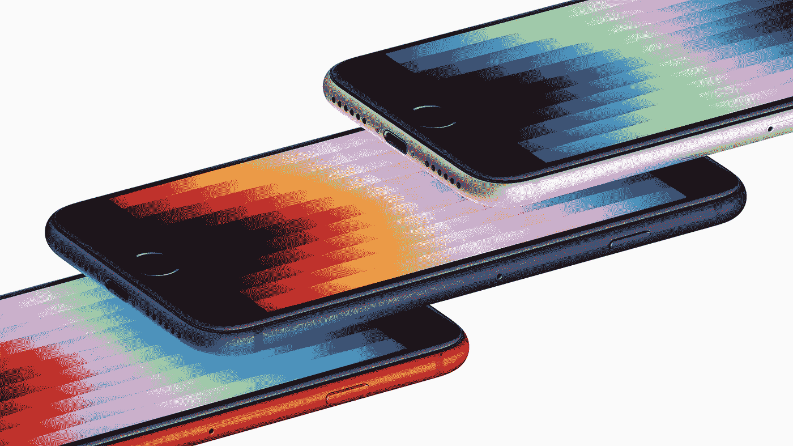
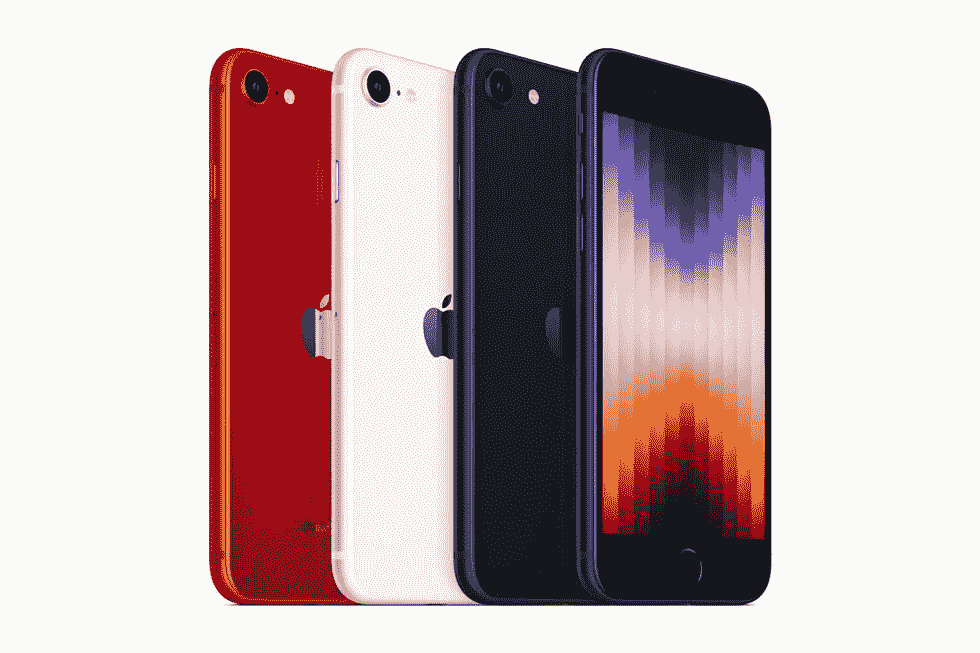

# 苹果的 iPhone SE (2022)以其显示屏的成本来固定价格

> 原文：<https://medium.com/codex/apples-iphone-se-2022-nails-the-price-at-the-cost-of-its-display-daea8255e46b?source=collection_archive---------0----------------------->

## iPhone 的故事和行业标准刷新率

来源:苹果。

谣言是真的。一切照旧。

在昨天的 Peek Performance Apple 活动上，公布了平价 iPhone SE。这款售价 429 美元的设备配备了苹果强大的 A15 仿生处理器，并升级了电池寿命和耐用性，是进入苹果生态系统的一个重要门户。增强的相机算法和 5G 支持增加了交易的甜头。

但进一步检查，一个明显的遗漏浮出水面。

4.7 英寸的高清显示屏对于高端设备来说并不是一个很好的外观，但 720p 的分辨率也不是我对这样一个小屏幕的最大不满。是刷新率。说说你对苹果和它的感应显示器的看法。

在 2022 年，60 Hz 的显示屏在智能手机上是荒谬的，更不用说 429 美元的智能手机了。

如果 [Realme](https://www.amazon.in/realme-Storage-Processor-Triple-Display/dp/B09RMG1M98/ref=sr_1_1?adgrpid=62992311740&ext_vrnc=hi&gclid=Cj0KCQiAmpyRBhC-ARIsABs2EApxeMClX0j1BUWaeTPQmIHYR05GQPJiHcIl6Z98XBjj_tBdx9hqOqcaAg3HEALw_wcB&hvadid=398059829956&hvdev=c&hvlocphy=1007768&hvnetw=g&hvqmt=e&hvrand=8689046250693372407&hvtargid=kwd-1188313309897&hydadcr=24568_1971427&keywords=realme+narzo+50&qid=1646800578&sr=8-1) 和[小米](https://www.mi.com/global/product/redmi-note-11-pro-5g/)可以以低于 200 美元的价格提供 120 Hz 的显示器，那么期望同样的东西贵一倍也不是不合理的。这是一种生活质量的提高，对你看到的和做的一切都有明显的影响。

高刷新率不仅仅是游戏玩家的专利；他们是每个人的 T4。

在性能方面，智能手机很少让人感觉与前辈有所不同。当然，[基准和图表](https://in.pcmag.com/mobile-phones/145051/iphone-13-benchmarks-apples-a15-chip-crushes-qualcomm)讲述了一个不同的故事，但这些收益很少转化为现实生活中的改善。但是，从超级用户到不熟悉智能手机技术的人，每个人都可以欣赏更快的刷新率。

无论是在社交媒体上滚动还是在互联网上浏览，更流畅的显示屏都会带来巨大的变化。回到过去几乎是不可能的。

来源:苹果。

## 苹果的 iPhone SE (2022)几乎一切都是正确的

苹果的便携式 iPhone SE 并没有开辟新的领域。

但它在苹果生态系统中占据了一个有趣的位置。

虽然 iPhone 13 Mini 的尺寸更小，但苹果的新 SE 在做出正确妥协的同时，轻松地低于其 729 美元的兄弟。考虑到苹果最新的摄像头优化将应用于 iPhone SE，过时的摄像头并不是一个大问题。至于有缺口的显示屏，那是个人喜好的问题。

虽然有些人对 bezels 和 TouchID 吹毛求疵，但其他人认为 iPhone 8 风格的外观具有标志性。

虽然苹果仍然将其 120 Hz 显示屏限制在 iPhone 和 iPads 的 Pro 系列中，但我曾希望 iPhone SE 会有更好的结果。当 829 美元的 iPhone 13 也满足于 60 赫兹的显示屏时，我不能责怪 429 美元的手机。或许 iPhone 14 阵容会赶上中端安卓人群。

现在，我不能全心全意地推荐 iPhone SE 而不是它的竞争对手。

如果你是一名 Android 用户，想要加入苹果的行列，你很可能已经拥有一部 90 赫兹或 120 赫兹显示屏的智能手机。尽管苹果因其反应灵敏的显示屏而享有快速手机的声誉，但 60 赫兹的显示屏将限制 iPhone SE。当你花 429 美元时，有成本意识的买家在选择苹果之前肯定会三思。

iPhone SE 离热情洋溢的推荐只有一步之遥，但包装的其余部分仍然是一个诱人的提议。