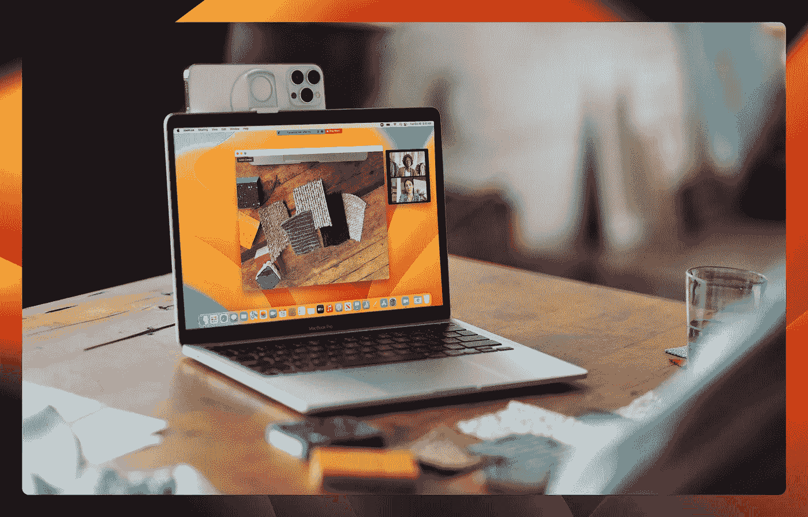

# 苹果的 macOS Ventura 大同小异，因为苹果并不傻

> 原文：<https://medium.com/codex/apples-macos-ventura-is-a-lot-of-the-same-because-apple-isn-t-stupid-4a61e47a6c26?source=collection_archive---------6----------------------->

## 如果它没坏…

信用苹果

苹果最近发布了 macOS 13 Ventura，作为 macOS 12 Monterey 的继任者。这个版本的 macOS 带来了很多我已经开始喜欢的新功能。但更重要的是，文图拉和我们在蒙特雷的时候一样，这很好。