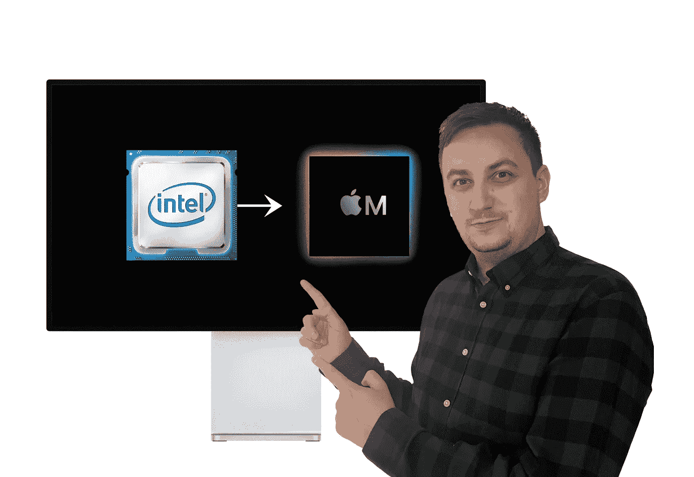

# 苹果转向 ARM 是一个巨大的成功

> 原文：<https://medium.com/codex/apples-move-to-arm-is-a-huge-success-335c256c9571?source=collection_archive---------2----------------------->

## 另一方面，Windows ARM 并不是很受欢迎

苹果从英特尔转移到 ARM 是一个巨大的成功——图片来自[雅各布·吉拉克](https://jakubjirak.com)(基于[来源](https://www.youtube.com/watch?v=vqs_0W-MSB0)

在 WWDC 2020 开发者大会上，苹果首次透露了一个相当重大的变化——MAC 将从英特尔处理器切换到苹果的硅芯片组。从这一点来看，这个巨头承诺的只是好处，尤其是在性能和能效方面。