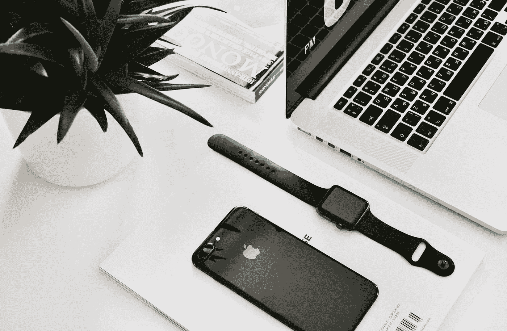

# 苹果的自负问题

> 原文：<https://medium.com/codex/apples-pretentiousness-problem-65822d51177e?source=collection_archive---------3----------------------->

照片由[伊戈尔的儿子](https://unsplash.com/@igorson?utm_source=medium&utm_medium=referral)在 [Unsplash](https://unsplash.com?utm_source=medium&utm_medium=referral) 上拍摄

我在想我最近听到的关于 Airpods pro 2 的谣言，以及他们如何在最初的 Airpods pro 一出来就取消它。