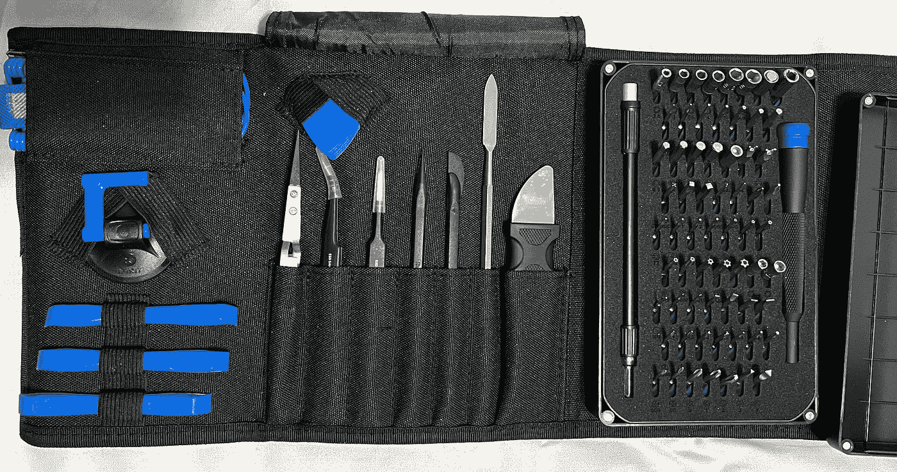

# 苹果维修 Cave 的权利可能适得其反

> 原文：<https://medium.com/codex/apples-right-to-repair-cave-could-backfire-9cd7ca414cf3?source=collection_archive---------7----------------------->

首先是降低了应用程序开发者的苹果税，然后我们重新获得了 MacBook Pro 上的端口，现在苹果做了一个*巨大的* 180 度转变，允许所有客户修理自己的手机和 MAC 电脑。第一次很棒，虽然太晚了，但绝对受欢迎。第二个也很棒，但是我们确实从它身上得到了又胖又重的机器，这不是很棒。不过最后这一个，已经让我开始怀疑了…