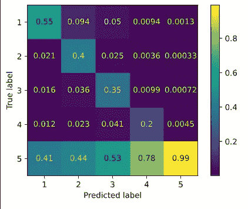
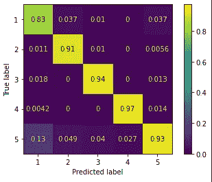
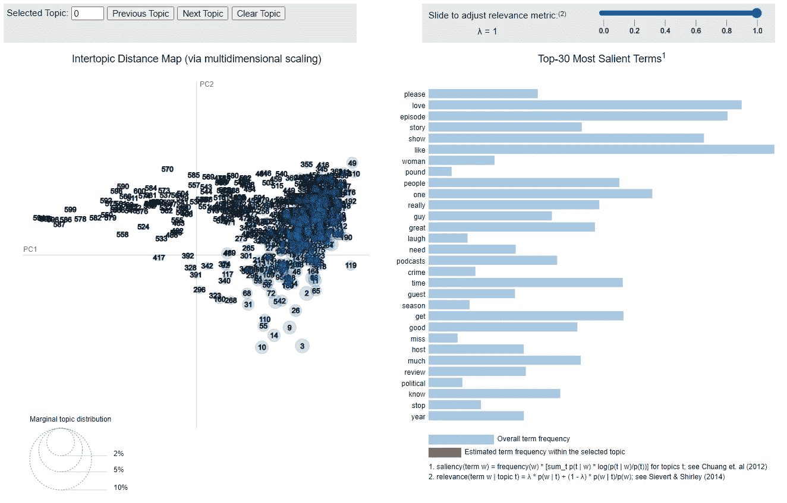
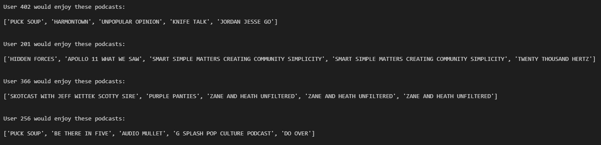

# 从四个不同的模型接近我的 NLP 数据集

> 原文：<https://medium.com/codex/approaching-my-nlp-data-set-from-four-different-models-436370cad864?source=collection_archive---------8----------------------->

## [法典](http://medium.com/codex)

在最近的一个 NLP 项目中，我从 Kaggle 获取了一个数据集，并从几个不同的角度对其进行了调查。在这个过程中，我实现了四种不同的建模技术，每种技术都有不同的用途。我计划阐明每种技术，并展示如何将一个项目分成几个小项目，每个小项目都有自己的目标，以达到目的。

## 数据

500 万条播客评论，包括书面和数字评级。数据每月更新，组织得非常好。我要求添加的唯一功能是离开评论的消费者的用户 ID。数据可在[这里](https://www.kaggle.com/thoughtvector/podcastreviews)获得。

## 我们的第一个模型——逻辑回归

数据集中的每个条目都有一个书面的和数字评级的审查，使其成为标签分类的理想选择。接近数据集时，设定你的标准和目标是很重要的。我们的数据集很大，我们的第一个模型的目标只是消除容易预测的评论。我们从一个简单的模型开始，接受一个大的误差。下一个模型的目标是处理这个错误。

NLP 的标准第一步适用于:

*   清理数据
*   标记化
*   把…按屈折变化形式进行归类
*   计数矢量化

常规过程中最大的发现是数据本身的形状。这是巨大的不平衡，有利于 5 评级。

紫色代表我们 5 班

检查像这样的大规模不平衡数据集的模型的混淆矩阵是很重要的，以确保我们的模型不会每次都选择多数类。

逻辑回归混淆矩阵热图

我为我们的初始分类模型选择了一个逻辑回归分类器。正如你在左边看到的，它为任何不是 5 的类选择了一个非常糟糕的结果。但重要的是记住我们既定的目标。这个模型倾向于选择多数类，但当它不选择多数类时，它往往是相当准确的。事实上，通过计算误差，每个错误分类的数据点平均错误 1.57。

就数字评分系统而言，评分为 2 的项目和评分为 3 的项目之间的实际差异是什么？A 4 vs a 5？评级基于非常主观的方法，因此该模型的目标是在实际评级的范围内进行预测。我删除了所有正确预测的数据点和所有在一个正确等级内的数据点。

## 第二个模型——随机森林

现在我们已经把数据集缩减到只有难以预测的项目。现在我们认真对待我们的建模和优化参数。这次的目标是准确性。尝试了几种模型，随机森林分类显示了巨大的成功。

随机森林混乱矩阵热图

哇，真是天壤之别。只有一类预测低于 90%，大部分误分类都指向另一个极端。在我看来，NLP 过程可能很难区分 1 和 5。现在，当我回到前面的步骤来改进我们的建模时，我有了一个重点关注的领域。

## 第三种模型— LDA/K 表示聚类

我们过程的下两个步骤的目标是创建一个协作推荐系统。为了做到这一点，我引入了惊奇库，它专门研究基于用户的推荐系统。它有三个要求:用户 id、商品 id 和评级。评级是明确的，并已用于创建我们的分类模型。项目 id 是我们正在评级的播客的名称。但是，缺少用户 id。所以我们用聚类来预测它们吧！

在这一步，我将两个无监督的模型放在一起，因为它们在这里是用来相互补充的。首先，我使用 K 均值聚类来预测基于书面评论文本的聚类。选择适当的集群数量很重要。太少，他们都将围绕着我们不平衡的多数阶级。太多了，我们花费额外的时间和处理能力来产生越来越多的冗余信息。经过一些实验，选择了 500 个集群。现在，我们可以根据数据点的聚类来分配数据点，这样我们就有了用户！作为未来项目的注意事项，将新用户分配到预先确定的集群是常见“冷启动”问题的一种可能解决方案。

LDA 每个小斑点是一个不同的预测主题。主题按预测的相似性分组。

为了模拟聚类，我转向一个不同的无监督学习过程:潜在狄利克雷分配(LDA)。LDA 像我们一样用于文本数据，并使用机器学习将我们的数据组织成主题。我们当前数据集的预期结果是基于评论的观点。基于高度正面的评论，主题可能是相似的，并且它们可能远离从负面评论中提取的主题。注意:这与 K Means 用来分配分类的过程不同，但可以假定它是相似的，因此是一个有用的可视化工具，有助于探索文本数据。

## 第四种模式

第四个模型直接来自我们之前讨论的目标:构建推荐系统。我从 surprise 库中导入 SVD 模型，并提供我们预测的集群来代替丢失的用户 id。瞧啊。我们已经创建了一个没有任何用户的基于用户的推荐系统！

我的简单推荐系统。

## 结论

必须指出，这一过程的每一步都有改进的余地。但是，这样做，清晰地划分每一步，并在每一步确定新的项目目标，对于回到起点并在未来的步骤中使用我们所学的知识会有很大的帮助。如果我们在继续前进之前花费时间和精力来完善每一步，那么这个项目将会以一种更加困难的方式得到完善和优化。组织有时意味着忽略完美。

感谢你的阅读，我希望你已经注意到一些建议！