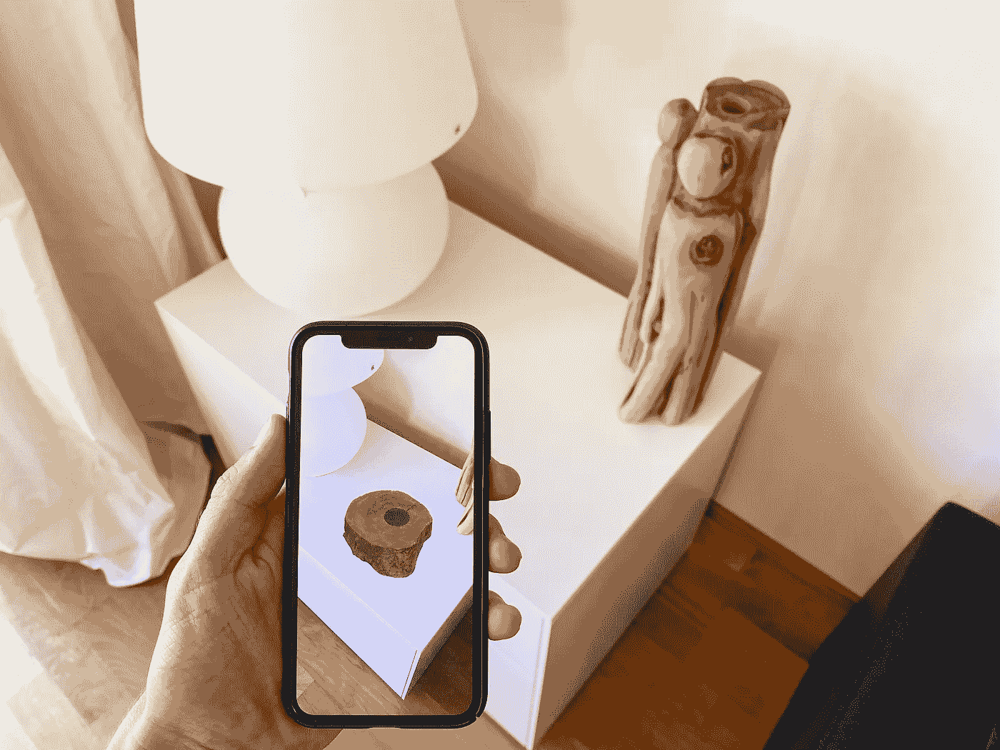

# Swift 中的 AR 应用程序—教程

> 原文：<https://medium.com/codex/ar-app-in-swift-tutorial-d715987168bf?source=collection_archive---------4----------------------->

## 第一部分

图片由 [UNIBOA](https://unsplash.com/@uniboa) 在 [Unsplash](https://unsplash.com) 拍摄。

增强现实是未来。随着苹果发布 SwiftUI 和 ARKit 3，创建增强现实应用程序变得前所未有的简单。在本教程中，我们将学习如何在 SwiftUI 中创建 AR 应用程序。这是一些迷你教程的介绍性教程，我们将在其中学习如何在 SwiftUI 中构建 AR 应用程序。跟随我们，让我们建立一个项目，你…