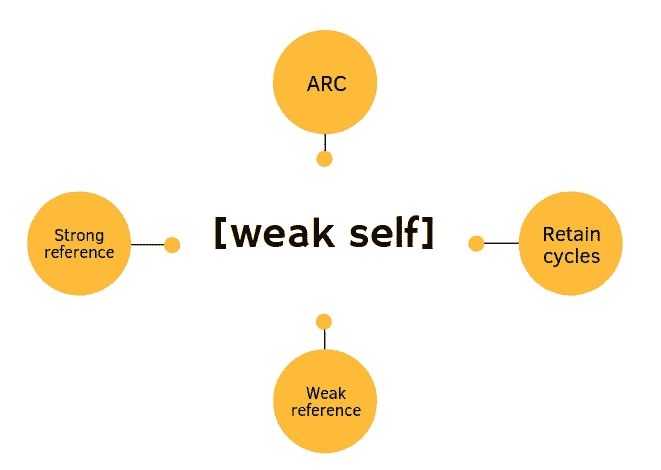

# Swift 中的 ARC:提示和技巧

> 原文：<https://medium.com/codex/arc-in-swift-tips-and-tricks-a21076c52e7?source=collection_archive---------0----------------------->

## 每次面试中最常问的话题

[图像来源](https://www.google.com/search?q=arc+in+swift+images&tbm=isch&ved=2ahUKEwiEm7CT7oH4AhW9_rsIHcy1CBoQ2-cCegQIABAA&oq=arc+in+swift+images&gs_lcp=CgNpbWcQAzoECCMQJzoFCAAQgAQ6BAgAEEM6BAgAEBhQhARYrBNgkxRoAHAAeACAAb0BiAGLGpIBBDAuMTmYAQCgAQGqAQtnd3Mtd2l6LWltZ8ABAQ&sclient=img&ei=iOiRYoS3G7397_UPzOui0AE&bih=821&biw=1440#imgrc=7QFK-h2y8cNKiM)

**你将学到什么:**

1.  什么是 ARC？
2.  ARC 是如何工作的？
3.  什么是强引用？
4.  什么是弱引用？
5.  主要部分，我们应该小心在 IOS 应用程序约弱
6.  弧形闭合