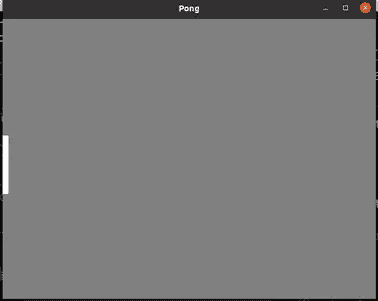
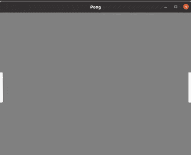
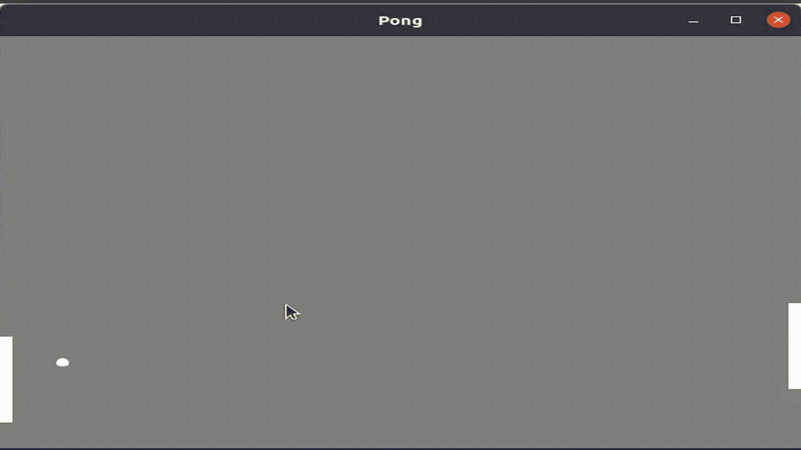

# 在 Rust: Pong 中编写街机游戏代码

> 原文：<https://medium.com/codex/arcade-games-in-rust-pong-2f85b267ec1a?source=collection_archive---------4----------------------->

我已经写了几篇关于在 Rust 中创建[刽子手](/me/stats/post/ee8f0a66ab00)和在 Rust 中创建[粒子系统](/codex/nature-of-rust-particles-40cec0a8c25e)的文章，我一直在寻找一个新的挑战…所以对我来说，下一步，在创建了一个没有输入的基于画布的项目之后，就是创建一个允许用户输入的基于画布的游戏。我能想到的最简单的方法是 Pong，所以我来了。

# 创建画布

该项目的第一阶段是将依赖项加载到 **cargo.toml** 文件中。这样做可以确保在项目中可以接触到预制的板条箱。创建画布并允许在画布上绘制对象所需的主要两个是 ***piston*** 和***piston _ window***。

```
.....
[dependencies]
piston = "0.53.0"
piston_window = "0.120.0"
```

将依赖项加载到项目中之后，下一步是绘制空白画布。下面的模板代码可以在 **main.rs** 文件中使用，这也是我在任何有活塞依赖项的项目开始时经常使用的。

```
**main.rs**extern crate piston_window;use piston_window::*;
use piston_window::types::Color;const WIDTH: u32 = 640;
const HEIGHT: u32 = 480;
const BACKGROUND_COLOUR: Color = [0.5, 0.5, 0.5, 1.0];fn main() {
    let mut window: PistonWindow = WindowSettings::new("Rusty Pong",
                                                  [WIDTH, HEIGHT])
        .exit_on_esc(true)
        .build()
        .unwrap(); while let Some(event) = window.next() {
        window.draw_2d(&e, |context, graphics, _device| {
            clear(BACKGROUND_COLOUR, graphics);
        }); }}
```

# 向窗户划一桨

现在游戏画布已经创建好了，是时候给它添加对象了。在 Pong 中有两个球拍，一个给玩家，一个给基于电脑的对手。为了制作这些桨，首先在项目的 src 目录中创建一个新文件 **paddle.rs** 。该文件将用于创建一个名为 **paddle** 的结构，该结构将跟踪在窗口上绘制 Paddle 的位置，并具有向窗口显示 Paddle 的功能。除了位置之外，Paddle struct 将使用布尔(真/假)特征来跟踪它是否是用户的 Paddle。

```
**paddle.rs**use piston_window::types::Color;
use piston_window::{rectangle, Context, G2d};const PADDLE_COLOUR: Color = [1., 1., 1., 1.];
const PADDLE_WIDTH: f64 = 10.;
const PADDLE_HEIGHT: f64 = 100.;pub struct Paddle {
    pos_x: f64,
    pos_y: f64,
    is_user: bool,
}impl Paddle { pub fn new(pos_x: f64, pos_y: f64, is_user: bool) -> Paddle {
        Paddle {
            pos_x: pos_x,
            pos_y: pos_y,
            is_user: is_user,
        }
    }

    pub fn display(&*self*, con: &Context, g: &mut G2d) {
        rectangle(
            PADDLE_COLOUR,
            [*self*.pos_x, *self*.pos_y, 
             *PADDLE_WIDTH*, PADDLE_HEIGHT,
            con.transform,
            g
        );
    }}
```

上面的代码首先从 piston_window 框中导入必要的属性，它们是类型 Color、函数 rectangle 和数据类型 Context 和 G2d。颜色数据类型用于定义 PADDLE_COLOUR 常量，该常量用于 PADDLE 的**显示**功能。上下文和 G2d 数据类型与上一步中在 **main.rs** 文件中创建的窗口相关，并允许从 piston_window 导入的 rectangle 函数将球拍绘制到游戏画布中。

当将 **con** 参数传入显示函数时，“ **&** ”意味着该函数是在引用对象，而不是传入对象本身。如果“ **&** ”没有被使用，那么原始对象将不会位于相同的内存空间中，并且不能被再次引用。

要实现 Paddle 结构并将其绘制到游戏画布上，必须在 **main.rs** 中导入该结构，创建一个变量来包含玩家 Paddle 结构和在窗口绘制循环中调用的显示函数。

```
**main.rs**extern crate piston_window;**mod paddle;**use piston_window::*;
use piston_window::types::Color;**use paddle::Paddle;**const WIDTH: u32 = 640;
const HEIGHT: u32 = 480;
const BACKGROUND_COLOUR: Color = [0.5, 0.5, 0.5, 1.0];fn main() {
    let mut window: PistonWindow = WindowSettings::new("Rusty Pong",
                                                  [WIDTH, HEIGHT])
        .exit_on_esc(true)
        .build()
        .unwrap();
    **let mut player = Paddle::new(0., 100., true);** while let Some(event) = window.next() {
        window.draw_2d(&e, |context, graphics, _device| {
            clear(BACKGROUND_COLOUR, graphics);
            **player.display(&context, graphics);**
       }); }}
```



将第一个桨添加到游戏画布

创建对手 paddle 的过程与上面的过程相同，除了分配给 Paddle struct 的变量将被称为对手。



画有两个桨的游戏画布

## 画和移动一个球

与创建球拍类似，第一步是创建一个名为 **ball.rs** 的新文件。这个文件将创建一个 Ball 结构，它将跟踪它的 x 和 y 位置，以及 x 和 y 平面上的速度和画布的宽度和高度。除了 Ball 结构实现中的新函数之外，还有另外两个函数:display(将球绘制到画布上)和 update(移动球)。更新功能将检查球的位置是否在画布的边界之外，如果球的位置在 y 平面之外，则球的方向被反转。如果球在 x 平面中的画布之外，那么它的位置被重置为画布的中心，并且方向被反转。

```
**ball.rs**use piston_window::types::Color;
use piston_window::{ellipse, Context, G2d};const BALL_COLOUR: Color = [1., 1., 1., 1.];
const RADIUS: f64 = 10.;pub struct Ball {
    pos_x: f64,
    pos_y: f64,
    vel_x: f64,
    vel_y: f64,
    width: f64,
    height: f64,
}impl Ball {
    pub fn new(pos_x: f64, pos_y: f64, 
               canvas_dim: [f64; 2]) -> Ball {
        Ball {
            pos_x: pos_x,
            pos_y: pos_y,
            vel_x: 5.,
            vel_y: 5.,
            width: canvas_dim[0],
            height: canvas_dim[1],
       }
    }

    pub fn display(&mut *self*, con: &Context, g: &mut G2d) {
        *self*.update();
        ellipse(
            BALL_COLOUR,
            [*self*.pos_x, *self*.pos_y, RADIUS, RADIUS],
            con.transform, g
        );
    } fn update(&mut *self*) {
        if (*self*.pos_y <= 0.) | (*self*.pos_y >= *self*.height) {
            *self*.vel_y *= -1.;
        }
        if (*self*.pos_x <= 0.) | (*self*.pos_x >= *self*.width) {
            *self*.vel_x *= -1.;
            *self*.pos_x = *self*.width / 2.;
            *self*.pos_y = *self*.height / 2.;
        }
       *self*.pos_x += *self*.vel_x;
       *self*.pos_y += *self*.vel_y;
    }
}
```

要将球添加到画布上，可以使用与 Paddle 相同的方法，只是在这种情况下，会将额外的参数传递给 Ball::new 函数，该函数包含画布宽度和高度的数组。

## **移动播放器桨**

对我来说，这可能有点复杂。然而，这是我从基本原则出发实现它的方式。在 main.rs 文件中创建了两个额外的变量，一个用于跟踪是否持有一个键，这是一个布尔值。另一个是 char 类型，将记录 key_pressed 作为单个字符(“u”表示向上，“d”表示向下)。

为了分配 key_pressed，press_args 函数的 piston_window 事件用于获取键。如果该键与向上箭头或向下箭头匹配，那么 key_pressed 将分别被赋予“u”或“d”。此外，held 变量被设置为 true。

```
**main.rs**...
while let Some(event) = window.next() {
    if let Some(Button::Keyboard(key)) = event.press_args() {
        held = true;
        match key {
            Key::Up => {
                key_pressed = 'u';
            }
            Key::Down => {
                key_pressed = 'd';
            }
            _ => {}
        }
    }
    ...
}
```

为了跟踪一个键被释放的时间，监视事件函数 release_args。如果它被触发，那么 held 被设置为 false，key_pressed 被设置为“n”(表示无)。

```
**main.rs**...
while let Some(event) = window.next() {
    ...
    if let Some(Button::Keyboard(key)) = event.release_args() {
        held = true;
        key_pressed = 'n';
    }
    ...
}
```

有了一种方法来跟踪向上或向下箭头是否在主游戏循环中被按下，现在在 paddle 结构中需要有一个函数来更新 Paddle。这将被称为 update_player，并根据球拍应该在屏幕上向上还是向下移动来增加或减少玩家的位置。

```
**paddle.rs**impl Paddle {
    ...
    pub fn update_player(&mut self, key, held) {
        if (key == 'u') & (pressed) {
            self.pos_y -= 5.;
        }
        if (key == 'd') & (pressed) {
            self.pos_y += 5.;
        }
    }
}
```

在 main.rs 中，update_player 函数在 player.display 函数之前被调用，以确保每次刷新帧时，画板在画布上绘制之前被移动。

## 移动对手的球拍

移动对手的球拍将基于球相对于右手球拍中心的垂直位置。如果球在球拍顶部的四分之一以上，那么对手将通过从位置 y 中减去而在画布上向上移动。如果球在球拍底部的四分之一以下，那么它将通过增加位置 y 而在画布上向下移动。

```
**paddle.rs** impl Paddle {
    ...
    pub fn update_opponent(&mut self, ball_pos_y:f64) {
        if *self*.is_user == false {
            if *self*.pos_y + (3\. * PADDLE_HEIGHT / 4.) < ball_pos_y {
                *self*.pos_y += 3.;
            } else if *self*.pos_y + PADDLE_HEIGHT / 4\. < ball_pos_y }
                *self*.pos_y -= 3.;
            }
        }
    }
}
```

## 重建游戏结构

为了监控球是否被球拍击中，第一步是创建一个名为 **Game** 的新结构。这将用于初始化和包含游戏的现有方面，将它们从 main.rs 文件中取出。除了追踪球拍和球之外，游戏还将为玩家和对手提供两个分数属性。除了初始化游戏结构的新功能，还有一个**更新 _ 游戏**的功能，它将运行球和桨的更新和显示功能。

```
**game.rs**use piston_window::{Context, G2d};use crate::ball::Ball;
use crate::paddle::Paddle;pub struct Game {
    ball: Ball,
    player_paddle: Paddle,
    player_score: u16,
    opponent_paddle: Paddle,
    opponent_score: u16,
    canvas_dim: [f64; 2],
}impl Game {
    pub fn new(canvas_dim: [f64; 2]) -> Game {
        Game {
            ball: Ball::new(canvas_dim[0] / 2., canvas_dim[1] / 2., 
                            canvas_dim),
            player_paddle: Paddle::new(0., 200., true),
            player_score: 0,
            opponent_paddle: Paddle::new(canvas_dim[0] - 10., 
                                         200., false),
            opponent_score: 0,
           canvas_dim: canvas_dim,
        }
    } pub fn update_game(&mut *self*, con: &Context, g: &mut G2d, 
                       key_pressed: char, held: bool) {
        *self*.player_paddle.update_player(key_pressed, held);
        *self*.player_paddle.display(&con, g);
        *self*.opponent_paddle.update_opponent(*self*.ball.pos_y);
        *self*.opponent_paddle.display(&con, g);
        *self*.ball.display(&con, g);
        *self*.hits_ball();
    }}
```

现在可以简化 main.rs 文件，以便对游戏结构进行初始化，并在绘制循环中调用 update_game 函数。

```
**main.rs**mod game;
use game::Game;
...
fn main() {
    ...
    let mut game: Game = Game::new([WIDTH as f64, HEIGHT as f64]);
    ...

    window.draw_2d(&event, |context, graphics, _device| {
        clear(BACKGROUND, graphics);
        game.update_game(&context, graphics, key_pressed, held);
    });
    ...}
```

## 把球从球拍上反弹回来

在上一节创建的游戏结构中，需要一个函数来监控球到达游戏画布的任意一端时是否击中了球拍。函数(hits_ball)将查看球的位置何时在距离屏幕左边缘或右边缘 10 个像素(球拍的宽度)以内。如果满足这个标准，那么球的 y 位置将与合适的球拍进行比较。如果球的 y 轴位置在球拍覆盖的范围内，那么球的 x 轴速度就会反转。这确保了球在被击中时会返回画布。当球到达画布的末端而被球拍错过时，分数应该更新以反映这一点。在球结构中，更新函数处理球在未命中后的重置。

在球更新之前，在 Game::update_game 函数中调用函数 **hits_ball** ，以确保在球的方向因失误而改变之前，可以更新分数。

```
**game.rs**....
impl Game {
...fn hits_ball(&mut *self*) {
    if *self*.ball.pos_x <= 10\. {
        if (*self*.ball.pos_y >= *self*.player_paddle.pos_y)
         & (*self*.ball.pos_y <= *self*.player_paddle.pos_y + 100.) {
            *self*.ball.vel_x *= -1.;
        }
    } else if *self*.ball.pos_x <= 0\. {
        *self*.opponent_score += 1; println!("Player: {} | Opponent: {}, self.player_score,
                  self.opponent_score);
    }
    if *self*.ball.pos_x >= *self*.canvas_dim[0] - 10\. {
        if (*self*.ball.pos_y >= *self*.opponent_paddle.pos_y)
         & (*self*.ball.pos_y <= *self*.opponent_paddle.pos_y + 100.) {
            *self*.ball.vel_x *= -1.;
        }
    } else if *self*.ball.pos_x >= *self*.canvas_dim[0] {
 *self*.player_score += 1;
        println!("Player: {} | Opponent: {}, self.player_score,
                  self.opponent_score);
    }
}
...
```

加入打印！线，如果球错过了，让分数在控制台上进行监测，而游戏正在运行。现在需要做的就是在终端中使用下面的命令构建并运行程序:

```
$cargo run
```



乒乓球比赛镜头

## 结论

对我自己来说，这是一个具有挑战性的项目，从学习如何在使用 piston_window 时接受输入，到如何构建游戏和幕后必要的逻辑。如果你想自己运行这个，代码可以在我的 [GitHub](https://github.com/Jack-Sim/rust_pong) 上找到。请让我知道，如果你在评论中给这一去，喜欢和关注我更多的内容。

非常感谢您的阅读:)